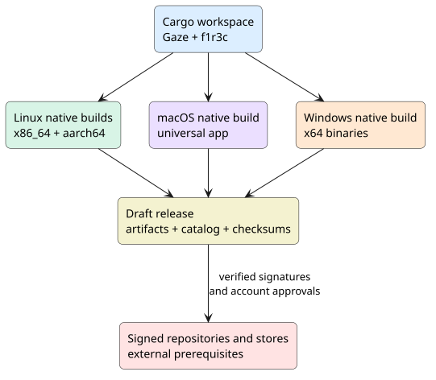

# F1R3Gaze distribution design and build guide

## Components and compatibility

F1R3Gaze contains the RSpace it needs to execute f1r3lang inside the application. The `f1r3c` command is shipped alongside the browser. F1R3Node is a separate, optional service: a customer does not need it merely to launch Gaze. Embers is not installed by any Gaze package. The release catalog currently lists only Gaze. A future organization installer may present several independently upgradable systems after each has an installer and the catalog records the exact combinations tested together.

Linux package managers install declared system libraries and can express versioned package dependencies. macOS DMGs are app delivery images, while component PKGs can be chained by a distribution PKG. Windows MSIs are independent components; a WiX Burn bootstrapper can select and chain them. The templates in `packaging/macos/organization-distribution.xml.in` and `packaging/windows/organization.wxs.in` deliberately expose only Gaze. The selector validator rejects an unknown system or an untested pair.



## Artifact matrix

| Target | Artifact | Builder | Current state |
| --- | --- | --- | --- |
| Debian 12+/Ubuntu 22.04+ x86_64, arm64 | `.deb` | Ubuntu 22.04 runner; x86_64 build available locally | Both architectures passed lower-version upgrade, launch and removal on all ten distro targets |
| Arch x86_64; Arch Linux ARM aarch64 | `.pkg.tar.zst` | `makepkg` on matching architecture | Both architectures passed build, lower-version upgrade, launch and removal in fork CI |
| Fedora 43/44, Enterprise Linux 9/10, openSUSE Leap 16 | `.rpm` | Matching distro and architecture container | All ten distro/architecture jobs passed build, lower-version upgrade, launch and removal in fork CI |
| Linux x86_64, aarch64 | `.tar.gz` and `.AppImage` | Matching Linux runner | Both architectures built and launched in fork CI |
| macOS Intel and Apple Silicon | universal `.dmg` and component `.pkg` | macOS 14 ARM runner; macOS 15 Intel installer runner | Unsigned build, DMG mount, PKG upgrade and installed URL delivery passed on both CPU families; signing and notarization await credentials |
| Windows 11 x64 | `.msi` and portable `.zip` | Windows Server 2022 runner; local cross-build for ZIP | Unsigned build, MSI major upgrade, installed running-app URL delivery, removal and ZIP launch passed; Windows 11 device pending |
| Linux sandbox channels | `.flatpak` and `.snap` | Matching Linux runners | Both architectures pass install, page/network/file access, URL desktop metadata, visible X11 window startup with Vulkan selected, and removal in fork CI |

The branch smoke workflows build the actual distribution payloads. Linux jobs build DEB, tarball and AppImage on native x86_64 and ARM64 runners, then install a lower-version DEB, upgrade to the release, launch and remove it in Debian 12/13 and Ubuntu 22.04/24.04/26.04 containers. Separate native jobs build, upgrade, launch and remove Arch and Arch Linux ARM packages and Fedora 43/44, Rocky Linux 9/10 and openSUSE Leap 16 RPMs. The older-version fixtures reuse the release payload while changing package metadata; they test package-manager transactions, while a future released older binary can test data migration. Flatpak and Snap jobs build and install on each native architecture, run both packaged commands, execute a built-in page, fetch a deterministic loopback page, compile a source file, inspect installed URL-handler metadata and open a visible X11 window with Vulkan selected before removal. The installer workflow mounts the macOS DMG, upgrades its component PKG, installs and removes the Windows MSI after an upgrade, checks the portable ZIP, exercises registered URL delivery, and runs Intel Mac theme, CLI and installer jobs. The tag release workflow runs the same smoke scripts before its draft-publication job can run.

`packaging/verify-system-theme.sh` runs in the native Linux x86_64/ARM64, macOS Apple Silicon/Intel and Windows x64 build jobs, including tag releases. It checks Linux portal queries with both dark and light replies, the macOS/Windows window-event source, light/dark/unspecified preference transitions, the browser's displayed palette, explicit theme overrides, title-bar behavior and stale labels after an OS theme change. These unit tests use controlled preference reports. The macOS and Windows jobs also run `native_system_theme` through the real winit event loop and compare its detected appearance with the CI user's macOS global setting or Windows app setting. That live check tests whichever preference the runner currently uses; the controlled tests exercise both preferences on every supported platform. Neither check changes the runner's desktop setting. A customer-device test of live OS setting changes remains separate.

The host on which this guide was written is Arch Linux x86_64. It has `makepkg`, `dpkg-deb`, `repo-add`, and `dpkg-scanpackages`. It does not have Apple's `hdiutil` or a Microsoft SDK link tool. An offline Windows-target Cargo check reached `ring` and then stopped because `lib.exe` was absent; that is a toolchain limitation, not evidence about the Windows application binary. Apple describes native `hdiutil`, code signing and notarization in its [macOS distribution guide](https://developer.apple.com/documentation/xcode/packaging-mac-software-for-distribution). GitHub documents the [native runners](https://docs.github.com/en/actions/reference/runners/github-hosted-runners) used by the release workflow.

## Build on the current machine

Build the two Rust executables and then package them:

```sh
cd f1r3-work/f1r3gaze
cargo build --locked --release -p gaze-shell -p f1r3c
packaging/linux/build.sh --format arch --version 0.1.0 --out dist
packaging/linux/build.sh --format deb --version 0.1.0 --out dist
packaging/linux/build.sh --format tar --version 0.1.0 --out dist
packaging/verify-source.sh
```

`build.sh` accepts `--bin DIR` to package a different native build. It compares the requested version with `[workspace.package]` in Cargo and compares both ELF machine types with the host. It fails rather than labeling a cross-architecture binary as a native package. The Debian dependency list includes the libraries linked by the local binary: glibc, libgcc and fontconfig; window-system and graphics loader dependencies are declared as well. RPMs are compiled on each supported distro baseline because Enterprise Linux 9 has a different library floor from the Debian build host.

The AppImage tool and runtime are fixed to versioned upstream releases and verified against their published SHA-256 digests:

```sh
packaging/linux/fetch-appimagetool.sh dist/appimagetool-tools
APPIMAGETOOL=packaging/linux/appimagetool-wrapper.sh \
APPIMAGETOOL_IMAGE="$PWD/dist/appimagetool-tools/appimagetool-x86_64.AppImage" \
APPIMAGETOOL_RUNTIME_FILE="$PWD/dist/appimagetool-tools/runtime-x86_64" \
packaging/linux/build.sh --format appimage --version 0.1.0 --out dist
```

The wrapper runs the AppImage tool without requiring FUSE on CI. The tool release and runtime checksums are taken from the [appimagetool](https://github.com/AppImage/appimagetool/releases/tag/1.9.1) and [type2 runtime](https://github.com/AppImage/type2-runtime/releases/tag/20251108) release assets.

Inspect the resulting Arch and Debian packages before installing them:

```sh
pacman -Qip dist/f1r3gaze-0.1.0-1-x86_64.pkg.tar.zst
pacman -Qlp dist/f1r3gaze-0.1.0-1-x86_64.pkg.tar.zst
dpkg-deb --field dist/f1r3gaze_0.1.0_amd64.deb
dpkg-deb --contents dist/f1r3gaze_0.1.0_amd64.deb
```

Install local packages with `sudo pacman -U FILE.pkg.tar.zst` on Arch or `sudo apt install ./FILE.deb` on Debian/Ubuntu. For Fedora or Enterprise Linux use `sudo dnf install ./FILE.rpm`; on openSUSE use `sudo zypper install ./FILE.rpm`. These local commands use the package manager's dependency resolver. The tarball and AppImage are portable artifacts and do not create a package-manager upgrade path.

From `f1r3-work/f1r3gaze`, the following commands install a locally built 0.1.0 package for the current CPU. Use a newer version and repeat the install command to upgrade a local DEB, Arch package or RPM. Select the RPM channel that matches the running distribution (`fc43`, `fc44`, `el9`, `el10` or `opensuse16`):

```sh
VERSION=0.1.0
sudo pacman -U "dist/f1r3gaze-${VERSION}-1-$(uname -m).pkg.tar.zst"
f1r3gaze --version
sudo pacman -R f1r3gaze

sudo apt install "./dist/f1r3gaze_${VERSION}_$(dpkg --print-architecture).deb"
f1r3gaze --version
sudo apt remove f1r3gaze

RPM_CHANNEL=fc44  # choose the channel for this host
sudo dnf install "./dist/f1r3gaze-${VERSION}-1.${RPM_CHANNEL}.$(rpm --eval '%{_arch}').rpm"
f1r3gaze --version
sudo dnf remove f1r3gaze

RPM_CHANNEL=opensuse16
sudo zypper install "./dist/f1r3gaze-${VERSION}-1.${RPM_CHANNEL}.$(rpm --eval '%{_arch}').rpm"
f1r3gaze --version
sudo zypper remove f1r3gaze
```

Run only the commands for the current distribution. The sandbox bundles have their own install and removal commands:

```sh
VERSION=0.1.0
flatpak --user install "dist/F1R3Gaze-${VERSION}-$(uname -m).flatpak"
flatpak run --user io.f1r3fly.F1R3Gaze
flatpak --user uninstall io.f1r3fly.F1R3Gaze

SNAP_ARCH=$(dpkg --print-architecture)  # amd64 or arm64
sudo snap install --dangerous "dist/f1r3gaze_${VERSION}_${SNAP_ARCH}.snap"
snap run f1r3gaze.f1r3gaze
sudo snap remove f1r3gaze
```

The Flatpak bundle declares its runtime repository in the bundle; Flatpak may fetch that runtime during installation. The local Snap is unsigned, so `--dangerous` is for development and [does not establish a Store trust or automatic update path](https://snapcraft.io/docs/explanation/snap-development/install-modes/). Store-based installs and refreshes become available after publication.

Once the matching listings are published to Flathub and the Snap Store, those stores provide the update channel. These commands are for the published listings, not the local test bundles:

```sh
flatpak --user install flathub io.f1r3fly.F1R3Gaze
flatpak --user update io.f1r3fly.F1R3Gaze
flatpak --user uninstall io.f1r3fly.F1R3Gaze

sudo snap install f1r3gaze
sudo snap refresh f1r3gaze
sudo snap remove f1r3gaze
```

Flatpak trusts the configured Flathub remote, and Snap validates Store assertions. Neither command uses the separate APT/pacman/RPM signing key. The Store listings and their publisher identities still need external approval before customers can use these commands.

## Repository and trust flow

`packaging/repository/stage.py` creates an unsigned publication tree in a *fresh* output directory:

```sh
python3 packaging/repository/stage.py --dist dist --out dist/repository-0.1.0
python3 packaging/release_metadata.py catalog --version 0.1.0 --dist dist \
  --base-url https://github.com/F1R3FLY-io/F1R3Gaze/releases/download/v0.1.0 \
  --out dist/catalog.json
```

The tree contains Debian `Packages` and `Release` files, pacman `.db`/`.files` indexes, and RPM `repodata` when `createrepo_c` and RPMs are available. RPM metadata uses gzip explicitly because [createrepo_c supports multiple compression formats](https://man.archlinux.org/man/extra/createrepo_c/createrepo_c.8.en) and its default varies by host. Both branch CI and the release workflow stage the complete DEB, Arch, and RPM matrix with `--version 0.1.0 --require-complete`, then run `packaging/repository/verify-staging.py --tree TREE --version 0.1.0` to check each index references its staged package. The release workflow uploads a compressed copy of the staging tree for review. It is marked `UNSIGNED-STAGING`. It must not be published until its repository signatures, package signatures, public key, fingerprint instructions, and install/update checks are ready. The publication host must be separate from the existing Reach demo Pages site. Staging stops before the tree reaches its configured size budget.

To prepare a signed promotion, work from a copy of the release artifacts. Sign the RPM files **before** creating repository indexes: RPM signatures change package bytes, so an index made earlier would contain stale hashes. `rpmsign --addsign` inserts the package signature, and `rpmkeys --checksig` verifies it against a temporary key database; both operations follow the [RPM signing](https://rpm.org/docs/6.1.x/man/rpmsign.1) and [key verification](https://rpm.org/docs/6.1.x/man/rpmkeys.8) interfaces. Then stage the repository from those signed bytes, sign its metadata, regenerate the catalog and checksums, and run the promotion gate:

```sh
VERSION=0.1.0
FINGERPRINT=YOUR_FULL_PUBLISHED_OPENPGP_FINGERPRINT
PUBLIC_KEY=/path/to/verified-public-key.asc
RELEASE_URL=https://YOUR_RELEASE_HOST/releases/v${VERSION}
cp -a dist dist-promotion
packaging/repository/sign-rpms.sh dist-promotion "$VERSION" "$FINGERPRINT"
python3 packaging/repository/stage.py --dist dist-promotion \
  --out repository-promotion --version "$VERSION" --require-complete
packaging/repository/sign-metadata.sh repository-promotion "$FINGERPRINT" "$VERSION"
python3 packaging/release_metadata.py catalog --dist dist-promotion \
  --version "$VERSION" --base-url "$RELEASE_URL" \
  --out dist-promotion/catalog.json --require-complete
GPG_SIGNING_KEY_ID="$FINGERPRINT" packaging/sign-checksums.sh dist-promotion
python3 packaging/repository/promotion_check.py --dist dist-promotion \
  --tree repository-promotion --catalog dist-promotion/catalog.json \
  --public-key "$PUBLIC_KEY" --fingerprint "$FINGERPRINT" \
  --version "$VERSION" --finalize
python3 packaging/repository/promotion_check.py --dist dist-promotion \
  --tree repository-promotion --catalog dist-promotion/catalog.json \
  --public-key "$PUBLIC_KEY" --fingerprint "$FINGERPRINT" --version "$VERSION"
```

The normal production entry point executes that sequence with a protected key. Set `GPG_PRIVATE_KEY` and `GPG_PASSPHRASE` through a secure local secret source, then run this from `f1r3-work/f1r3gaze` after collecting the complete unsigned artifact matrix in `dist`:

```sh
VERSION=0.1.0
FINGERPRINT=YOUR_INDEPENDENTLY_REVIEWED_FULL_PRIMARY_FINGERPRINT
RELEASE_URL=https://github.com/F1R3FLY-io/F1R3Gaze/releases/download/v${VERSION}
packaging/repository/promote.sh --dist dist --out "signed-promotion-${VERSION}" \
  --version "$VERSION" --base-url "$RELEASE_URL" --fingerprint "$FINGERPRINT"
```

The output is a fresh `signed-promotion-${VERSION}` directory containing `dist/` with the RPMs signed before `catalog.json` and `SHA256SUMS.asc` are generated, and `repository/` with signed APT, pacman and RPM indexes. The command imports the private key into a temporary GPG home, compares its primary fingerprint with the separately supplied value, unlocks it for the run, and checks the complete promotion before moving the output into place. It never uploads the tree or retains the private key in the output. It requires `rpmsign`, `rpmkeys`, `repo-add`, `dpkg-scanpackages`, `createrepo_c`, GnuPG and Python on the host.

The last manual command above is a read-only dry run. The `--finalize` invocation removes `UNSIGNED-STAGING` only after it checks the complete artifact matrix, catalog URLs and digests, tree size, staged package copies and indexes, APT/pacman/RPM signatures, and the signed checksum file including `catalog.json`. The release URL and independently published fingerprint must be real before production use. The branch workflow exercises the signing order on copies of real Linux packages with a temporary CI key. The tag workflow runs `promote.sh` with a temporary passphrase-protected key on copies of every native artifact and saves the finalized release and repository as a CI-only artifact. A separate job downloads that artifact, rechecks its signatures and package copies, requires the publication URL to match the signed catalog, generates the Homebrew and WinGet manifests, and validates the latter against pinned schemas and the signed MSI. Other jobs install from its signed APT, pacman, DNF and Zypper indexes on native x86_64 and ARM64 runners; all those jobs gate draft publication. Tags pushed to a fork validate without creating a draft; only the upstream repository may create a release draft. On upstream, a separate production promotion job uses the configured key to create signed release assets and a signed repository tree. The publish job downloads both, runs the same publication assembly check with the independently configured fingerprint, and creates a draft from those exact signed assets. Upstream publication requires the full macOS signing and notarization inputs, Windows signing inputs, a GPG signing key and passphrase, and the independently reviewed full `GPG_EXPECTED_FINGERPRINT` repository variable. Missing inputs fail the workflow. A manual dispatch is available once the workflow exists on the repository's default branch, and creates a draft only if `publish_draft` is explicitly selected. Temporary CI keys and signed copies are never published as production packages or repositories.

`sign-metadata.sh` also exports `f1r3gaze-signing-key.asc` at the signed tree's root. The promotion gate verifies signatures using that published copy and compares its primary fingerprint with the separately supplied trusted key. It verifies both pacman's package database and its separate files index, so `pacman -Fy` can also run with mandatory database signatures. This ensures the key customers download is the key that verified the staged packages and indexes. A fingerprint learned only from the package host is insufficient to establish trust.

### Customer repository configuration after publication

Run the common preparation below in Bash after the signed tree is published over HTTPS. Enter the repository root URL and the **full 40- or 64-digit primary fingerprint obtained independently from F1R3FLY.io**. The command stops before installing any trust material if they differ. The current unsigned staging tree must never be used as the repository root.

```bash
set -euo pipefail
read -r -p 'Published repository HTTPS root: ' BASE
read -r -p 'Independently verified full signing-key fingerprint: ' EXPECTED_FPR
BASE=${BASE%/}
EXPECTED_FPR=${EXPECTED_FPR^^}
[[ $BASE =~ ^https://[^/]+(/.*)?$ && $EXPECTED_FPR =~ ^([0-9A-F]{40}|[0-9A-F]{64})$ ]]
KEY_FILE=$PWD/f1r3gaze-signing-key.asc
curl --fail --location --silent --show-error \
  "$BASE/f1r3gaze-signing-key.asc" --output "$KEY_FILE"
ACTUAL_FPR=$(gpg --batch --show-keys --with-colons --fingerprint "$KEY_FILE" |
  awk -F: '$1 == "fpr" {print toupper($10); exit}')
[[ $ACTUAL_FPR == "$EXPECTED_FPR" ]] || {
  echo 'Signing-key fingerprint mismatch; repository was not configured' >&2
  exit 1
}
```

Run **one** of the following blocks in that same Bash session. For Debian 12/13 and Ubuntu 22.04/24.04/26.04, the source is a Deb822 `.sources` file scoped to this key, as [APT documents](https://manpages.debian.org/testing/apt/sources.list.5.en.html):

```bash
sudo install -d -m 0755 /etc/apt/keyrings
gpg --batch --yes --dearmor --output f1r3gaze-signing-key.gpg "$KEY_FILE"
sudo install -m 0644 f1r3gaze-signing-key.gpg /etc/apt/keyrings/f1r3gaze.gpg
printf 'Types: deb\nURIs: %s/apt\nSuites: stable\nComponents: main\nSigned-By: /etc/apt/keyrings/f1r3gaze.gpg\n' "$BASE" |
  sudo tee /etc/apt/sources.list.d/f1r3gaze.sources >/dev/null
sudo apt update
sudo apt install f1r3gaze
# Later: sudo apt update && sudo apt upgrade f1r3gaze
# Remove: sudo apt remove f1r3gaze
```

For Arch Linux x86_64 or Arch Linux ARM aarch64, pacman expands `$arch` to the system architecture. The repository requires both package and database signatures, following [pacman.conf](https://man.archlinux.org/man/pacman.conf.5.en):

```bash
sudo pacman-key --add "$KEY_FILE"
sudo pacman-key --lsign-key "$EXPECTED_FPR"
if grep -qx '\[f1r3gaze\]' /etc/pacman.conf; then
  echo 'f1r3gaze already exists in pacman.conf; inspect it before changing it' >&2
  exit 1
fi
printf '\n[f1r3gaze]\nSigLevel = Required DatabaseRequired\nServer = %s/arch/$arch\n' "$BASE" |
  sudo tee -a /etc/pacman.conf >/dev/null
sudo pacman -Syu f1r3gaze
# Later: sudo pacman -Syu f1r3gaze
# Remove: sudo pacman -R f1r3gaze
```

For Fedora 43/44 and Enterprise Linux 9/10, the channel names match the generated RPM directories. DNF checks both the signed RPMs and signed `repomd.xml`, as its [configuration reference](https://dnf.readthedocs.io/en/latest/conf_ref.html) specifies:

```bash
. /etc/os-release
case "$ID" in
  fedora) CHANNEL=fc${VERSION_ID%%.*} ;;
  rocky|rhel) CHANNEL=el${VERSION_ID%%.*} ;;
  *) echo "Unsupported RPM distribution: $ID" >&2; exit 1 ;;
esac
case "$CHANNEL" in fc43|fc44|el9|el10) ;; *) echo "Unsupported channel: $CHANNEL" >&2; exit 1 ;; esac
sudo install -d -m 0755 /etc/pki/rpm-gpg
sudo install -m 0644 "$KEY_FILE" /etc/pki/rpm-gpg/F1R3Gaze.asc
printf '[f1r3gaze]\nname=F1R3Gaze\nbaseurl=%s/rpm/%s/$basearch\nenabled=1\ngpgcheck=1\nrepo_gpgcheck=1\ngpgkey=file:///etc/pki/rpm-gpg/F1R3Gaze.asc\n' "$BASE" "$CHANNEL" |
  sudo tee /etc/yum.repos.d/f1r3gaze.repo >/dev/null
sudo dnf install f1r3gaze
# Later: sudo dnf upgrade f1r3gaze
# Remove: sudo dnf remove f1r3gaze
```

For openSUSE Leap 16, libzypp accepts mandatory repository and RPM signature checks in the `.repo` file; see [libzypp's repository security model](https://opensuse.github.io/libzypp/classzypp_1_1RepoInfo.html):

```bash
sudo install -d -m 0755 /etc/zypp/keys
sudo install -m 0644 "$KEY_FILE" /etc/zypp/keys/f1r3gaze.asc
printf '[f1r3gaze]\nname=F1R3Gaze\nbaseurl=%s/rpm/opensuse16/$basearch\nenabled=1\nautorefresh=1\ngpgcheck=1\nrepo_gpgcheck=1\npkg_gpgcheck=1\ngpgkey=file:///etc/zypp/keys/f1r3gaze.asc\n' "$BASE" |
  sudo tee /etc/zypp/repos.d/f1r3gaze.repo >/dev/null
sudo zypper refresh f1r3gaze
sudo zypper install f1r3gaze
# Later: sudo zypper update f1r3gaze
# Remove: sudo zypper remove f1r3gaze
```

The published tree uses `apt`, `arch/x86_64`, `arch/aarch64`, and `rpm/{fc43,fc44,el9,el10,opensuse16}/{x86_64,aarch64}` beneath its root. DNF and Zypper expand `$basearch` on the client; APT uses `amd64` and `arm64` inside its index. A public domain and independent fingerprint must be provided before customer use.

The draft GitHub release collects artifacts first, generates `catalog.json`, and then generates `SHA256SUMS` and its detached signature when a key is configured. CI also generates candidate Homebrew and WinGet manifests from the actual DMG and MSI bytes. Publish those manifests only after the DMG is notarized and the MSI is signed:

```sh
python3 packaging/release_metadata.py homebrew --version 0.1.0 --dist dist \
  --base-url https://github.com/F1R3FLY-io/F1R3Gaze/releases/download/v0.1.0 \
  --out metadata/Casks/f1r3gaze.rb
python3 packaging/release_metadata.py winget --version 0.1.0 --dist dist \
  --base-url https://github.com/F1R3FLY-io/F1R3Gaze/releases/download/v0.1.0 \
  --out metadata/winget
```

The cask points to the DMG and links `f1r3c` from the installed app. This follows Homebrew's [cask artifact model](https://docs.brew.sh/Cask-Cookbook). The WinGet output is a three-file manifest set matching the [community repository format](https://github.com/microsoft/winget-pkgs/blob/master/.github/instructions/manifests.instructions.md). `packaging/winget/validate.py metadata/winget/F1R3FLY.F1R3Gaze/0.1.0 --dist dist` validates all three files against a pinned copy of [Microsoft's 1.12.0 manifest schemas](https://github.com/microsoft/winget-cli/tree/49d0f8291b40f88744a29ae7ca0d1df962ade537/schemas/JSON/manifests/v1.12.0), checks their shared identity and version, and compares the installer hash with the built MSI. Install `packaging/winget/requirements.txt` first. Microsoft's `winget validate` and its community submission checks remain publication steps. Neither generator submits or publishes anything.

After a signing key and verified fingerprint are published, a customer can check a release download with:

```sh
gpg --verify SHA256SUMS.asc SHA256SUMS
sha256sum -c SHA256SUMS
```

Do not infer trust from a checksum downloaded from the same unauthenticated location. Compare the signing-key fingerprint with an independently published source first. No production signing key or fingerprint has been provisioned yet.

## Native installers and optional stores

The macOS script creates one universal `F1R3Gaze.app` and stages only its two executables, metadata, icon and license. The DMG supports drag-and-drop installation; the component PKG is the building block for a later organization selector. Developer ID Application and Developer ID Installer credentials are separate. The script signs and notarizes both artifacts when those credentials are present. The app registers `f1r3://` and `f1r3h://` as separate URL types in `Info.plist`, following [Apple's URL type contract](https://developer.apple.com/documentation/bundleresources/information-property-list/cfbundleurltypes). Its AppKit delegate receives [`application:openURLs:`](https://developer.apple.com/documentation/AppKit/NSApplicationDelegate/application%28_%3Aopen%3A%29) for cold launches and running instances, accepts only syntactically valid addresses of those two types, and opens each in a browser tab in delivery order. The macOS build jobs compile and test that handler, check the installed bundle's registration, exercise a running-app URL delivery and test cold launch through the system's registered URL association. A Mac App Store variant would need its own sandbox and entitlement review, so it is tracked separately.

The Windows script produces a per-machine MSI and a portable ZIP. On Linux, after installing `cargo-xwin`, PowerShell and the Rust Windows target, run `packaging/windows/build-local.sh 0.1.0 dist` to cross-compile the PE binaries and create the portable ZIP. The local x86_64 ZIP was built and its three files inspected. WiX v4 states it supports Windows only; an MSI build on this Arch host failed in its directory compiler, so the MSI uses a Windows runner. That runner installed a synthetic older MSI, upgraded to the release MSI, delivered a registered URL to the running installed app, removed the MSI and launched both ZIP commands. The MSI registers `f1r3://` and `f1r3h://` and supports silent installation and major upgrades. Stable numeric `X.Y.Z` releases avoid mapping distinct prereleases to the same MSI version. The standalone MSI is the primary channel; Microsoft Store review is a separate follow-up. WinGet publication is also separate from MSI creation.

Flatpak and Snap definitions use the same Gaze and compiler payload. Install `xvfb`, `xauth`, `xdotool` and a Mesa Vulkan driver on the smoke host. On a Linux machine with Flatpak Builder, use `packaging/flatpak/ci-smoke.sh 0.1.0` after building the native executables. It stages the input, creates `dist/F1R3Gaze-0.1.0-$(uname -m).flatpak`, installs it for the current user, exercises the sandbox and removes it. This test adds the Flathub remote for the matching runtime and needs network access. For Snap, prepare `packaging/snap/stage.sh target/release dist/snap-input 0.1.0`, then run Snapcraft 9 or newer on a matching Ubuntu 24.04 builder to pack it; `packaging/snap/ci-smoke.sh FILE.snap 0.1.0` installs, exercises and removes the unsigned snap. Both scripts run the built-in page, fetch a local HTTP page, compile and inspect a source file in the application writable area, check the installed desktop file's custom URL declarations, and open a visible window on an isolated X11 display with the Vulkan backend selected. The Snapcraft 8 `8_core24` OCI image does not support the recipe's GPU extension. The manifests are `packaging/flatpak/io.f1r3fly.F1R3Gaze.json` and `dist/snap-input/snap/snapcraft.yaml`. CI checks a virtual X11 display; real Wayland sessions, hardware GPUs and host desktop URL dispatch still need customer-device validation. Store publication follows those checks.

## Release sequence and pending work

The tag workflow builds native Linux binaries and packages, builds universal macOS and Windows artifacts, checks available metadata, creates a draft release, and produces the cask and WinGet files as review artifacts. The `package-linux-smoke.yml` and `package-installers-smoke.yml` workflows run on `feature/additional-packages` pushes; the installer workflow also runs on `v*` tags. Branch smoke runs cancel an older run for the same workflow and branch; tag runs are retained. Each builds unsigned artifacts on GitHub-hosted runners and performs installation and launch checks. [Fork Linux run 37713789205](https://github.com/dylon/F1R3Gaze/actions/runs/37713789205) passed all 31 package build, upgrade and lifecycle jobs, including both Flatpak and Snap architectures, virtual-display graphics and repository staging; [fork installer run 37713789218](https://github.com/dylon/F1R3Gaze/actions/runs/37713789218) passed all four native installer jobs with theme, PKG and MSI upgrade, and running-app URL checks. [Fork tag release run 37744295267](https://github.com/dylon/F1R3Gaze/actions/runs/37744295267) passed 37 jobs, including the final signed-repository promotion gate and installations from its APT, pacman, DNF and Zypper indexes on both architectures; draft publication was skipped on the fork. The pacman client also refreshed and queried the signed `.files` index. The Apple Silicon package runner checks the universal app's two Mach-O slices and tests the installed ARM slice. A separate Intel job downloads and installs that exact universal artifact, checks its native slice, PKG upgrade, running-app and cold URL handling, and gates the release draft; another Intel job checks the native compiler, CLI and system theme. The Windows runner is Windows Server 2022, so Windows 11 customer validation remains separate. Arch Linux ARM uses the third-party `menci/archlinuxarm` image; its package and lifecycle passed on that image. Publishing package repositories, a Homebrew tap, WinGet, Flathub, Snap Store, Microsoft Store or Mac App Store requires external accounts or credentials. Signed install, upgrade and removal tests on customer macOS and Windows 11 machines also remain pending. Each of these is a leaf in the external pgmcp child epic.
