# F1R3Gaze storage: where files live, and how start-up keeps them whole

This document describes where F1R3Gaze keeps its files, in what formats, how
it writes them so that no crash loses data, and how start-up finds and
repairs damage. It is written so that the design can be rebuilt from it.
Every claim about behaviour is backed by a test or a model run, recorded in
the [storage ledger](ledger.md) (entries S1–S17).

**Contents**

1. [Terms](#1-terms)
2. [Principles](#2-principles)
3. [The five classes](#3-the-five-classes)
4. [Where the roots are](#4-where-the-roots-are)
5. [The file catalogue](#5-the-file-catalogue)
6. [Formats](#6-formats)
7. [Writing a file durably](#7-writing-a-file-durably)
8. [The instance lock](#8-the-instance-lock)
9. [Start-up](#9-start-up)
10. [Moving an old profile](#10-moving-an-old-profile)
11. [Backups](#11-backups)
12. [Following the system's colour scheme](#12-following-the-systems-colour-scheme)
13. [The window](#13-the-window)
14. [Freshness records](#14-freshness-records)
15. [Verifying storage](#15-verifying-storage)
16. [References](#16-references)

## 1. Terms

| Term | Meaning |
|---|---|
| **profile** | Everything F1R3Gaze keeps for one user: five folders, the *roots*. |
| **class** | The kind of a file, which decides its root: *config*, *data*, *state*, *cache* or *runtime* (section 3). |
| **root** | The folder holding one class, chosen by the platform's conventions (section 4). |
| **portable profile** | A profile whose five roots are subfolders of one folder named by `--profile DIR` or `F1R3GAZE_PROFILE`. |
| **system-wide layer** | A read-only `settings.toml` or theme folder installed for every user (`$XDG_CONFIG_DIRS`, `$XDG_DATA_DIRS` and their equivalents). |
| **legacy profile** | The single folder older versions kept everything in, such as `~/.local/share/f1r3gaze`. |
| **durable** | Kept by the disk: it survives a power cut. |
| **pending operation** | A directory operation (create, link, rename, unlink) that every process already sees, but that is not yet durable (section 7.1). |
| **process crash** | The process ends without warning (a kill, a panic, an abort). The kernel keeps everything the process did. |
| **power cut** | The machine stops. Only durable state survives, plus some of the pending operations. |
| **managed file** | A file start-up checks and repairs: settings, state files, wallet lists, and so on. |
| **backup session** | The folder `backups/<UTC time>/` in a root, where one start keeps the originals of what it repairs (section 11). |
| **desktop units** | The unit a window system gives positions in: points on macOS, physical pixels on Windows and X11 (section 13). |
| **scheme** | One of the two built-in palettes, *dark* or *light*. |
| **theme file** | A file `themes/<name>.css` that sets the chrome's colours. |

Colours in the diagrams mean the same everywhere:

| Colour | Meaning |
|---|---|
| blue | F1R3Gaze code |
| green | the operating system and third-party code |
| yellow | state the user can see change, or changes not yet durable |
| orange | durable state and durability points |
| red | crashes and failures |
| grey | where something is checked, or nothing happens |

## 2. Principles

1. **Each kind of file lives where the operating system expects it.**
   Settings go where the user's settings go, caches where caches go. On
   Linux this is the XDG Base Directory specification \[XDG-BD\]; on macOS
   and Windows it is their own conventions \[Apple-FSPG\], \[MS-KF\].
2. **Nothing the user made is lost.** No file is overwritten, repaired or
   replaced before a durable copy of it exists. Nothing is ever moved onto
   a name that is taken.
3. **Crash safety is designed, then checked.** The order of every write is
   specified in TLA+ and model-checked against both kinds of crash (section
   7.3). The implementation is then tested at every crash point of every
   write (`MemFs`), real start-ups are checked to be behaviours of the
   model (section 15.2), and each ordering step has a test that fails
   without it: a mutation check, in the sense of mutation analysis
   \[DeMillo-1978\].
4. **One writer per profile.** An instance lock keeps a second F1R3Gaze from
   writing the same profile (section 8).
5. **Start-up repairs, and a second start writes nothing.** Missing files are
   made, damaged ones are backed up and repaired, and a start that finds
   everything whole changes nothing but its busy flag: one file made and
   removed, and one folder synced (section 9.2).
6. **When unsure, read only.** A file that cannot be read is never
   overwritten. A profile that cannot be locked or written is opened read
   only.

**The pieces.** `main.rs` opens the profile (`Profile::open`: the roots, the
lock, start-up's repair and move; sections 4, 8 and 9) and the engine on
it, whose crates keep the wallets, keys, permissions, site data and
freshness records. The chrome and the window keep the session, the
history, the theme and the window's geometry through the profile. Every
file is written through `gaze-fs` (section 7), with two exceptions. A site
store appends its records without a sync, as a browser's relaxed IndexedDB
durability does: a power cut can lose its last records, which the next open
drops as a torn tail, and its compaction goes through `gaze-fs`. The content
cache's files are named by their hash and checked when read, so they need
no sync.

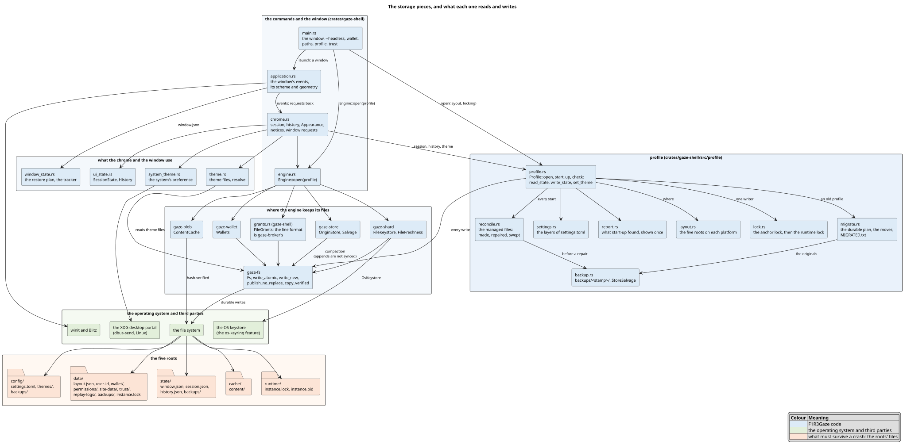

## 3. The five classes

| Class | What the XDG specification \[XDG-BD\] keeps there | What F1R3Gaze keeps there | Losing it |
|---|---|---|---|
| **config** | the user's configuration files | `settings.toml`, the theme files | the user's choices |
| **data** | the user's data files | wallets and their keys, permission decisions, site data, freshness records, replay logs, the user id | money, identity, decisions: never regenerable |
| **state** | state that should persist between restarts but is not important or portable enough for *data*: history, the current view and layout | the window's size and place, the open tabs, the history | convenience only |
| **cache** | non-essential cached data | fetched content, by hash | nothing: it is fetched again |
| **runtime** | non-essential runtime files of a login session (sockets, locks) | the instance lock | nothing |

The browser history is *state*, not *data*: the XDG specification lists
"actions history" as its example of state, and losing it costs no money and
no decision. The window's geometry and open tabs are the specification's
"current state of the application that can be reused on a restart".

## 4. Where the roots are

### 4.1 Per platform

| Class | Linux (XDG) | macOS | Windows |
|---|---|---|---|
| config | `$XDG_CONFIG_HOME/f1r3fly-io/f1r3gaze` | `~/Library/Application Support/io.f1r3fly.f1r3gaze/config` | `%APPDATA%\f1r3fly-io\f1r3gaze` (roams) |
| data | `$XDG_DATA_HOME/f1r3fly-io/f1r3gaze` | `…/io.f1r3fly.f1r3gaze/data` | `%LOCALAPPDATA%\f1r3fly-io\f1r3gaze\data` |
| state | `$XDG_STATE_HOME/f1r3fly-io/f1r3gaze` | `…/io.f1r3fly.f1r3gaze/state` | `…\state` |
| cache | `$XDG_CACHE_HOME/f1r3fly-io/f1r3gaze` | `~/Library/Caches/io.f1r3fly.f1r3gaze` | `…\cache` |
| runtime | `$XDG_RUNTIME_DIR/f1r3fly-io/f1r3gaze`, else `<state>/runtime` | `$TMPDIR/io.f1r3fly.f1r3gaze`, else `<state>/runtime` | `…\runtime` |
| system settings (read only) | `$XDG_CONFIG_DIRS/f1r3fly-io/f1r3gaze/settings.toml` (default `/etc/xdg`) | `/Library/Application Support/io.f1r3fly.f1r3gaze/config/settings.toml` | `%ProgramData%\f1r3fly-io\f1r3gaze\settings.toml` |
| system themes (read only) | `$XDG_DATA_DIRS/f1r3fly-io/f1r3gaze/themes` (default `/usr/local/share:/usr/share`) | `/Library/Application Support/io.f1r3fly.f1r3gaze/themes` | `%ProgramData%\f1r3fly-io\f1r3gaze\themes` |

- **Folder names.** Linux and Windows use a vendor folder and an
  application folder, `f1r3fly-io/f1r3gaze`. macOS uses the bundle
  identifier, `io.f1r3fly.f1r3gaze`, from `packaging/macos/Info.plist`.
- **One OS folder, several classes.** Where one operating-system folder
  holds several classes (Application Support on macOS, the local
  application data on Windows), each class has a subfolder named after it.
- **Windows configuration roams.** The roaming application data follows a
  user from machine to machine in a domain. Settings and themes belong
  there; keys, site data and caches do not.

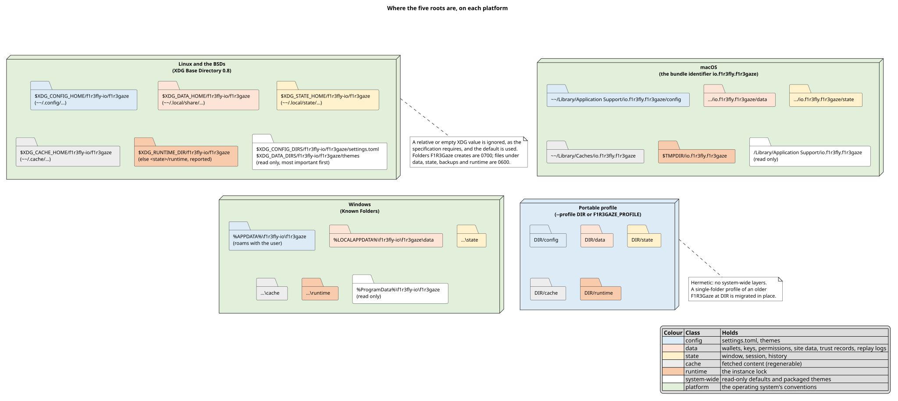

### 4.2 Resolving the roots

The mapping is a pure function of the platform and of what was read from the
machine (`profile/layout.rs`). The tests therefore check all three platforms
on any one of them.

**⟨Resolve the roots⟩** — given the command line and the machine:

1. If `--profile DIR` was given, or else `F1R3GAZE_PROFILE` is set, the
   layout is portable: each class is `absolute(DIR)/<class>`, and there are
   no system-wide layers. ⟨Done⟩.
2. Otherwise, by platform:
   - **XDG.** For each of `XDG_CONFIG_HOME`, `XDG_DATA_HOME`,
     `XDG_STATE_HOME` and `XDG_CACHE_HOME`, use its value if it is an
     absolute path, else its default under `$HOME` (`.config`,
     `.local/share`, `.local/state`, `.cache`). Append
     `f1r3fly-io/f1r3gaze`.
     - **Runtime.** `$XDG_RUNTIME_DIR` if absolute; else
       `<state>/runtime`, with a message on stderr. The specification:
       "If $XDG_RUNTIME_DIR is not set applications should fall back to a
       replacement directory with similar capabilities and print a warning
       message." \[XDG-BD, §3\]
     - **System-wide layers.** The system folders are the absolute
       entries of `$XDG_CONFIG_DIRS` and `$XDG_DATA_DIRS`, split at `:` and
       kept in order (most important first), or their defaults.
   - **macOS.** Under `~/Library/Application Support/io.f1r3fly.f1r3gaze`:
     `config`, `data`, `state`. The cache is in `~/Library/Caches`. The
     runtime folder is `$TMPDIR/io.f1r3fly.f1r3gaze` if `$TMPDIR` is
     absolute, else `<state>/runtime`, reported.
   - **Windows.** The roaming and local application data come from the
     Known Folders API, else from `%APPDATA%` and `%LOCALAPPDATA%`.
     Without either, start-up stops and suggests `--profile`.
3. Without a home folder (Linux, macOS), start-up stops with exit status 2
   and suggests `--profile`.

An empty or relative value is never used: the XDG specification requires
absolute paths and says to ignore any other. What counts as absolute is the
target platform's rule, not the host's: `/…` on Linux and macOS, `X:\…` or
`\\server\…` on Windows. A test checks all $`4^5 = 1024`$ combinations of
the five variables being unset, empty, relative or absolute (ledger S3).

### 4.3 Layered settings

`settings.toml` is read in layers, lowest first:

| Layer | Source |
|---|---|
| $`L_0`$ | the built-in defaults |
| $`L_1, \dots, L_n`$ | the system-wide files, least important first (`$XDG_CONFIG_DIRS` read in reverse) |
| $`L_{n+1}`$ | the user's `settings.toml` |

For a setting $`k`$, let $`S(k) = \{\, j \mid L_j \text{ sets } k \text{ to a usable value} \,\}`$.
Since $`L_0`$ sets every setting, $`S(k)`$ is never empty, and the value
in use is

```math
\mathrm{value}(k) = L_{j^*}(k), \qquad j^* = \max S(k).
```

An unusable value in a higher layer therefore leaves the value of the layer
below in place, and is reported with its file, line and column. An array
replaces the arrays below it, and `embers_api = ""` unsets a lower layer's
service.

## 5. The file catalogue

```text
<config>/                          the user's choices
├── settings.toml                  TOML, 0600 when new; a rewrite keeps its mode
├── settings.toml.example          the template, rewritten when it differs (section 9.5)
├── themes/
│   ├── default-dark.css.example   the built-in dark scheme, rewritten when it differs
│   ├── default-light.css.example  the built-in light scheme, rewritten when it differs
│   └── <name>.css                 the user's themes (never touched)
└── backups/<UTC time>[.n]/…       originals start-up repaired, and an old profile's
                                   converted files (legacy-profile/, section 10)

<data>/                            what cannot be regenerated
├── layout.json                    marks a profile in this layout: the migration's last step,
│                                  or a new profile's first start (section 10.1)
├── .startup-busy                  there while a start is under way (section 9.2)
├── .migration/plan.json           a migration in progress, until it is done (section 10.2)
├── instance.lock, instance.pid    the anchor lock (section 8)
├── user-id                        a random id, part of every site key's identity
├── wallet/
│   ├── wallets.tsv                address TAB label, one wallet per line
│   ├── wallet-active              the address that pays
│   ├── keys/<hash>.key            secret keys (file keystore only), never touched by start-up
│   └── exports/                   keys the user exported
├── permissions/grants.tsv         the user's permission decisions
├── site-data/
│   ├── origins.json               the index of sites with stores
│   └── <hash>.gzs                 each site's store, an append-only log
├── trust/freshness.tsv            the highest finalized block seen per binding
├── replay-logs/*.gzlog            recorded tab sessions
└── backups/<UTC time>[.n]/…

<state>/                           convenience
├── window.json                    the window's size, place, full screen, zoom
├── session.json                   the open tabs and the sidebar's layout
├── history.json                   the pages visited, newest first
└── backups/<UTC time>[.n]/…       including an old profile's workspace.json (legacy-profile/)

<cache>/
└── content/<aa>/<64 hex>          fetched content, by hash (regenerable)

<runtime>/
├── instance.lock                  the runtime lock (sticky on Linux)
└── instance.pid                   who holds it

<the old profile>/
└── MIGRATED.txt                   where each of its files went (section 10.6)
```

Names that begin with a dot and end in `.tmp-<pid>-<n>` are the temporary
files of writes in progress (section 7.2). Start-up removes those of
processes that died, except in `wallet/keys/`, where one may hold a new
key's only copy (section 9.3).

**Modes.**
- **Folders.** Folders F1R3Gaze creates are 0700, and a folder that already
  exists, such as a shared `~/.cache/f1r3fly-io`, is never changed. That is
  what the XDG specification asks: "If, when attempting to write a file, the
  destination directory is non-existent an attempt should be made to create
  it with permission 0700. If the destination directory exists already the
  permissions should not be changed." \[XDG-BD, §4\]
- **Files.** Files under *data*, *state*, *runtime* and every `backups/` are
  0600 from the moment they exist, so a secret is never briefly readable by
  others. On Windows, files inherit the profile folder's access list.

## 6. Formats

### 6.1 `settings.toml`

TOML \[TOML\]. Each table holds the settings of one area:

| Table | Setting | Type | Default | Accepted |
|---|---|---|---|---|
| `[appearance]` | `theme` | string | `"system"` | `system`, `default-dark` (`dark`), `default-light` (`light`), or a theme file's name (section 6.2) |
| | `restore_sidebar` | boolean | `false` | |
| `[browsing]` | `home` | string | `"gaze://newtab"` | an address with scheme `gaze`, `https`, `http`, `f1r3`, `f1r3h` or `file` |
| | `https_only` | boolean | `false` | |
| `[shard]` | `observers` | array of strings | `["http://localhost:40453"]` | `http` or `https` addresses |
| | `validator` | string | `"http://localhost:40403"` | an `http` or `https` address |
| | `shard_id` | string | `"root"` | not empty |
| | `quorum` | integer | `2` | at least 1 |
| | `phlo_price` | integer | `1` | at least 1 |
| `[wallet]` | `embers_api` | string | `""` (none) | `""`, or an `http` or `https` address |
| | `max_fee` | integer | `10_000_000` | at least 0 |
| `[content]` | `mirrors` | array of strings | `[]` | `http` or `https` addresses |
| | `cache_bytes` | integer | `536_870_912` (512 MiB) | at least 0 |
| `[site_data]` | `store_quota` | integer | `10_485_760` (10 MiB) | at least 0 |

**Reading.**
- **A problem in one place.** A value of the wrong type or out of range,
  an unknown setting or table, or a setting outside its table is reported
  with its line and column. The setting keeps the value of the layer
  below.
- **Suggestions.** For an unknown name, the nearest known one is
  suggested. Nearness is the optimal string alignment distance
  \[vanderLoo-2014\] (also called the restricted Damerau–Levenshtein
  distance \[Boytsov-2011\]; see \[Damerau-1964\] and
  \[Levenshtein-1966\]), in which swapping two
  neighbouring letters is one edit: at most one edit for names of up to
  five letters, two for longer ones.
- **A file that is not UTF-8 TOML is not used at all.** For the user's own
  file, start-up keeps a backup and writes the template in its place.
- **Both crates read the same TOML.** `toml` (reading, with positions) and
  `toml_edit` (writing) parse with the same `toml_parser`, so they agree on
  what is valid. Both bound how deeply a file may nest.

**The template.**
- **What it holds.** It is the text of a new `settings.toml` and of
  `settings.toml.example`. Each table's header is active. Each setting is
  shown commented out, as `#   name = default`, under a few lines saying
  what it does. Deleting the first four characters of every such line
  gives exactly the built-in defaults; a test checks this.
- **What F1R3Gaze changes in the file.** F1R3Gaze writes to `settings.toml`
  only when the user chooses a theme. It changes one value with `toml_edit`,
  so the user's comments and layout survive:
  - an existing value is replaced in place, keeping the spaces around it
    and a comment after it;
  - a missing setting is added after the other settings of its table;
  - a missing table is added at the end, as a standard table.
- **What it keeps.** A byte-order mark is kept: TOML 1.1.0 says nothing
  about one \[TOML\], while the TOML test suite and `toml_parser` both
  accept a leading one. CRLF line endings are kept
  when every line has one. A file that is not valid TOML is never rewritten.
  The result is read back by both parsers before it is written, and written
  atomically (section 7) through a symbolic link to its target, keeping the
  file's mode.

### 6.2 Theme files

A theme file is a restricted subset of CSS that can set the chrome's twelve
colour tokens and nothing else:

```text
file        = [ BOM ] , gap , ( root | items ) , gap ;
root        = ":root" , gap , "{" , items , "}" ;
items       = { gap , ( declaration | ";" ) } , gap ;
declaration = token , gap , ":" , blank , colour , blank , end ;
token       = "--gaze-" , name ;        (* one of the twelve tokens below *)
colour      = "#" , 6 * hexadecimal digit ;
end         = ";" | line break | "}" | end of file ;
gap         = { white space | comment } ;
blank       = { space | tab | "/*" comment "*/" } ;
comment     = "/*" , { any character } , "*/"
            | "#" , { any character but a line break } ;   (* first on its line *)
```

| Token | Colours |
|---|---|
| `--gaze-bg` | the window's background |
| `--gaze-surface` | the current tab, cards and panels |
| `--gaze-raised` | selected and raised items |
| `--gaze-text` | text |
| `--gaze-muted` | secondary text and icons |
| `--gaze-border` | borders and fields |
| `--gaze-accent` | focus rings and main buttons |
| `--gaze-accent-text` | text on the accent colour |
| `--gaze-hover` | what the pointer is over |
| `--gaze-warning` | warnings |
| `--gaze-success` | success |
| `--gaze-danger` | errors and destructive buttons |

**What is refused.**
- **Syntax.** `@`-rules (such as `@import`), other selectors, nested
  blocks, `url()`, `!important`, any value but `#RRGGBB`, and files over
  64 KiB are refused, with the line.
- **Contrast.** Text, muted text and accent text must reach a contrast of
  4.5:1 against the colour they are drawn on, as WCAG 2.1's criterion 1.4.3
  asks for body text \[WCAG\]. So must warnings, success and danger, when
  the file sets them.

**Which scheme a theme resembles.** A theme's missing tokens come from the
built-in scheme it resembles. It is *light* when its background
(`--gaze-bg`, else `--gaze-surface`) is lighter than the point where black
and white text reach the same contrast. With $`L`$ the relative luminance
of the background \[WCAG\], black text reaches $`(L + 0.05)/0.05`$ and white
text $`1.05/(L + 0.05)`$. The two are equal when

```math
(L + 0.05)^2 = 0.0525
\quad\Longleftrightarrow\quad
L^* = \sqrt{0.0525} - 0.05 \approx 0.1791 .
```

A background with $`L > L^*`$ is light. A test checks every grey from
`#000000` to `#ffffff` against this rule (ledger S12).

**The catalogue.**
- **Where themes are found.** In the user's `themes/` folder, then in the
  system-wide theme folders, most important first. A user's file hides an
  installed one of exactly the same name. Only `*.css` files are themes,
  so the `.example` files never are.
- **Names.** A theme's name is its file name without `.css`. It starts with
  a letter or digit, holds only letters, digits, `.`, `_` and `-`, is at
  most 64 characters, and is neither a built-in choice nor a Windows device
  name (`CON`, `NUL`, `COM1`, …). It cannot end in `.` or `.css`.
- **A theme that cannot be used.** Its file is missing, unreadable or
  refused. The chrome then shows the built-in scheme the system prefers
  (dark when it has no preference) and says why.
- **In Appearance** (`docs/ui/README.md`, section 8.13). Every theme file is
  a row: a usable one can be chosen, and one that cannot be used says why
  and cannot be. **New theme** writes the colours shown as `my-theme.css`,
  then `my-theme-2.css`, `my-theme-3.css`, … (names compared ignoring case,
  as macOS and Windows compare file names), with `write_new`: never over
  anything. A name taken by something the list does not show, such as a
  folder, is skipped for the next one. The new theme is then chosen, so it
  can be edited and reloaded. **Reload** reads the folders and the chosen
  theme again. A session that only reads writes no theme file.

The two `.example` files are written by `theme::example_css`. Each reads back
as exactly its built-in scheme, and starts with a comment saying how to make
a theme of one's own.

### 6.3 State files (JSON)

`session.json`, `history.json` and `window.json` are JSON objects with a
`version` field. The version is read first, on its own. A file whose version
is newer than this build knows was written by a newer F1R3Gaze: it is left as
it is and never overwritten, even if the rest of it has a shape this build
cannot read. Unknown fields are ignored, and missing fields take their
defaults.

| File | Fields |
|---|---|
| `session.json` | `version` (1), `sidebar_open`, `panel` (one of `tabs`, `history`, `sites`, `grants`, `wallet`, `console`, `appearance`), `tree_tabs`, `tabs` (at most 100 of `{url, title, parent}`), `active` |
| `history.json` | `version` (1), `visits`: at most 5 000 `{url, title, at}`, newest first, `at` in Unix seconds |
| `window.json` | `version` (1), `normal` (`{width, height, position, surface_offset, units, scale}` or null), `maximized`, `fullscreen`, `monitor` (`{name, uuid, origin, size, scale}` or null), `zoom` (kept within 0.25–5) |

### 6.4 Line files

Every line file is UTF-8 text, one record per line; `⇥` below stands for a tab. A damaged file keeps
its readable lines: the original goes to a backup first, and the lines
that could not be read are reported.

| File | A line | Example |
|---|---|---|
| `wallet/wallets.tsv` | `address TAB label` | `1111…5YN⇥savings` |
| `wallet/wallet-active` | `address` | `1111…5YN` |
| `permissions/grants.tsv` | `site TAB grant-hash TAB urn TAB allow\|deny TAB classes`; a site is an origin (`https://host:port`) or a shard site (`f1r3://<publisher>/<project>`), the classes are among `read`, `explore`, `deploy`, `session` | `https://example.org:443⇥9f2c…e1⇥rho:serve:x⇥allow⇥read,deploy` |
| `trust/freshness.tsv` | `shard TAB binding TAB block`; a first `#` line says so | `root⇥rho:serve:a⇥12` |

In `freshness.tsv`, `%`, tab, carriage return and line feed in a field are
written `%25`, `%09`, `%0D` and `%0A`.

## 7. Writing a file durably

### 7.1 What the file system promises

Every write follows from three properties of journaling and copy-on-write
file systems (ext4, XFS, btrfs, APFS, NTFS), in the terms of Pillai et al.
\[Pillai-2014\]:

- **A1.** A directory operation (create, link, rename, unlink) is atomic,
  and every process sees it at once.
- **A2.** It is durable only once its directory is synced (`fsync` on the
  directory) \[Linux-fsync\]. Until then a power cut keeps any subset of the
  pending operations.
- **A3.** A file's data is durable only once the file is synced.

Windows has no directory fsync. NTFS records every metadata change in a
write-ahead log, in order, so F1R3Gaze assumes:

- **W1.** A power cut keeps a per-volume *prefix* of the pending operations.
- **W2.** Flushing a file (`FlushFileBuffers`) makes durable every metadata
  change logged on its volume before it.

These are assumptions drawn from the log's design, not promises of the API:
`FlushFileBuffers` is documented only to write "all the buffered information
for a specified file to the device" \[MS-FlushFileBuffers\]. They are
checked in the model (`MemFs::ntfs` and the NTFS configuration of the TLA+
model), not on Windows hardware. On Windows, gaze-fs syncs a file after
linking or renaming it, which W2 makes sufficient.

**A folder's entries live in it.** A new folder's own name is an entry of
its parent, so until the parent is synced, a power cut can take the folder,
and with it everything inside, however durably that was written. So every
folder F1R3Gaze makes is synced in its parent before anything is published
in it (⟨create folders durably⟩, section 9.3), and the test file system
`MemFs` drops, at a power cut, every name whose folder did not survive
(ledger S7).

FAT and exFAT have none of these properties. A `--profile` on such a volume
is not crash-safe.

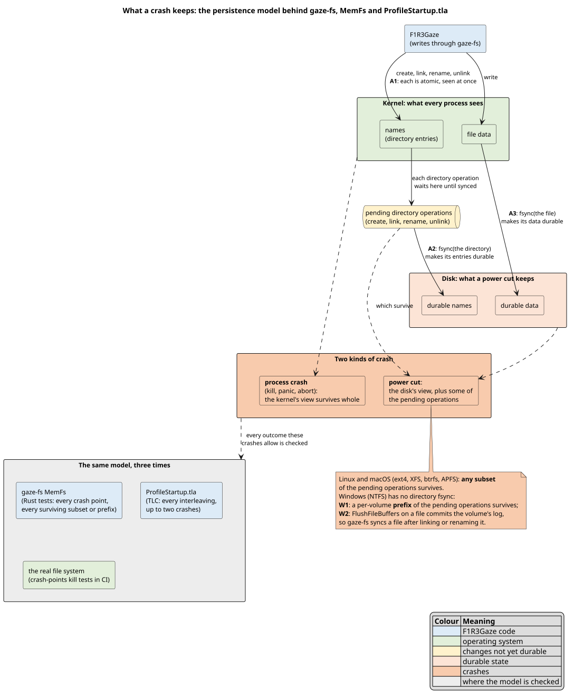

### 7.2 The writes

All writes to the profile go through the `gaze-fs` crate. A clippy lint
(`clippy.toml`, `disallowed-methods`) rejects `std::fs::{write, rename, copy}`,
`File::create`, `std::fs::{create_dir_all, create_dir}` and
`Fs::create_dir_all` elsewhere; each exception carries an `allow` that says
why.

**⟨Write atomically⟩** `write_atomic(path, bytes, perm)` replaces a file's
content:

1. Resolve `path` through symbolic links, so a link is kept and its target
   written.
2. Create a temporary file `.name.tmp-<pid>-<n>` in the same folder. It is
   created with the final mode (0600 for `Private`, the replaced file's mode
   for `Preserve`), so no one else can read it at any moment.
3. Write `bytes`, then sync the file (A3). Its content is now durable under
   the temporary name.
4. Rename it over `path` (A1). POSIX requires that a directory entry named
   `path` "shall remain visible to other threads throughout the renaming
   operation and refer either to the file referred to by new or old before
   the operation began" \[POSIX-rename\], and Linux states that it "will be
   atomically replaced" \[Linux-rename\]. Neither promises durability: that
   is step 5. On Windows, retry up to five times while another process
   holds the file open.
5. Sync the folder (A2), or on Windows the file (W2). The new name is now
   durable.

On any error, the temporary file is removed and its folder synced.

**Crash argument.**
- Before step 4, `path` still has its old content, and the temporary file
  is swept at the next start.
- After step 4, every process sees the new, already durable content.
- A power cut before step 5 keeps either the old name or the new one,
  each with whole content.

**⟨Replace for readers⟩** `replace_unsynced(path, bytes, perm)` takes steps
1, 2 and 4 of ⟨Write atomically⟩ and syncs nothing. A reader still never
sees part of the bytes, and a process that dies at any point leaves the
old content or the new, whole; a power cut may leave the old content, the
new, or what the file system kept of the new file's data. It is for a
record that any crash makes meaningless anyway: who holds the instance
lock (section 8). Its syncs would cost four fsyncs a start and buy nothing
(ledger S15, parts 2 and 3).

**⟨Publish without replacing⟩** `publish_no_replace(from, to)` gives the file
at `from` the free name `to`:

1. Link `to` to the file (`link` fails if `to` exists), then sync `to`'s
   folder. The file now has two durable names.
2. Unlink `from`, then sync `from`'s folder.

Without hard links (FAT, some network file systems), it checks that `to` is
free, then renames. The instance lock makes that check safe among F1R3Gaze
processes.

**Crash argument.** At every point the file has at least one durable name
(step 1 syncs before step 2 removes the old name), and `to` is never taken
from anyone.

**⟨Move across file systems⟩** `move_no_replace(from, to)`:

1. Try a rename. On `EXDEV`, `copy_verified`: copy into a temporary file,
   sync it, read it back, and compare it byte for byte.
2. Publish the copy without replacing.
3. Only then, unlink `from` and sync its folder.

### 7.3 The model

The start-up protocol was specified in TLA+ \[Lamport-1994\],
\[Lamport-2002\] before it was implemented: `tla/ProfileStartup.tla`.
TLC \[Yu-1999\] checks every interleaving with up to two crashes, under both
the Unix (A1–A3) and the NTFS (W1–W2) semantics.

| Invariant | Meaning |
|---|---|
| `NoLoss` | every item that existed still exists, at its old or its new name |
| `NoOverwrite` | no move replaces a file that was there |
| `CorruptKept` | a damaged file's content survives in a backup until it is repaired |
| `ValidUntouched` | a whole file is never changed |
| `PublishedComplete` | a name, once published, has its whole content |
| `MarkerImpliesComplete` | the migration marker exists only once every item has moved |
| `NeverAbsent` | a managed file that existed is never absent, after any crash |
| `RepairInPlace` | a damaged file holds its original or its repair, never only a backup |
| `ReadyIsValid` | at ready, every managed file is whole and the busy flag is gone |
| `ReadyIsDurable` | at ready, nothing is pending |
| `Termination` (liveness) | with finitely many crashes, start-up finishes |

Each defect the protocol guards against was put into the model on purpose,
and TLC found the invariant it breaks (ledger S2, S4, S6).
`scripts/storage-model.sh` runs the whole set, 29 runs in all: 6
configurations, 14 faults, 4 hazards and 5 controls. The model's files sit
in their real class folders (settings in config, the marker in data, state
files in state), because a model that shares one folder between them lets
one folder sync stand in for another (ledger S6, part 2). The model, its
constants and every run are described in [tla/README.md](tla/README.md).
Real start-ups are checked against it too: their recorded operations must
be behaviours of the model (section 15.2).

## 8. The instance lock

One F1R3Gaze at a time writes a profile (`profile/lock.rs`). Two locks are
taken, in order:

1. **The anchor,** `<data>/instance.lock`. It guards the data root, where
   two writers could damage the append-only site stores. Every process that
   writes the same data root meets here, whatever its `$XDG_RUNTIME_DIR`
   (a cron job, `su`).
2. **The runtime lock,** `<runtime>/instance.lock`. It sits in the folder
   the platform keeps for such files. On Linux it has the sticky bit, as
   the XDG specification advises for files in that folder: "Files in this
   directory MAY be subjected to periodic clean-up. To ensure that your
   files are not removed, they should have their access time timestamp
   modified at least once every 6 hours of monotonic time or the 'sticky'
   bit should be set on the file." \[XDG-BD, §3\] If a cleaner removes it
   anyway, the anchor still holds.

The lock files' folders, the data root among them, are made here at a
first start, durably: each new folder is synced in its parent before the
lock file is made inside it (section 9.3).

Both are `File::try_lock` \[Rust-lock\]: `flock` on Unix, `LockFileEx` on
Windows. The kernel releases them when the process ends, however it ends,
so a crash never leaves a stale lock. They are released in reverse order,
so a process starting at that moment never takes the anchor only to find the
runtime lock still held.

**Who holds the lock.**
- **What is recorded.** Each lock file, and an `instance.pid` beside it,
  records the holder's process id, mode (`window`, `headless`, or a wallet
  command), start time and data root. A second F1R3Gaze names the holder.
- **Why a separate file.** The `instance.pid` files exist because Windows
  forbids reading the bytes of a locked file \[MS-LockFileEx\].
- **How it is written.** Each `instance.pid` is replaced with
  `replace_unsynced` (section 7.2): a reader never sees half a record, and
  nothing is synced, since a crash ends the hold it records along with the
  process. After a power cut it may hold an old holder or garbage, which no
  one reads while the lock is free, and the next start replaces it.

**What a second F1R3Gaze does.** It meets a held lock:
- **The window, `--headless`, and the commands that change the profile**
  exit with status 1, naming the holder.
- **Commands that only read** go on, with the profile read only.

**Every command** (`main.rs`, `Command::locking`):

| Command | Lock | When another F1R3Gaze holds it |
|---|---|---|
| `f1r3gaze [URL]` (the window) | taken | exit 1, naming the holder |
| `--headless URL …` | taken | exit 1 |
| `wallet new`, `import`, `use`, `remove` | taken | exit 1 |
| `wallet list`, `balance`, `export`, `send` | taken if free | read-only; `export FILE` writes the file named, outside the profile |
| `profile backups` | taken if free | read-only |
| `profile backups prune --older-than DAYS` | taken | exit 1 |
| `trust list` | taken if free | read-only |
| `trust forget BINDING`, `trust forget --all` | taken | exit 1 |
| `paths` | none | it only prints where the folders are, touching no file |
| `profile check` | none | it runs start-up reading only (section 9.7), and exits 1 when a start would change something, as `fsck -n` does when it finds work |

Every command but `paths` and `profile check` runs the whole start-up of
section 9, the move of an old profile included, before it does its work.

A lock that the file system cannot provide is reported, and the other lock
guards alone. When neither can be taken, or the anchor cannot be created (a
read-only file system, no permission), the profile can only be read.

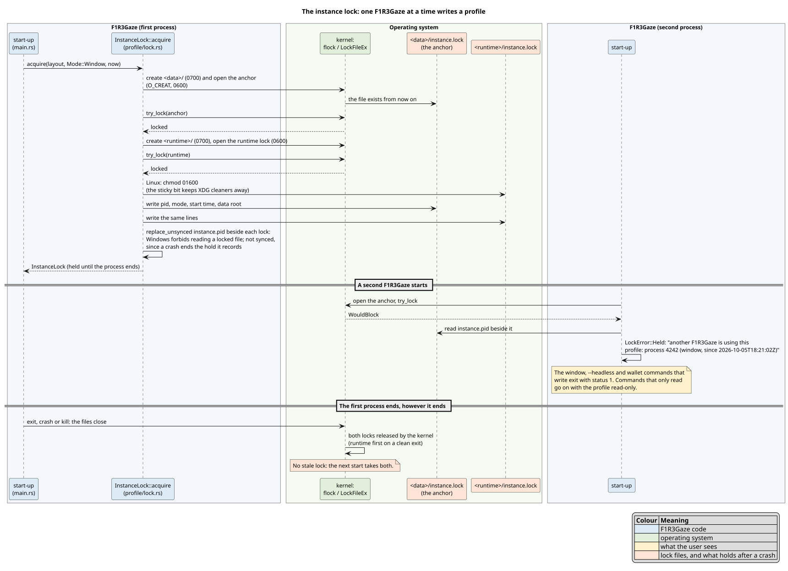

## 9. Start-up

Start-up brings the profile to a known state before the window opens: every
folder exists, every managed file is whole, and nothing is pending. It never
loses a byte to do so (`profile/migrate.rs` for steps 3, 4 and 7,
`profile/reconcile.rs` for steps 5 and 6).

### 9.1 The order

1. **Locate** the five roots (section 4.2).
2. **Lock** the profile (section 8). The lock files' folders, the data root
   among them, are created durably (section 9.3).
3. **Begin**: run the barrier if the last start did not finish (section
   9.2), then set the busy flag.
4. **Migrate** an old single-folder profile, or, for a profile with nothing
   to migrate, create the marker `data/layout.json`
   (`{"layout":1,"created":"<UTC time>"}`). A marker already there is left
   to step 6.
5. **Prepare** the folders and sweep dead writers' temporary files (section
   9.3).
6. **Reconcile** each managed file (sections 9.4 and 9.5), then report the
   wallet keys (section 9.6).
7. **Finish**: remove the busy flag and sync the data folder. Nothing is
   pending any more.
8. **Load** the layered settings (section 4.3).
9. **Open** the engine, and show what start-up reported.

Steps 3 to 7 are one function, `profile::start_up`, the only copy of their
order: `Profile::open` runs it after the lock, `profile check` runs it
reading only, and the trace checks (section 15.2) run it on their file
systems. Step 8 follows in `Profile::open`.

A read-only session (section 9.7) skips steps 3, 4 and 7, and steps 5 and 6
only report. A session that was going to write becomes read-only on the
way when:
- the marker says a newer F1R3Gaze set the profile up: before step 3, so
  that no busy flag is left in its profile;
- the busy flag cannot be written (step 3);
- the migration stops, waits, or finds a newer profile (step 4): the busy
  flag then stays, so the next start runs the barrier;
- the folders cannot be made (step 5), the busy flag staying too.

Each is reported, and the window shows it.

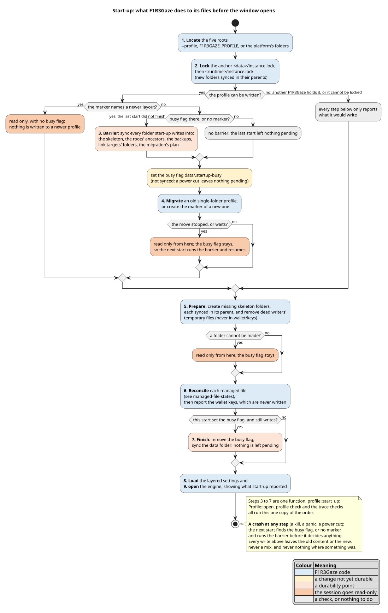

### 9.2 The busy flag and the barrier

**The problem.** A start that dies leaves directory operations pending
(section 7.1). The next start sees those names, because every process does,
but they are not durable. If it decides from them, for example "this item
already moved, so remove its old name", a power cut can then take the new
name, after the old one is gone. The model shows that two crashes lose an
item this way (ledger S2).

**The barrier** syncs every folder start-up writes into. Afterwards
everything the dead start did is durable, and decisions are safe. It costs
one fsync per folder, so it runs only when it is needed:

```math
\text{barrier} \iff F \lor \lnot M
```

where $`F`$ means the busy flag `data/.startup-busy` exists and $`M`$
means the marker `data/layout.json` exists.

- **The flag.** Step 3 creates it, without a sync, before anything is
  written. Step 7 removes it and syncs. A process crash at any point in
  between leaves it, so the next start runs the barrier. A power cut leaves
  nothing pending, so the start after one needs no barrier, whether or not
  the flag survived.
- **The marker.** A start creates the data root before it can set the
  flag, which lives inside it. A start that dies while making the data
  root leaves its folders' names pending and no flag. A profile without a
  marker is either new or not yet migrated, so nothing about it is known to
  be durable (ledger S6, part 2).

**The folders it syncs** are those that exist among:
- the skeleton (section 9.3);
- every ancestor of every root, up to the file system's root, because a
  start may have created any of them;
- every folder under each root's `backups/`, where a repair that did not
  finish may have left its copy's name pending;
- the folder of each managed file's link target, where writes through the
  link go;
- `data/.migration/` and, while its plan can be read, every folder the plan
  changes.

A folder above the roots that cannot be opened is skipped: no start could
have created anything in it.

**The cost.** A start after one that finished does exactly three writing
operations: it creates the flag, removes it, and syncs the data folder.
That is one directory fsync. The tests check this exact list on every
outcome of the matrix in section 9.5.

### 9.3 The folders

**The skeleton** is every folder start-up creates: `config/`,
`config/themes/`, `data/`, `data/wallet/{,keys,exports}/`,
`data/{permissions,site-data,trust,replay-logs}/`, `state/`, `cache/`,
`cache/content/` and `runtime/`. The `backups/` folders appear only when
something is backed up.

**⟨Create folders durably⟩** `gaze_fs::create_dir_durably(dir)`:
1. Walk up from `dir` to its nearest ancestor that exists. A link to a
   folder counts as one.
2. If nothing is missing, stop. A steady start creates and syncs nothing.
3. Otherwise, create the missing folders (0700), then sync the parent of
   each, oldest first. Each new name is durable before anything is
   published inside it.

**⟨Sweep⟩** A temporary file named `.<name>.tmp-<pid>-<n>` is a write that
never published. If `<pid>` is not this process, the write is dead and its
original is intact, so the file is removed and its folder synced. The swept
folders are `config/`, `config/themes/`, `data/`, `data/wallet/`,
`data/wallet/exports/`, `data/permissions/`, `data/site-data/`,
`data/trust/`, `data/replay-logs/`, `state/` and `runtime/`. If
`settings.toml` is a link, the link target's folder is swept too, but only
for `.settings.toml.tmp-*` names.

Never swept:
- **`data/wallet/keys/`.** The file keystore syncs its temporary file
  before renaming it, so after a crash in between, the temporary file holds
  the only copy of a new key (section 9.6).
- **`cache/`.** gaze-blob uses its own names, and the cache can be fetched
  again.
- **`backups/`, `data/.migration/` and the old profile.**

### 9.4 Reconciling a file

**⟨Reconcile a file⟩** For each managed file `m`, in the order of the table
in section 9.5:

1. **Read** it.
   - Not found, but a link is there: a link to nothing. Report it, leave it
     as it is, and save nothing to it this session (*block* it).
   - Not found: go to step 4.
   - Any other error: report it as *unreadable*, and block it. It is never
     written.
2. **Check** its content.
   - *Valid*: done, and nothing is written. This is why a second start is
     silent.
   - *Newer*: a newer F1R3Gaze wrote it, in a format this one does not
     know. Report a Notice, and block it.
   - *Damaged*: go to step 3.
3. **Repair** it.
   1. **Keep a durable copy:** `Backups::copy_into` creates the copy in
      this start's backup session, syncs it, and syncs its folder. If the
      copy cannot be made, report it as *unrepaired* and block the file.
      Nothing is repaired without a copy.
   2. **Apply the fix.** Either write its repair over it with
      `write_atomic` (section 7.2), or, for `wallet-active` only, remove it
      and sync its folder.
   3. **Report** the repair, naming the backup.
4. **Missing.** If the file has a default, create it with `write_new`,
   which never replaces anything. If something appeared meanwhile, go back
   to step 1, once. A file with no default is left absent for its owner to
   create.

**Crash argument.**
- *During step 3.1:* the file still holds its original. A leftover copy is
  never relied on. The next start finds the file still damaged and makes a
  new, complete copy.
- *During step 3.2, before the rename:* the file holds its original, and a
  durable copy exists.
- *From the rename on:* the file holds its whole repair, which was synced
  before the rename.

So a damaged file is never absent, and it holds its original or its repair,
never only a backup. These are the model's `NeverAbsent`, `RepairInPlace`
and `CorruptKept`. They are checked at every crash point by
`a_repaired_file_is_never_absent_at_any_crash`.

**A race that remains.** If you edit a file by hand between step 1 and the
rename, `write_atomic` replaces your edit, and the backup holds what step 1
read. The instance lock cannot prevent this, because your editor does not
take it. The window is the time between one read and one rename,
microseconds long.

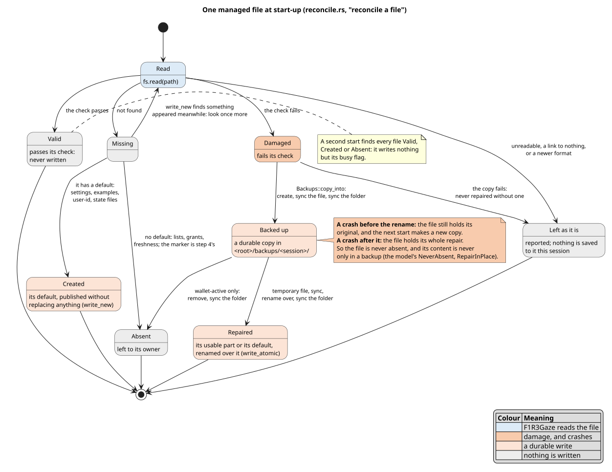

### 9.5 The managed files

| File | Valid when | Missing | Damaged: repair | Damaged: report | Unreadable |
|---|---|---|---|---|---|
| `config/settings.toml` | UTF-8 TOML (bad values are diagnostics, not damage; empty is valid) | the template | the template; mode kept | Warning | Warning; theme changes apply to the session only |
| `config/settings.toml.example` | the template, byte for byte | written | rewritten | Quiet | Warning |
| `config/themes/default-{dark,light}.css.example` | the built-in text, byte for byte | written | rewritten | Quiet | Warning |
| `data/layout.json` | a marker of layout 1 | step 4's | `{"layout":1,"repaired":true}` | Warning | Warning |
| `data/user-id` | 1 to 256 bytes of UTF-8 with no white space inside | a new id | a new id | **Alert**: sites see a new user | Warning; a new id in memory |
| `data/wallet/wallets.tsv` | every line usable, and (file keystore) every wallet with a key file listed | absent; created if keys can be listed again | the usable lines, then wallets listed again | Warning | Warning; the wallets cannot change |
| `data/wallet/wallet-active` | an address | absent | removed: no wallet pays until one is chosen | Warning | Warning; the wallets cannot change |
| `data/permissions/grants.tsv` | every line usable | absent | the usable lines | Warning | Warning; decisions not saved |
| `data/site-data/origins.json` | a JSON array of strings | absent | the names that can be read | Warning | Warning; the index is not saved |
| `data/trust/freshness.tsv` | every line usable | absent | the usable lines | **Alert**: a stale answer could be accepted once | **Alert**; records kept in memory only |
| `state/{window,session,history}.json` | its format, version at most this build's | the default | the default | Warning | Warning; not saved |

- **Usable lines** are kept byte for byte, line endings included.
- **Modes.** New files are 0600. A rewrite keeps the mode of
  `settings.toml` and the examples, which you may have opened up. Every
  other rewrite is 0600.
- **Not managed:** the cache, your own theme files, backups,
  `wallet/exports/`, `replay-logs/`, `instance.lock` and `instance.pid`.
  Site stores (`site-data/*.gzs`) are repaired when they open, with the
  same copy first (section 11).

**The tests** run the rule of this table on every state of every file.
There are five states: missing, valid, damaged, empty, and unreadable,
where a folder stands at the file's path. The combinations are:
- exhaustive within each root: $`5^4 + 5^6 + 5^3 = 16\,375`$ profiles, the
  marker left out of the data root;
- pairwise across roots, the marker included: $`61 \cdot 25 = 1\,525`$
  profiles.

For each profile, the tests check four things:
1. the file holds its repair or its default, and the backup holds the
   original byte for byte;
2. every byte present before is still at its path or in a backup;
3. nothing is left pending;
4. a second start writes only its busy flag.

### 9.6 Wallet keys

With the file keystore, a wallet's key is in
`data/wallet/keys/<blake2b("wallet:" + address)>.key`. The address is
derived from the key itself, so a key file proves which wallet it holds.
Start-up only reads key files. It never writes, copies or removes them.

- **Listing wallets again.** Each key file of a wallet that the list does
  not name is added to the list with the label "(recovered)", in the order
  of the key files' names. This also happens when the list is missing or
  damaged. Recovery never chooses the wallet that pays.
- **Reports:**

  | Finding | Report |
  |---|---|
  | a key file that cannot be read as a key | **Alert**, naming the listed wallet and its label |
  | a key file that cannot be read at all | **Alert** |
  | a listed wallet with no key file | Warning: it cannot pay |
  | an unfinished save holding a key's only copy | Warning, with the command that imports it (`f1r3gaze wallet import <path>`) |

  An unfinished save is a `<hash>.tmp` from an older F1R3Gaze, or a
  `.<hash>.key.tmp-*` from this one, while `<hash>.key` itself is missing.
- **The operating system's keystore** (macOS and Windows, built with
  `os-keyring`). Key files mean nothing there, and none of this runs.

### 9.7 Read-only sessions

A session is read-only when another F1R3Gaze holds the lock, the file
system cannot be written, a migration could not finish, a newer F1R3Gaze
set the profile up, or the profile's folders cannot be made.
`f1r3gaze profile check` runs the same way, with no lock at all.
- **Every check still runs.** What would be created, backed up, repaired
  or swept is reported with "would", and so is something in the way of a
  folder, which would stop a start from writing.
- **Nothing is written.** The only operations are reads; the lock's files
  are the one exception, written when this session took the lock. The
  tests check that no operation that writes appears in the trace.
- **A newer profile gets no busy flag.** `Profile::open` reads the marker
  first (`migrate::newer_layout`), and goes read-only before step 3.
- **Every file is blocked** for the session, which says why: state files
  are read but not saved, a theme chosen applies to this session only, the
  wallets and permission decisions are not changed, and the freshness
  records are enforced but not saved.
- **Site data and the content cache.** No site store is opened (a store's
  first write would change it). The content cache is read, and verified as
  always, but nothing is stored, removed or evicted: a page fetched again
  is served from memory.

The session's lock policy (section 8) decides the first of these; start-up
(`profile::start_up`) the others, in the order of section 9.1.

## 10. Moving an old profile

Before this layout, F1R3Gaze kept everything in one folder, the *legacy
profile*: `~/.local/share/f1r3gaze` on Linux,
`~/Library/Application Support/F1R3Gaze` on macOS, `%APPDATA%\F1R3Gaze` on
Windows. Start-up's step 4 moves it into the five roots, once
(`profile/migrate.rs`). Nothing is ever overwritten, and the old folder is
left with a note, `MIGRATED.txt`, that says where each file went.

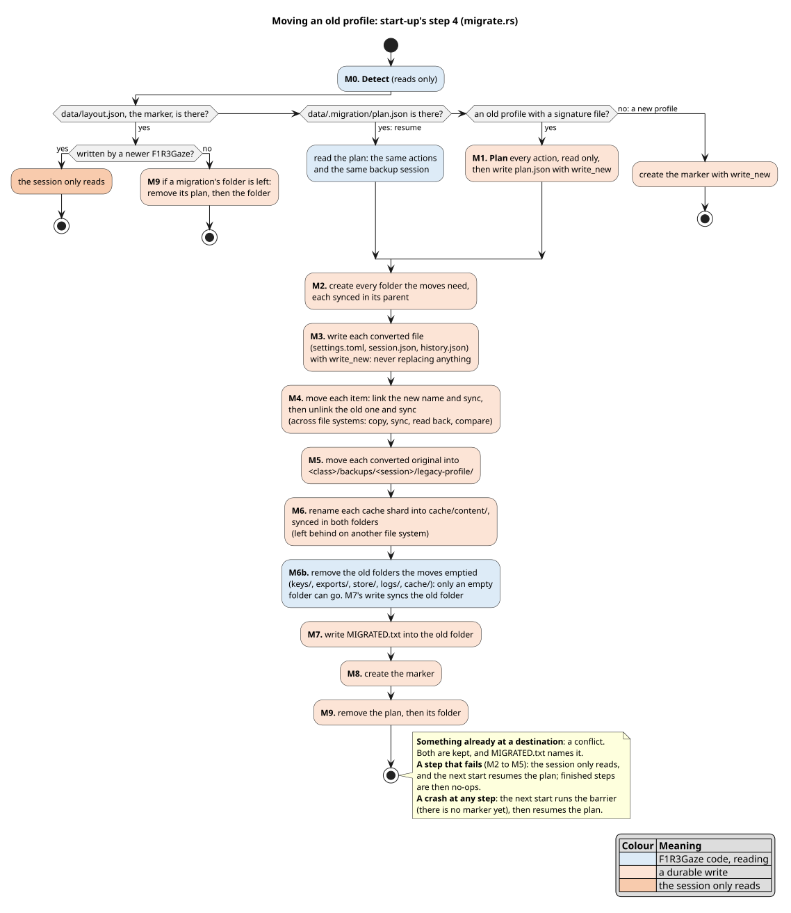

### 10.1 Detection (M0)

Step 4 reads only, and decides in this order:
1. **A marker** `data/layout.json` is there. If a newer F1R3Gaze wrote it,
   the session only reads. Otherwise the profile is current, and a
   migration's folder still there is cleaned up (M9).
2. **A plan** `data/.migration/plan.json` is there: a migration began and
   did not finish. It is resumed.
3. **An old profile**: the first legacy folder that is a folder (a link to
   one counts), has no `MIGRATED.txt`, and holds at least one of
   `settings.conf`, `workspace.json`, `user-id`, `wallets.tsv`,
   `grants.tsv`, `wallet-active` or `palette.css`. Folder names alone never
   count. A second old profile is reported, not moved, and so is a folder
   that holds wallet keys and nothing else F1R3Gaze recognises.
4. **Otherwise** the profile is new: its marker is made
   (`{"layout":1,"created":"…"}`), with `write_new`.

### 10.2 The plan (M1)

The migration is decided once, written to `data/.migration/plan.json`
(owner-only, durable before anything moves), and then replayed until it is
done. A crash at any step resumes the same plan, so a resumed migration
uses the same backup session and makes the same decisions. The plan holds:

| Field | Meaning |
|---|---|
| `format` | 1. A larger one is never replayed: the session only reads |
| `legacy` | the old folder |
| `roots` | the config, data, state and cache roots it was planned for. A start that sees others does not replay it |
| `session` | the backup session the originals go into: the start's UTC time, `.n` if that name is taken in any class's backups |
| `planned` | when, in UTC |
| `theme`, `settings`, `notes` | what the conversion did, by name only, for `MIGRATED.txt` |
| `actions` | in this order: every `dir`, every `write`, every `move` of an item, every `move` of an original, every `move-cache-shard`, every `leave` |

What each old entry becomes (links are not followed):

| Old entry | Action |
|---|---|
| `settings.conf` | converted into `config/settings.toml` (section 10.4); the original kept in `config/backups/<session>/legacy-profile/` |
| `workspace.json` | split into `state/session.json` and `state/history.json`; its theme folded into `settings.toml` (section 10.5); the original kept in `state/backups/<session>/legacy-profile/` |
| `palette.css` | `config/themes/custom.css` |
| `user-id`, `wallets.tsv`, `wallet-active` | `data/user-id`, `data/wallet/` |
| `grants.tsv` | `data/permissions/` |
| `keys/<64 hex>.key`, `keys/<64 hex>.tmp` | `data/wallet/keys/` |
| `exports/*` | `data/wallet/exports/` |
| `store/origins.json`, `store/<64 hex>.gzs` | `data/site-data/` |
| `logs/*.gzlog` | `data/replay-logs/` |
| `cache/<2 hex>/` | `cache/content/`, renamed whole |
| a link to an absolute path | moved as a link |
| a relative link, a linked folder, anything else | left, with the reason |

A portable root (`--profile DIR`) is migrated in place: its own `config/`,
`data/`, `state/` and `runtime/` folders are skipped, and `cache/<2 hex>/`
moves into `cache/content/` beside it.

### 10.3 The replay (M2–M9)

| Step | Does | Durable before the next step | After a crash here |
|---|---|---|---|
| M2 | every `dir`, created durably | each new folder's name | done again: nothing to do |
| M3 | every `write` | the converted file, published without replacing | the same bytes are found: done |
| M4 | every item `move` | the new name, before the old one goes | one of the five cases below |
| M5 | every original `move`, into the plan's session | the same | the same |
| M6 | every cache shard | the rename, in both folders | the shard is found moved |
| M6b | every old folder the moves emptied (`keys/`, `exports/`, `store/`, `logs/`, `cache/`), removed | nothing more: M7's write syncs the old folder | the folder is found gone, or removed now |
| M7 | `MIGRATED.txt`, written atomically into the old folder | the note | it is written again, with the same text |
| M8 | the marker, with `write_new` | the marker | the profile is current; only M9 remains |
| M9 | the plan and its folder removed | each removal | the next start finishes it |

`MIGRATED.txt` comes before the marker, so a crash never leaves an emptied
old folder without its note. The plan is durable before M2, so a power cut
can never make a second plan with another backup session.

**⟨Remove the emptied folders⟩ (M6b).** The folders are the parents of
every moved item and cache shard below the old folder, deepest first. Each
is removed only if it is empty (`rmdir`), so nothing that was not moved
can go with it: a folder that still holds something stays, and the note
lists what is in it. One that is gone already, after a crash, is skipped.
Every item in it was moved by then, its new name durable and its old name's
removal synced (⟨Move a file⟩), so the removal loses nothing whatever a
power cut keeps. The removals need no sync of their own: M7 next writes the
note into the old folder atomically, which syncs it (on Windows, the
rename's flush commits them, W2); a start that stops before M7 leaves its
busy flag, and the next start's barrier syncs every folder of the plan,
the old folder among them. Until ledger S14 the folders were left, empty,
though the note says the folder holds only it; the CI's migration check
found them.

Before each `write` and `move`, the destination's own temporary files of
dead writers are removed (`.<name>.tmp-<pid>-<n>`, the model's sweep of
`TmpOf(a)`).

**⟨Write a converted file⟩** at `dst`:
1. Read `dst`. If it holds the converted text, the write is done.
   If it holds anything else, it is a **conflict**: both are kept.
2. If nothing is there, `write_new`: a temporary file, synced, read back,
   and published without replacing anything.
3. If something appeared meanwhile, go back to step 1, once.

**⟨Move a file⟩** from `src` to `dst`:

| `src` | `dst` | Then |
|---|---|---|
| absent | present | done, by an earlier start |
| absent | absent | missing: noted |
| present | absent | **move**: `move_no_replace` (a link: checked free, then renamed). On another file system, copied, synced, read back and compared, published, and only then is `src` removed |
| present | the same file | `src` removed: an earlier start published it and died. The barrier made `dst` durable first |
| present | something else | a **conflict**: both are kept |

If `dst` appears between the look and the move, it is looked at once more,
and is a conflict or the same file. A moved file's mode only ever tightens,
to at most 0600. A link's mode is never changed, since that would change
its target's.

**⟨Move a cache shard⟩** A shard is renamed whole. Across file systems, it
and every later shard are left, because the cache can be fetched again.
The cache never fails a migration.

**Failure.** If any `dir`, `write` or `move` fails, the replay stops. The
session only reads, and an Alert says where it stopped and why. The next
start resumes the plan, and every finished action is then a no-op.

### 10.4 `settings.conf` into `settings.toml`

The old file's lines were `key = value`. The old parser
(`LegacySettings::parse`, kept unchanged in `migrate/convert.rs`) is the
reference: a converted file must give the same settings it gave.

1. Start from the template of section 6.1.
2. For each setting, in the template's order, that the old file **sets**
   (a line that, trimmed, is not a comment, has an `=`, and whose trimmed
   key is an old key), write the value the old parser gave it with
   `edit_setting`, just after its table's header.

| Old key | Setting |
|---|---|
| `home`, `https_only` | `[browsing]` |
| `observers`, `validator`, `shard_id`, `quorum`, `phlo_price` | `[shard]` |
| `mirrors`, `cache_bytes` | `[content]` |
| `store_quota` | `[site_data]` |
| `embers_api`, `max_fee` | `[wallet]` |
| `restore_sidebar` | `[appearance]` |

**How values are written.**
- Strings are written as strings, and comma-separated lists as arrays.
- An empty `embers_api` is written as `""`, which unsets it.
- A number too large for TOML's 64-bit integers is written as its digits in
  a string. The setting then has a diagnostic and its default, instead of
  making the whole file invalid.
- A value the new file refuses (`home = example.com`, `quorum = 0`) is
  written as it was. The setting keeps its default, and `MIGRATED.txt` names
  it, never its value.

**Why the old templates convert byte for byte.** Every line of the three
old templates is a comment, so none sets anything, and the result is the
template itself. The three are commits `7853bc2` (298 bytes), `f6ee26a`
(433 bytes, the one on this machine) and `e7ff471` (528 bytes).

**The property.** 2,000 old files generated from seeds with SplitMix64
\[Steele-2014\] mix comments, lines without `=`, misspellings, duplicates,
every old key with good and bad values, CRLF and control characters. For
each file $`t`$, let $`L`$ be what the old parser gives, $`N`$ what the
converted file gives, $`S(t)`$ the settings it sets (decided by the test
from the old parser's rules), and $`A(k, L)`$ whether the new schema
accepts $`L`$'s value of $`k`$ (decided by the test's own checker). Then
for every setting $`k`$:

```math
N_k = \begin{cases}
L_k & \text{if } k \in S(t) \text{ and } A(k, L), \text{ with no diagnostic,}\\
\text{default}_k & \text{if } k \in S(t) \text{ and not } A(k, L), \text{ with exactly one,}\\
\text{default}_k & \text{if } k \notin S(t), \text{ with none.}
\end{cases}
```

Both of the first two cases occur more than 1,000 times, so the property is
not vacuous.

### 10.5 The theme

`workspace.json` held the theme. Dark was the default, so a dark theme may
never have been chosen.

| Old theme | Becomes |
|---|---|
| `"dark"`, unknown, or the file unreadable | `system`, the new default: nothing written, and a Notice |
| `"light"` | `theme = "default-light"` |
| `"custom"`, with `palette.css` movable to `themes/custom.css` | `theme = "custom"` |
| `"custom"`, `palette.css` missing or `custom.css` different | `system`, and a note |

### 10.6 `MIGRATED.txt`

The note names folders and files only, never an address, a setting's
value, a tab's title or the history:

```text
F1R3Gaze moved this profile on 2026-10-05 at 18:21:02 UTC.

F1R3Gaze now keeps its files in four places:
  config  /home/u/.config/f1r3fly-io/f1r3gaze
  data    /home/u/.local/share/f1r3fly-io/f1r3gaze
  state   /home/u/.local/state/f1r3fly-io/f1r3gaze
  cache   /home/u/.cache/f1r3fly-io/f1r3gaze

Moved
  user-id                 data/user-id
Converted
  settings.conf           config/settings.toml (no settings were set: it is the new template)
                          the original is kept in config/backups/2026-10-05T18-21-02Z/legacy-profile/settings.conf
  workspace.json          state/session.json (1 tab) and state/history.json (4 visits)
                          the original is kept in state/backups/2026-10-05T18-21-02Z/legacy-profile/workspace.json
  Theme: your theme was "dark", the old default, so F1R3Gaze now follows your system's light or
  dark setting. To keep it dark, choose Dark in Appearance, or set theme = "default-dark"
  under [appearance] in settings.toml.

An older F1R3Gaze started now finds this folder empty: its settings, wallets and keys are in the folders above.
```

Its "Not moved" part names each conflict, and its "Left here" part comes
from a fresh listing of the old folder and its item folders. Each entry
there carries its reason, including names that are not UTF-8, which the
plan cannot hold.

### 10.7 What is tested

| Test | What it shows |
|---|---|
| `the_users_real_profile_shape` | this machine's old profile: the `f6ee26a` template, an id, a dark workspace with one tab and four visits, files 0644. The id is kept byte for byte, the old folder holds only the note, there are only Notices, and a second start writes only its busy flag |
| `a_full_legacy_profile_moves_every_item` | every row of the table in 10.2, with each file 0600 afterwards |
| `a_portable_root_is_migrated_in_place` | the portable layout |
| `conflicts_keep_both`, `a_file_that_appears_meanwhile_is_never_replaced` | nothing is overwritten, even by a file another program creates in the gap |
| `moves_across_file_systems`, `the_cache_is_left_behind_across_devices`, `the_cache_moves_on_one_device` | the copy path, and the cache's rules |
| `symlinks_are_moved_not_followed` | links |
| `a_failed_migration_opens_read_only_and_resumes`, `a_resumed_migration_keeps_its_backup_folder`, `a_plan_from_other_roots_is_not_replayed`, `a_newer_plan_is_not_replayed`, `a_newer_marker_opens_read_only` | failures and resumption |
| `detection_needs_a_signature`, `a_profile_is_migrated_once`, `a_fresh_profile_never_migrates_later` | detection |
| `migrated_txt_never_holds_urls`, `moved_files_are_private`, `workspace_splits_for_each_theme` | the note, the modes, the theme |
| `a_crash_at_any_step_resumes_and_loses_nothing` | every crash point and power cut, on one file system and across two, under POSIX and NTFS rules (6,573 states). At each state the tests check `NoLoss`, `NoOverwrite`, `PublishedComplete` and `MarkerImpliesComplete`. The start after the crash must end where a start without crashes ends, with nothing pending |
| `two_crashes_never_lose_an_item` | the model's shape (one move on one file system, one onto another, one conversion), through two crashes: 238,314 states |

**A rehearsal on a copy** (ledger S16). This machine's old profile was
copied, and the copy moved by the release binary as the real one would be:
a start with no `--profile`, with HOME pointing to the copy's folder and
the XDG `*_HOME` variables unset, as in the user's session, after `paths`
had named only that folder. `profile check` wrote nothing and asked for the
move; the first start moved the id byte for byte, wrote the template as
`settings.toml`, kept both originals in `backups/`, split the workspace
into its one tab and four visits, and left only the note above; the window
then opened at 1280×800 on the moved session (in a network namespace, so
its page did not load), and a later start wrote only the lock's files and
the busy flag. The original folder's files, sizes, modes, times and inodes
were the same at the end as at the start.

## 11. Backups

A backup goes to `<class root>/backups/<UTC time>[.n]/<path below the root>`
(`profile/backup.rs`).
- **One folder per start.** Each start has its own *session* folder, named
  by when it began, as `YYYY-MM-DDTHH-MM-SSZ` in UTC (computed with
  Hinnant's civil-date algorithms \[Hinnant\]), with no `:`, so the name is
  valid on Windows. It is claimed with an exclusive `create_dir`, so two
  starts never share one; a second start within the same second gets `.1`.
- **No backup replaces anything.** Within a session, a file keeps its path
  below the root, with `.n` added if that name is taken.
- **Durable before the original changes.** Every new folder is made durable
  by syncing its parent. A backup is synced before the original is touched.

**Two kinds of backup.**
- **A copy**, owner-only and synced, keeps the original while the file is
  repaired in place: every damaged managed file at start-up (section 9.4),
  and a site's store when it opens. The file is never absent, and its
  content is never only in a backup.
- **A move** keeps exactly the original's bytes and mode. Start-up no longer
  uses it: moving a damaged file away and then writing its repair leaves
  the file absent in between (the model's fault `move-then-write`).

**Pruning.**
- **No automatic deletion.** Backups are never pruned automatically.
  `f1r3gaze profile backups` lists them, with their sizes.
  `f1r3gaze profile backups prune --older-than DAYS` removes the sessions
  that began more than `DAYS` days ago.
- **Clearing history clears its backups.** "Clear history" also removes
  every backup of `history.json` (and of an old profile's `workspace.json`,
  which held it too), because clearing history means all of it.

## 12. Following the system's colour scheme

`theme = "system"`, the default, follows the operating system's light or dark
preference (`system_theme.rs`).
- **macOS and Windows** report it through winit.
- **Linux** reports nothing through winit, so F1R3Gaze reads the XDG desktop
  portal's `org.freedesktop.appearance` `color-scheme` setting \[Portal\],
  by running `dbus-send` (a fixed argument list, no shell):

  ```text
  dbus-send --session --print-reply=literal --reply-timeout=250
    --dest=org.freedesktop.portal.Desktop /org/freedesktop/portal/desktop
    org.freedesktop.portal.Settings.ReadOne
    string:org.freedesktop.appearance string:color-scheme
  ```

| Answer | Meaning |
|---|---|
| `variant uint32 0` | no preference: dark |
| `variant uint32 1` | dark |
| `variant uint32 2` | light |
| any other value | no preference: "Unknown values should be treated as 0 (no preference)." \[Portal\] |
| `…Error.UnknownMethod` | a portal older than `ReadOne` (added in version 2 of the interface, in xdg-desktop-portal 1.17.1): ask again with the deprecated `Read`, whose answer has one more `variant` |
| `…portal.Error.NotFound` | the portal has no such setting: no preference |
| no bus, no portal, no answer within 1 s | unknown: dark until an answer comes |
| `dbus-send` is not installed | unknown, and no query is made again this session |

**How the queries run.**
- **One at a time, off the main thread.** Queries run one at a time on the
  `gaze-system-theme` thread. Each is killed and reaped after one second.
- **When asked.** The window asks again when it gains the focus, at most
  every two seconds. At start-up the main thread waits at most 100 ms for
  the first answer, before the window exists.
- **A missed answer changes nothing.** A query that gets no answer keeps the
  preference already known.

**How the window follows it** (`chrome.rs`, `application.rs`).
- **macOS and Windows.** Before the first frame, the window reports
  winit's `system_theme()`; afterwards, each `ThemeChanged`.
- **Linux.** The portal's first answer is waited for at start-up as above;
  later answers, and those asked for when the window gains the focus, wake
  the window.
- **What changes.** On a new preference the chosen theme is resolved again
  (`theme::resolve`), and the window is repainted only if the colours
  changed: with System, or a theme file that fell back to the preferred
  scheme. Dark, Light and a usable theme file ignore the preference.

`F1R3GAZE_SYSTEM_THEME=dark|light|none` fixes the preference, for tests; the
window then ignores what the window system reports. Any other value is
reported as a warning, and the preference is read as usual. The snapshot
harness instead answers the portal's question itself, with a fake
`dbus-send` ([`docs/ui/README.md`](../ui/README.md), section 12.2).

**What the window does with the scheme** (ledger S12, part 3; chrome
ledger L13). The scheme shown goes beyond the chrome's own colours:

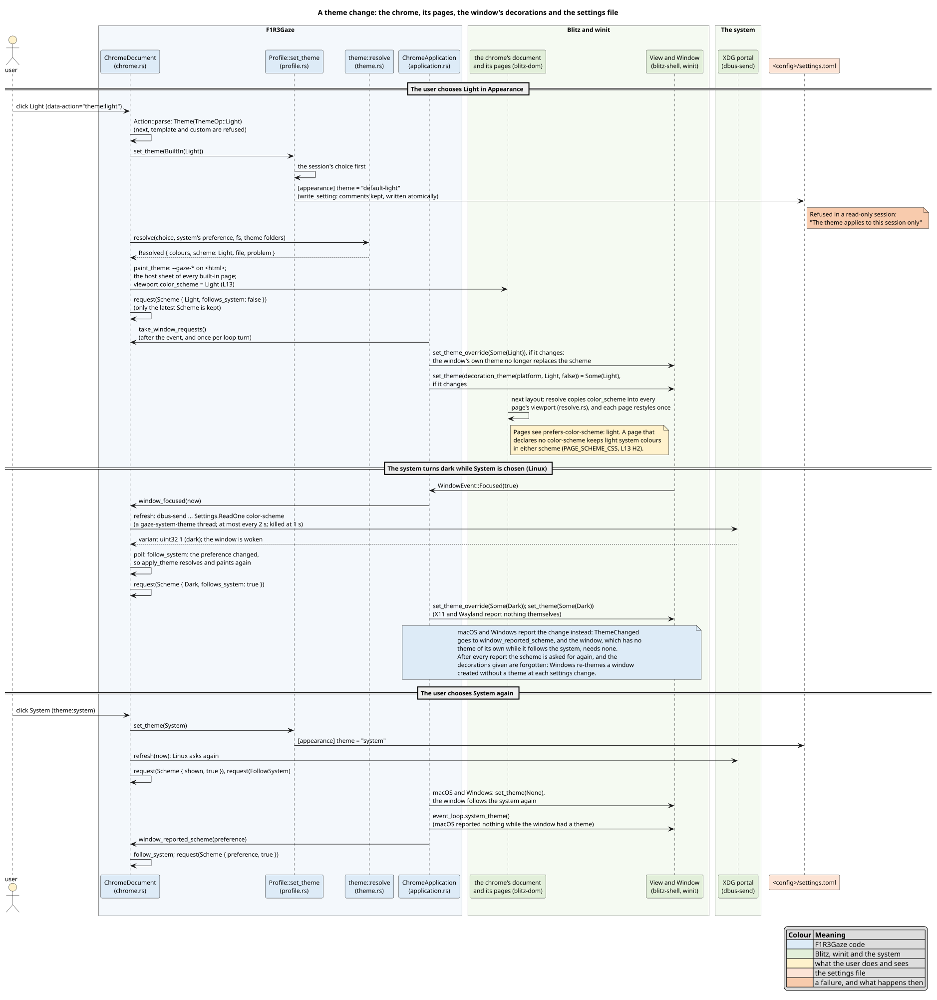

- **Pages.** A page's `prefers-color-scheme` is the scheme shown, as in
  Chrome and Firefox. A page that declares no colour scheme keeps light
  system colours (`mark`, `dialog`), as it would in those browsers
  ([`docs/ui/README.md`](../ui/README.md), section 3.6).
- **The window's decorations.** While the window follows the system, macOS
  and Windows are left to do it themselves (the window has no theme of its
  own, so it goes on reporting the system's changes); otherwise, and always
  on X11 and Wayland, the decorations are given the scheme shown.
- **Choosing System again** asks the system again: the portal on Linux (at
  most every 2 s), and `system_theme()` on macOS, which reports nothing
  while a window has a theme of its own.
- **Windows** re-applies the system's theme to the window at each settings
  change even while an explicit choice is shown; F1R3Gaze sets the scheme
  shown back after each report.
- **The Appearance panel says what it follows.** Under the System, Dark and
  Light control, with System chosen, one of: "Follows your system, which
  prefers dark." (or light), "Your system states no preference, so the dark
  scheme is used.", or "Your system's preference could not be read, so the
  dark scheme is used."

## 13. The window

`state/window.json` keeps the window's size and place, whether it was
maximized or full screen, the monitor it was on, and the page zoom
(`window_state.rs`).

**Units.** Window systems give positions in different units:
- **Windows and X11** use physical pixels, one space across every monitor.
- **macOS** uses points, which winit converts to physical pixels with the
  window's own scale; that scale differs between monitors, so on macOS
  positions are kept in points.
- **Wayland** gives no positions: the compositor places windows.

*Desktop units* are points on macOS and physical pixels elsewhere. For a
monitor $`M`$, let $`\sigma(M)`$ be the desktop units per logical pixel:
1 on macOS, $`M`$'s scale factor elsewhere.

**Restoring.** With the window $`W`$ and a monitor $`M`$ as rectangles in
desktop units, $`W`$ is visible on $`M`$ when both

```math
\bigl|[W_x, W_x + W_w] \cap [M_x, M_x + M_w]\bigr| \;\ge\; \min\bigl(W_w,\; 96\,\sigma(M)\bigr)
```

```math
M_y - 16\,\sigma(M) \;\le\; W_y \;\le\; M_y + M_h - 48\,\sigma(M)
```

hold. The first keeps a grabbable part of the window over the monitor; the
second keeps its title bar reachable.
- **Where the window goes.** The saved place is used only if $`W`$ is
  visible on some monitor. Otherwise the window is centred on the monitor
  it was on, else on the primary one.
- **How a monitor is found.** By macOS display UUID, then by name (of
  several with one name, the one at the same origin), then by origin, then
  by size.
- **Size and zoom.** The size shrinks to fit that monitor. Where no monitor
  bounds it (none is listed; Wayland, below) it is kept between
  $`320 \times 240`$ and $`8192 \times 8192`$ logical pixels: a damaged
  file's huge size would otherwise reach winit-x11, which converts it to
  X11's 16-bit sizes with an `unwrap`. The zoom is kept within
  $`[0.25, 5]`$, to hundredths.
- **Full screen** returns on the saved monitor, else on the current one.

**Following the window.**
- **What is ignored.** A minimized window is ignored; Windows reports one
  at $`(-32000, -32000)`$. So is a size that is not a positive number.
- **The normal size and place** change only while the window is neither
  maximized nor full screen, so leaving either restores them.
- **When it is saved.** 500 ms after the last change, and during a long
  drag at least every 3 s.

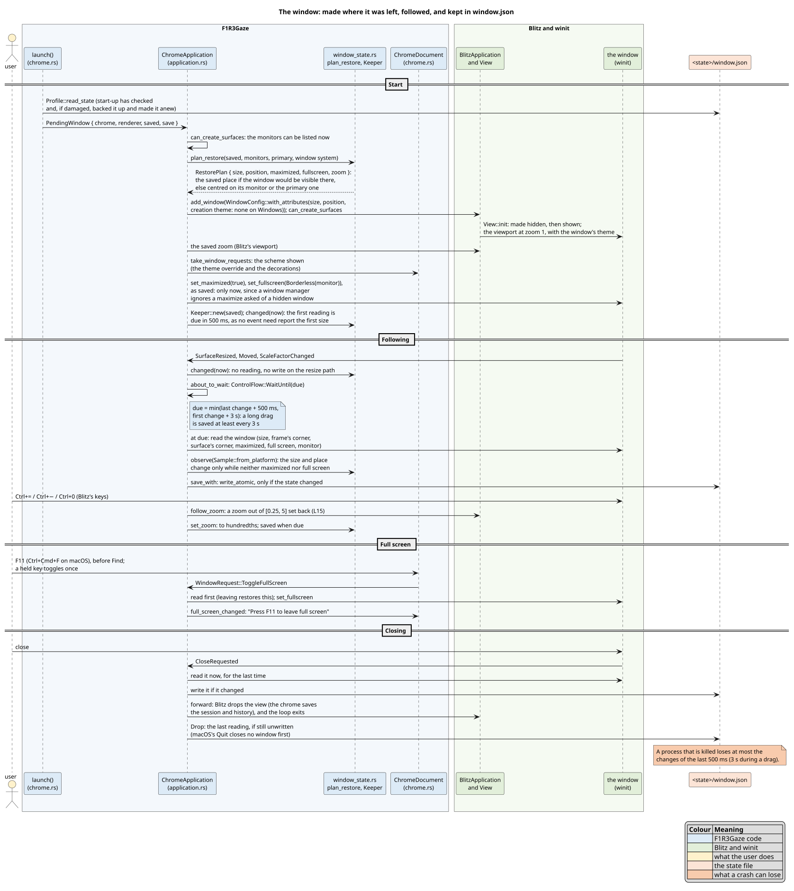

**Making the window** (`ChromeApplication::create_window`; ledger S13,
part 2). The window is made once the event loop can list the monitors, in
`can_create_surfaces`, at the size and place `plan_restore` gives, with the
theme of its decorations (none on Windows, which would keep a theme given at
creation for good: ledger S12, part 3). Blitz makes a window hidden and
shows it in `View::init`, with its zoom at 1. Then, in this order:
1. the saved zoom;
2. the scheme shown (Blitz's theme override, and the decorations);
3. maximized, then full screen on the saved monitor, as saved: a window
   manager ignores a maximize asked of a window that is not yet shown.

Where each platform puts a window, and in what units:

| Platform | Placed by | Position in `window.json` |
|---|---|---|
| X11 | the frame's corner (`with_position`, a user-specified place) | physical pixels; the frame's corner is the surface's less the window manager's frame (`_NET_FRAME_EXTENTS`) |
| Windows | the frame's corner | physical pixels; a minimized window reports $`(-32000, -32000)`$, ignored |
| macOS | the surface's corner, in points | points, with the frame's corner and the offset to the surface |
| Wayland | the compositor | none |

**Wayland.** It gives no position, and sets none. Its monitors' scale is
the whole-number output scale, not the fractional one the desktop may use,
so a size cannot be fitted to a monitor from it: a $`2560 \times 1440`$
output at 125 % would measure $`1280 \times 720`$. The size is kept as
saved, within the bounds above, and the compositor bounds a new window
itself (winit-wayland's `configure_bounds`). A place an X11 session saved
is not used on Wayland, and is forgotten once a Wayland session saves the
window: its readings carry no position, and the normal size and place are
written whole. The next X11 session then lets the window system place the
window, until it saves a place of its own.

**When it is read and saved.** A size, place or scale change only marks the
window changed: nothing is read or written on the path of a resize (chrome
ledger L9). The window is read, and `window.json` written if what it holds
changed (a `Keeper` compares with what it last wrote):
- when a save is due: 500 ms after the last change, at least every 3 s
  during one, through `ControlFlow::WaitUntil`, and 500 ms after the window
  is made, since no event need report its first size (an X11 window mapped
  with no window manager gets none);
- before it closes (`CloseRequested`): with no window manager, X11 reports
  no move, so a move is seen only by reading the window;
- when it loses the focus, once it has had it (winit-x11 reports a focus
  loss when a window is mapped);
- before entering or leaving full screen, so that leaving restores what was
  there;
- when the event loop ends, from the last reading (macOS's Quit closes no
  window first).

A process that is killed loses at most the changes of the last 500 ms, or
3 s during a drag: the same kind of loss as the history's 2 s.

**Full screen.** F11, or Ctrl+Cmd+F on macOS, enters full screen on the
window's monitor or leaves it; the status bar says how to leave. It is
kept in `window.json`, and the window is made full screen again on its
monitor.

**Zoom.** Blitz's keys zoom the window: Ctrl+= and Ctrl+− by a tenth,
Ctrl+0 back to 100 %. Blitz bounds neither: in its `f32`, ten presses of
Ctrl+− from 100 % leave $`-7.45 \times 10^{-8}`$ and twelve $`-0.2`$, by
which the viewport's size is divided, and the window showed nothing but its
background (chrome ledger L15). F1R3Gaze sets the zoom back within
$`[0.25, 5]`$ after each key, and keeps it to hundredths, since Blitz holds
it in an `f32` (1.2 is $`1.2000000476837158`$ there). A window restored at
a zoom looks very slightly different from one zoomed to it with the keys:
Blitz keeps the border widths of the scale a document was first styled at
(ledger S13 part 2, E3; reported as
[DioxusLabs/blitz#1076](https://github.com/DioxusLabs/blitz/issues/1076)).

## 14. Freshness records

The implementation spec's resolution step 4 and the proposal's "Freshness"
section require the browser to remember the highest finalized block at
which it has seen each binding, and to refuse an answer read at an older
block: such an answer is a replay of superseded state.

**Kept on disk.** A record that lived only in memory would be forgotten at
each restart, and an attacker could then replay a stale binding. So the
records are kept in `<data>/trust/freshness.tsv` (`gaze-shard/src/fresh.rs`).
- **Each shard's records are separate.** The lines of other shards are kept
  as they are.
- **Duplicates.** Lines for one binding merge to the highest block.
- **When a record is written.** Only when a block rises, while the bridge
  holds its lock, so the file only grows.

**Exception: a development shard.** A shard whose observers are all on
this machine (loopback) keeps its records in memory only. Such shards are
reset often, and persisted records would then refuse every site.

`f1r3gaze trust list` shows the records of the configured shard
(`[shard] shard_id`). After that shard is reset, `f1r3gaze trust forget
BINDING` or `f1r3gaze trust forget --all` removes its records. The
records of other shards are never touched, and the file is written only
if something was removed.

## 15. Verifying storage

Every claim in this document is checked, most of them in several ways, and
each check is recorded in the [ledger](ledger.md) with the evidence it
produced.

### 15.1 The layers

| Layer | What it checks | Where |
|---|---|---|
| **Tests** | each component's behaviour: the roots for every combination of XDG variables, settings, themes, the lock, the repair of every state of every file, every kind of old profile | `cargo test --workspace` |
| **Crash enumeration** | the code itself, under the persistence model of section 7.1. A test's work is crashed after each of its operations, and every state a power cut could then leave is checked: any subset of the pending operations (A1–A3), or a prefix of each volume's (W1–W2). Two crashes in a row are checked the same way. The crash points run on every core | `gaze_fs::every_crash`, `every_two_crashes` over `MemFs` |
| **The model** | the protocol's design, exhaustively: every interleaving of its steps with up to two crashes (section 7.3) | `scripts/storage-model.sh`: 29 runs |
| **Traces** | that the code does what the model does: real start-ups, recorded, are behaviours of the model (section 15.2) | `scripts/storage-trace.sh`: 171 traces |
| **Real kills** | the real file system and operating system: the binary, built with the features `crash-points` and `storage-trace`, aborts at a chosen storage operation (`F1R3GAZE_CRASH_AT=k`), is started again, and the two processes' trace is checked against the model (section 15.2) | `scripts/storage-kill.sh`: 164 kills |
| **Mutation checks** | that each test guards its fix: the fix is undone, and its test must fail \[DeMillo-1978\] | `scripts/mutation-check.py`, section 15.3 |
| **A lint** | that every write goes through gaze-fs, and every folder is made durably | `clippy.toml`, section 7.2 |
| **The benchmark** | what a start writes, against what its own record of storage operations predicts, and what it costs, before the layout and after it (section 15.4) | `scripts/storage-bench.sh` |
| **Desktops** | what only a desktop session shows: KDE Plasma on Wayland on this machine (ledger S18, part 1), and macOS and Windows, by a person at each, from a checklist | [`manual-checks.md`](manual-checks.md) |

**Why every layer.**
- Tests show behaviour, but a missing fsync changes no behaviour until the
  power fails.
- Crash enumeration finds such defects in the code, but only in the shapes
  the tests build.
- The model checks every shape the design allows, but it is a separate text
  from the code.
- Traces tie the two together: a change to the code that departs from the
  model is rejected, even when no crash test happens to hit it.
- Real kills check what `MemFs` only models, the kernel and the disk, though
  no test can cut a real machine's power.
- Mutation checks show that each of the other checks would fail if its fix
  were undone.

Where the inputs are few, they are all tried: the 1,024 environments of
the five XDG variables (each unset, empty, relative or absolute), and the
16,375 profiles of section 9.5. Where they are not, a property is checked on
generated inputs, as QuickCheck does \[Claessen-2000\]: the conversion of
2,000 old settings files, generated from seeds, so a failure can be
generated again.

### 15.2 Checking real start-ups

Trace validation follows Cirstea, Kuppe, Loillier and Merz
\[Cirstea-2024\]. A real start's file operations are recorded, put into the
model's terms, and given to TLC with `ProfileStartupTrace.tla`, which
follows only the model's steps that do what each recorded event says.

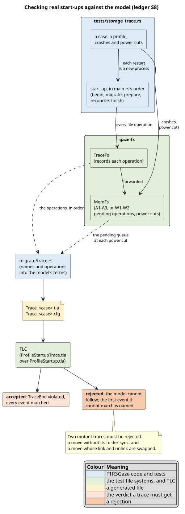

1. **Recording.** The test runs start-up (`profile::start_up`, the one copy
   of `main.rs`'s order) on `MemFs` through `TraceFs`, with the case's
   crashes and power cuts. Each restart is a new process, as
   `gaze_fs::with_process_id` makes it, so the next start sweeps the dead
   one's temporary files, as after a real restart.
2. **Converting.** Each concrete name the model has becomes the model's
   name. Each operation on one becomes an event, with the content a
   fingerprint identifies for a created file. The barrier becomes one event
   with the folders it synced, and a power cut becomes the indices of the
   kept operations in the model's queue. Names the model does not have
   (folders made, the plan, `MIGRATED.txt`, the cache, start-up's repair)
   are left out. A sync of a modelled folder that the protocol does not
   need there is allowed anywhere: it only makes things durable.
3. **Checking.** TLC accepts a trace by reporting `TraceEnd` violated, which
   means every event was matched. A rejected trace is reported with how
   many events the model could follow, found by a binary search over probe
   invariants $`l \le n`$, and the first event it could not.

**The cases** are this machine's profile's shape, a full profile, two
volumes, NTFS, a conflict and a copy that comes out wrong. On top of those:
- a process killed after every 5th operation, on one volume and on two;
- three crashes in the windows the sweeps and the copy's check are for;
- power cuts a quarter, half and three quarters through, keeping none,
  all, or every other pending operation.

Two **mutant** traces must be rejected: a move whose folder sync was
removed, and a move whose link and unlink were swapped.

**Real kills** (`crates/gaze-shell/tests/crash_points.rs`, ledger S8
part 2) check the same thing on the real file system, with the real binary
and real crashes. An old profile (the shape of this machine's, and a full
one) is laid flat at a portable root, and `f1r3gaze wallet list` opens it:
the shortest command that runs the whole start-up.
1. **A reference run** counts the storage operations start-up makes before
   the note `profile opened`, and finds the windows the guards are for: the
   temporary marker made, the marker linked, the plan's temporary file
   made, the first item linked. For the two shapes it counted 335 and 427
   on 2026-10-06. The count depends on where the profile is: the barrier
   looks at and syncs every folder above it, two operations each, so S14's
   runs, one folder deeper, counted two more, and four more again before
   the holder's record stopped being synced (ledger S15, part 3).
2. **A killed run**, with `F1R3GAZE_CRASH_AT=k` for every 5th operation and
   each window: `crash_point` aborts the process at its k-th operation, and
   `F1R3GAZE_STORAGE_TRACE` has appended every operation it finished. The
   test appends the crash.
3. **A clean run** finishes the move, appending to the same trace.
4. **The checks.** Nothing is lost: every old file's bytes are somewhere
   in the profile, the id at its place. The marker and `MIGRATED.txt`
   exist, and the plan is gone. For three of the kills, a third run
   changes nothing but the lock files. Then TLC must accept the trace, the
   plan taken from the note `plan <json>` that the migration makes
   (`migrate::trace::plan_of`).

**Alignment.** The lock's folders and files go through start-up's file
system too (`InstanceLock::acquire_in`), so every storage operation before
`profile opened` is a traced one: a process killed at its k-th operation
has recorded exactly k − 1 of them. The test asserts this for every kill.
Kills are chosen before that note, since the engine's own files (stores,
wallets, grants) are written with `StdFs`, untraced.

**What the traces found.** The model had no step 5 sweep, so it could not
follow a start that removes the temporary marker a dead start left after
linking the marker. `PrepareStep` was added, and every verdict of the 29
runs is unchanged (ledger S8). Converting the traces also showed that the
code did not sweep the temporary marker before making the marker, which
the model's `MarkerStep` does. The code now does.

### 15.3 Mutation checks

`scripts/mutation-check.py SPEC OUT` takes a spec of mutations. For each, it
replaces one unique text in one file, runs the named test, restores the
file from a copy, and compares the restored file with the copy byte for
byte. A mutation passes when its test fails ("red") and the file is
restored exactly.

When a fix can be observed by no test, such as a folder made durably on the
real file system, the mutation instead must make clippy fail with the
named lint (`"check": "clippy"`).

A mutation whose fix is gone, because the code it guarded was replaced or
found redundant, keeps its entry with `"retired"` and the reason, and is
reported, not run. Every spec is run again whenever the code it names
moves (the S14 campaign ran all of them on the final code).

| Spec | Entry | Mutations |
|---|---|---|
| `s3-layout.json` | S3 | 6 |
| `s4-gaze-fs.json` | S4 | 11 |
| `s5-lock.json` | S5 | 9 |
| `s6-salvage.json` | S6 | 3 |
| `s6-reconcile.json` | S6 (part 2) | 25 |
| `s7-migrate.json` | S7 | 35 (two retired) |
| `s8-trace.json` | S8 | 6 |
| `s8-kills.json` | S8 (part 2) | 4 |
| `s14-switch-over.json` | S14 (part 1) | 41 (two retired) |
| `s9-settings.json` | S9 | 10 |
| `s12-themes.json`, `s12-system-theme.json` | S12 | 17 |
| `s12-chrome.json` | S12 (part 3) | 25 |
| `s13-window-state.json` | S13 | 12 |
| `s13-window.json` | S13 (part 2) | 26 |
| `s15-v1.json` | S15 (part 3) | 3 |

### 15.4 The cost of a start

`scripts/storage-bench.sh` measures what a start writes and how long it
takes, with the build from before the five roots (the S1 rebuild of
`3d5ba26`) and the build under test (ledger S15).

**Terms.**
- A **start** is one run of a command on a profile: a **page**,
  `--headless gaze://newtab --timeout 5`, of which about 256 ms is the
  headless runner waiting for the page to settle; `wallet list`, which opens
  the whole engine and loads no page; and `profile check`, which only
  reads.
- The **profiles**: `fresh` (nothing there yet), `steady` (made by one
  start of the same build), `old-3` and `old-full` (single-folder profiles
  from before the layout, which the build under test moves: a migration
  every time), and `moved` (`old-full` after its move).
- $`\Delta`$ is a start's time with the build under test less its time with
  the build before.

**What a start writes.** `strace -f -y` records every system call that
names a path in the profile; a `write` counts by the file it writes to,
never by the bytes it writes, which may quote a path (ledger S17). Before
the run, each start's counts were
predicted from the start's own record of its storage operations: a
`storage-trace` build of the same source writes every `Fs` operation as a
line of JSON, and each operation maps to the system calls `StdFs` makes for
it (`create_new` is an `openat` that creates and a `write`; `sync_file` and
`sync_dir` an `fsync` each; `create_dir_all` $`2k-1`$ `mkdir` calls for
$`k`$ missing folders, since std tries the deepest first). The lock files,
which the lock opens itself, add their own known calls. In three full runs
(two of the build before V1 below, one after it), every count of every
start was the one predicted, so every write a start makes goes through
gaze-fs or the lock. With V1:

| Start (page or `wallet list`) | open to write | write | fsync | rename | link | unlink | rmdir | mkdir | chmod | ftruncate | flock |
|---|---|---|---|---|---|---|---|---|---|---|---|
| `steady`, `moved` | 5 | 4 | 1 | 2 | 0 | 1 | 0 | 0 | 1 | 2 | 2 |
| `fresh` | 14 | 13 | 45 | 2 | 9 | 10 | 0 | 16 | 1 | 2 | 2 |
| `old-3` (a migration) | 15 | 14 | 62 | 3 | 12 | 14 | 1 | 26 | 4 | 2 | 2 |
| `old-full` (a migration) | 15 | 14 | 80 | 4 | 20 | 22 | 6 | 24 | 9 | 2 | 2 |

`profile check` writes nothing on any profile, and the build before the
layout writes only on a fresh profile (`settings.conf` and `user-id`). The
fsyncs counted are those on the profile; the barrier of an unfinished start
(section 9.2) also syncs the folders above it, 14 more for `fresh` and 13
for an old profile in these runs. A steady start writes only the instance
lock's files and the busy flag:

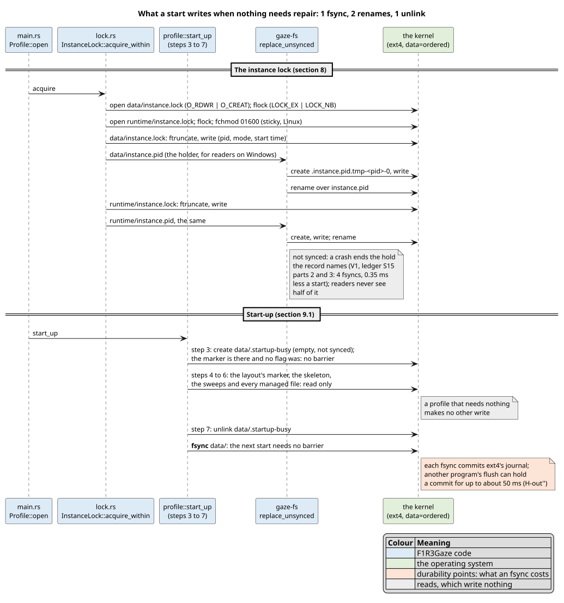

**What it costs.** Each before / after comparison is measured in 30 pairs
for a page and 100 for `wallet list`: one start of each build, the order
alternating from pair to pair. The table is the run of the build before V1
(ledger S15, part 2, at a load of about 15); V1 then took about 0.35 ms off
a steady start (below). With $`a_i`$ and $`b_i`$ the two times of
pair $`i`$, the cost reported is the median of the differences, and the
Wilcoxon signed-rank test \[Wilcoxon-1945\] gives its p-value:

```math
\tilde d = \operatorname{median}_{1 \le i \le n} \left( a_i - b_i \right)
```

| Profile | page: $`\tilde d`$ (ms) | `wallet list`: $`\tilde d`$ (ms) | `wallet list`: median after (ms) |
|---|---|---|---|
| `steady` | +1.56 | +1.29 | 4.75 |
| `fresh` | +5.46 | +5.76 | 9.38 |
| `old-3` | +7.56 | +7.08 | 10.63 |
| `old-full` | +8.86 | +8.20 | 11.70 |

Every p-value is below $`10^{-6}`$. The machine: an AMD Threadripper PRO
5975WX pinned to eight cores at their highest frequency, the profile on
ext4 mounted `nobarrier`, so an fsync there commits the journal without
asking the drive to empty its cache, and costs less than with barriers,
ext4's default \[Linux-ext4\]. In one start of each under `strace -T`,
the time inside fsync was 65 to 98 % of $`\Delta`$ for `fresh` and the
migrations, in both runs: what such a start adds is mostly its fsyncs.
(strace stops the process at each call's entry and exit, which makes each
call look longer, so these shares are upper bounds.) A page costs what
`wallet list` costs: the page itself adds nothing measurable.

**Why pairs.** hyperfine runs one build's starts back to back, then the
other's, and compares the two blocks with Welch's t-test \[Welch-1947\]
and the Mann–Whitney U test \[Mann-1947\]. On a machine whose load drifts,
the blocks see different machines: the same steady page measured +3.58 ms
in one run and +8.15 ms in another that way, and `old-full` −4.92 ms,
where pairs give +1.56 ms and +8.86 ms. The script reports both; the pairs
are the measure.

**Slow starts.** A few starts take tens of milliseconds more than the
rest, each of their fsyncs waiting up to about 50 ms. ext4's ordered mode
writes a file's data before the journal commit that names it
\[Linux-ext4\], so a commit that an fsync needs can wait for another
program's large flush, such as a database's checkpoint. A program that
wrote 64 MiB and then synced it, every 200 ms, made 23 % of migrating
starts slow, against 1 % without it (ledger S15, part 2). A start's
exposure grows with its fsyncs: 1 when steady, 59 to 93 when it creates or
moves a profile (the barrier's included). A steady start once made five:
four made the `instance.pid` files durable, though a crash ends the hold
they record. **V1** writes them without syncing (section 8), and a steady
`wallet list` takes 0.35 ms less (100 pairs against the build before it,
Wilcoxon p = 1.1e-4).

**The environment.** Every measurement here ran with the session's
`LD_PRELOAD` file-tracing shim of pgmcp, which wraps every `open`, `mkdir`,
`link`, `rename`, `truncate` and `unlink` of both builds alike and reports
some of them to its socket. Under strace its own calls in a steady page
start of the build under test took 0.34 ms, and none in the build before,
which writes nothing to report.

### 15.5 Running everything

```text
cargo test --workspace --locked                          # every test, crash enumeration included
cargo clippy --workspace --all-targets --locked -- -D warnings
scripts/storage-model.sh                                 # the model: 29 runs
scripts/storage-trace.sh                                 # 171 traces against the model
scripts/storage-kill.sh                                  # 164 real kills against the model
scripts/storage-smoke.sh target/debug/f1r3gaze target/scratch/smoke   # a private skeleton; a second start changes no file but the lock's
scripts/storage-bench.sh                                 # what a start writes and costs, before the layout and after (section 15.4)
scripts/mutation-check.py docs/storage/mutations/s7-migrate.json target/scratch/storage/mutations/s7
```

CI runs the tests on Linux, macOS and Windows, with `storage-smoke.sh` on
each, and `storage-migration-ci.sh` on Linux (an old profile on `/dev/shm`,
moved across file systems) and macOS. Its `lint` job runs clippy with Rust
1.95 in five configurations. Its `model` job runs `storage-model.sh
--quick` and `storage-trace.sh --quick`, and its `kill` job runs
`storage-kill.sh --quick` on all three systems.

## 16. References

Each reference was fetched and checked on 2026-10-05 (\[Linux-ext4\],
\[Mann-1947\], \[Welch-1947\] and \[Wilcoxon-1945\] on 2026-10-06). Each
DOI resolves, and each quote in this document is verbatim.

- \[Apple-FSPG\] Apple Inc. *File System Programming Guide*, Documentation
  Archive, updated 2018-04-09. "File System Basics" (Table 1-3) and "macOS
  Library Directory Details" (Table A-1): items in Application Support and
  Caches "should be put in a subdirectory whose name matches the bundle
  identifier of the app."
  <https://developer.apple.com/library/archive/documentation/FileManagement/Conceptual/FileSystemProgrammingGuide/MacOSXDirectories/MacOSXDirectories.html>
- \[Boytsov-2011\] L. Boytsov. "Indexing methods for approximate dictionary
  searching: Comparative analysis." *ACM Journal of Experimental
  Algorithmics* 16, 2011. doi:[10.1145/1963190.1963191](https://doi.org/10.1145/1963190.1963191)
- \[Cirstea-2024\] H. Cirstea, M. A. Kuppe, B. Loillier, S. Merz.
  "Validating Traces of Distributed Programs Against TLA+ Specifications."
  *SEFM 2024*, LNCS 15280, pp. 126–143, Springer, 2025 (online 2024-11-26).
  doi:[10.1007/978-3-031-77382-2_8](https://doi.org/10.1007/978-3-031-77382-2_8)
- \[Claessen-2000\] K. Claessen, J. Hughes. "QuickCheck: a lightweight tool
  for random testing of Haskell programs." *ICFP '00*, pp. 268–279, ACM,
  2000. doi:[10.1145/351240.351266](https://doi.org/10.1145/351240.351266)
- \[Damerau-1964\] F. J. Damerau. "A technique for computer detection and
  correction of spelling errors." *Communications of the ACM* 7(3),
  pp. 171–176, 1964. doi:[10.1145/363958.363994](https://doi.org/10.1145/363958.363994)
- \[DeMillo-1978\] R. A. DeMillo, R. J. Lipton, F. G. Sayward. "Hints on
  Test Data Selection: Help for the Practicing Programmer." *Computer*
  11(4), pp. 34–41, IEEE, 1978. doi:[10.1109/C-M.1978.218136](https://doi.org/10.1109/C-M.1978.218136)
- \[Hinnant\] H. Hinnant. "chrono-Compatible Low-Level Date Algorithms,"
  2021-09-01: `days_from_civil`, `civil_from_days`.
  <https://howardhinnant.github.io/date_algorithms.html>
- \[Lamport-1994\] L. Lamport. "The Temporal Logic of Actions." *ACM
  Transactions on Programming Languages and Systems* 16(3), pp. 872–923,
  1994. doi:[10.1145/177492.177726](https://doi.org/10.1145/177492.177726)
- \[Lamport-2002\] L. Lamport. *Specifying Systems: The TLA+ Language and
  Tools for Hardware and Software Engineers.* Addison-Wesley, 2002. ISBN
  0-321-14306-X. Free PDF:
  <https://lamport.azurewebsites.net/tla/book-21-07-04.pdf>
- \[Levenshtein-1966\] V. I. Levenshtein. "Binary codes capable of
  correcting deletions, insertions, and reversals." *Soviet Physics
  Doklady* 10(8), pp. 707–710, 1966. No DOI exists; record:
  <https://cir.nii.ac.jp/crid/1570291225532032128>
- \[Linux-ext4\] The Linux kernel documentation, *ext4 General
  Information*, "Options": `data=ordered` (the default), "All data are
  forced directly out to the main file system prior to its metadata being
  committed to the journal"; `barrier=<0|1(*)>, barrier(*), nobarrier`,
  "This enables/disables the use of write barriers in the jbd code.
  barrier=0 disables, barrier=1 enables." Fetched 2026-10-06.
  <https://docs.kernel.org/admin-guide/ext4.html>
- \[Linux-fsync\] fsync(2), Linux man-pages 6.19: "Calling fsync() does not
  necessarily ensure that the entry in the directory containing the file
  has also reached disk. For that an explicit fsync() on a file descriptor
  for the directory is also needed."
  <https://man7.org/linux/man-pages/man2/fsync.2.html>
- \[Linux-rename\] rename(2), Linux man-pages 6.19: "If newpath already
  exists, it will be atomically replaced, so that there is no point at
  which another process attempting to access newpath will find it missing."
  <https://man7.org/linux/man-pages/man2/rename.2.html>
- \[Mann-1947\] H. B. Mann, D. R. Whitney. "On a Test of Whether one of
  Two Random Variables is Stochastically Larger than the Other." *The
  Annals of Mathematical Statistics* 18(1), pp. 50–60, 1947.
  doi:[10.1214/aoms/1177730491](https://doi.org/10.1214/aoms/1177730491)
- \[MS-FlushFileBuffers\] Microsoft. FlushFileBuffers function: "Flushes the
  buffers of a specified file and causes all buffered data to be written to
  a file."
  <https://learn.microsoft.com/en-us/windows/win32/api/fileapi/nf-fileapi-flushfilebuffers>
- \[MS-KF\] Microsoft. KNOWNFOLDERID: `FOLDERID_RoamingAppData`
  (`%APPDATA%`), `FOLDERID_LocalAppData` (`%LOCALAPPDATA%`),
  `FOLDERID_ProgramData` (`%ProgramData%`).
  <https://learn.microsoft.com/en-us/windows/win32/shell/knownfolderid>
- \[MS-LockFileEx\] Microsoft. LockFileEx function: "Locking a portion of a
  file for exclusive access denies all other processes both read and write
  access to the specified region of the file", and "the time it takes for
  the operating system to unlock these locks depends upon available system
  resources."
  <https://learn.microsoft.com/en-us/windows/win32/api/fileapi/nf-fileapi-lockfileex>
- \[Pillai-2014\] T. S. Pillai, V. Chidambaram, R. Alagappan,
  S. Al-Kiswany, A. C. Arpaci-Dusseau, R. H. Arpaci-Dusseau. "All File
  Systems Are Not Created Equal: On the Complexity of Crafting
  Crash-Consistent Applications." *OSDI '14*, pp. 433–448, USENIX, 2014.
  No DOI exists.
  <https://www.usenix.org/conference/osdi14/technical-sessions/presentation/pillai>
- \[Portal\] XDG Desktop Portal. `org.freedesktop.portal.Settings`, version
  2: `ReadOne` (added in version 2), `Read` (deprecated), and
  `org.freedesktop.appearance` `color-scheme`: "0: No preference",
  "1: Prefer dark appearance", "2: Prefer light appearance".
  <https://flatpak.github.io/xdg-desktop-portal/docs/doc-org.freedesktop.portal.Settings.html>
- \[POSIX-rename\] The Open Group. rename(), *The Open Group Base
  Specifications* Issue 8 (IEEE Std 1003.1-2024).
  <https://pubs.opengroup.org/onlinepubs/9799919799/functions/rename.html>
- \[Rust-lock\] The Rust standard library. `File::lock` and
  `File::try_lock`, stable since Rust 1.89.0: `flock` on Unix, `LockFileEx`
  on Windows. "The lock will be released when this file (along with any
  other file descriptors/handles duplicated or inherited from it) is
  closed." <https://doc.rust-lang.org/std/fs/struct.File.html#method.lock>
- \[Steele-2014\] G. L. Steele Jr., D. Lea, C. H. Flood. "Fast splittable
  pseudorandom number generators." *OOPSLA 2014*, pp. 453–472, ACM, 2014.
  doi:[10.1145/2660193.2660195](https://doi.org/10.1145/2660193.2660195)
- \[TOML\] T. Preston-Werner, P. Gedam, et al. *TOML v1.1.0*, 2025-12-18.
  "Newline means LF (U+000A) or CRLF (U+000D U+000A)."
  <https://toml.io/en/v1.1.0>
- \[vanderLoo-2014\] M. P. J. van der Loo. "The stringdist Package for
  Approximate String Matching." *The R Journal* 6(1), pp. 111–122, 2014:
  "The optimal string alignment distance … is a straightforward extension
  of the Levenshtein distance that allows for transpositions of adjacent
  characters." doi:[10.32614/RJ-2014-011](https://doi.org/10.32614/RJ-2014-011)
- \[WCAG\] W3C. *Web Content Accessibility Guidelines (WCAG) 2.1*, W3C
  Recommendation, 2025-05-06. Success criteria 1.4.3 (4.5:1) and 1.4.11
  (3:1). Relative luminance: "L = 0.2126 * R + 0.7152 * G + 0.0722 * B",
  with the sRGB threshold 0.04045. <https://www.w3.org/TR/WCAG21/>
- \[Welch-1947\] B. L. Welch. "The Generalization of 'Student's' Problem
  when Several Different Population Variances are Involved." *Biometrika*
  34(1–2), pp. 28–35, 1947.
  doi:[10.1093/biomet/34.1-2.28](https://doi.org/10.1093/biomet/34.1-2.28)
- \[Wilcoxon-1945\] F. Wilcoxon. "Individual Comparisons by Ranking
  Methods." *Biometrics Bulletin* 1(6), pp. 80–83, 1945.
  doi:[10.2307/3001968](https://doi.org/10.2307/3001968)
- \[XDG-BD\] W. Bastian, A. Karlitskaya, L. Poettering, J. Löthberg. *XDG
  Base Directory Specification*, version 0.8, 2021-05-08. The quotes here
  are from the 0.8 text; later editions changed some wording without a new
  version number. <https://specifications.freedesktop.org/basedir/0.8/>
- \[Yu-1999\] Y. Yu, P. Manolios, L. Lamport. "Model Checking TLA+
  Specifications." *CHARME '99*, LNCS 1703, pp. 54–66, Springer, 1999.
  doi:[10.1007/3-540-48153-2_6](https://doi.org/10.1007/3-540-48153-2_6)
