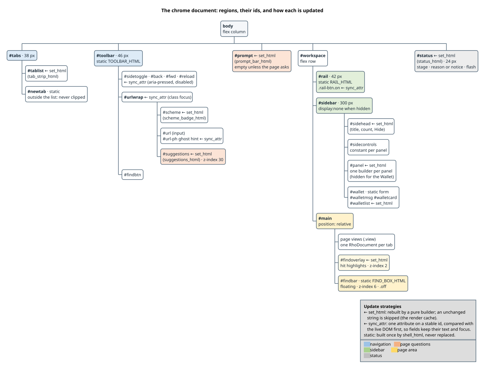
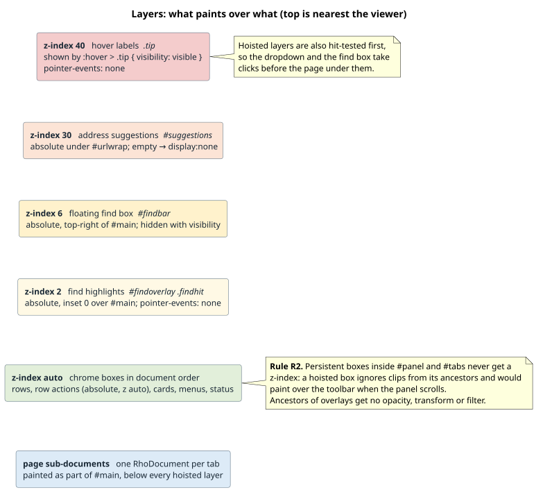
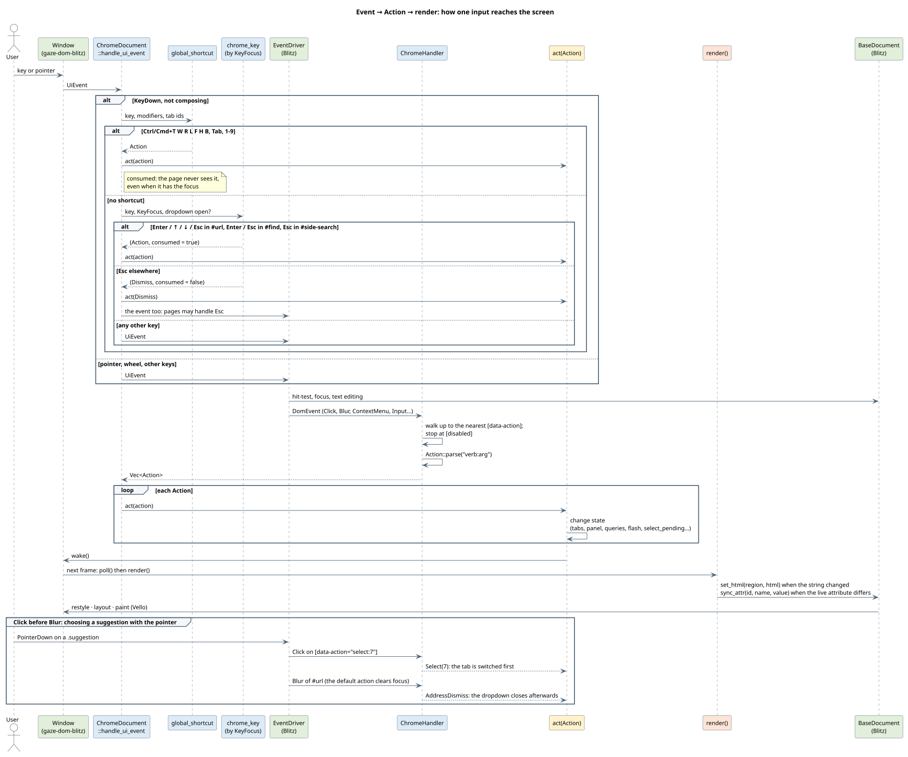
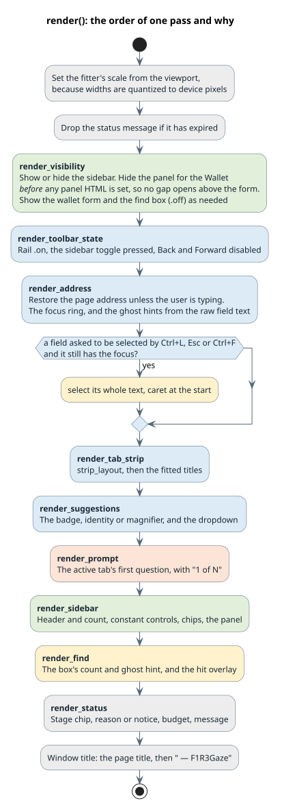
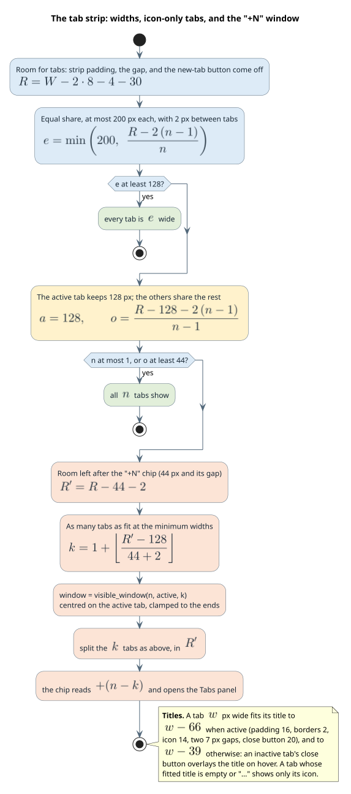
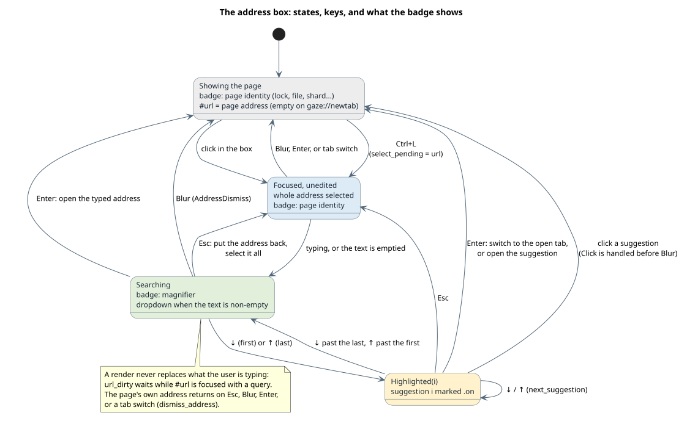
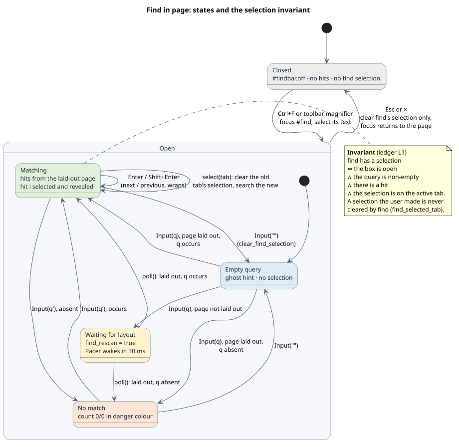
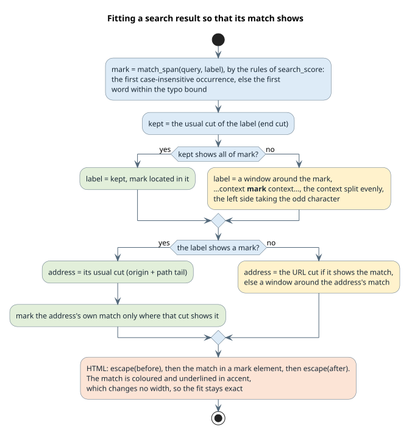

# The F1R3Gaze chrome: design

The **chrome** is everything in the F1R3Gaze window except the page itself:
- the tab strip;
- the toolbar with the address box;
- the icon rail and the sidebar panels;
- the prompt bar;
- the find box;
- the status bar.

This document describes what each part does, how it is built, and why it is
built that way, in enough detail to rebuild it. The history behind the
design is in two places:
- [the defect ledger](ledger.md): every bug, its hypotheses, experiments, and
  verdicts.
- [`../screenshots/ui/`](../screenshots/ui/): before and after captures of
  every dialog.

**Terms used throughout.**

| Term | Meaning |
|---|---|
| **px** | A CSS pixel. The snapshots use a 1280 × 800 window at scale 1, so one CSS pixel is one device pixel. |
| **Blitz** | The HTML/CSS engine the chrome and pages render with ([DioxusLabs/blitz](https://github.com/DioxusLabs/blitz), pinned at rev `674d7d2`). It uses Stylo for styles, Taffy for layout, **parley** for text, and **Vello** for painting. |
| **Region** | An element of the chrome document whose content the chrome code rebuilds as a unit. |
| **Token** | A named colour variable (`--gaze-*`) of the colour scheme. |
| **WCAG** | The W3C Web Content Accessibility Guidelines 2.1 [W3C-WCAG21]. |
| **Contrast ratio** | The WCAG measure of how distinct two colours are, from 1:1 (identical) to 21:1 (black on white). Defined in §4.2. |

## Contents

1. [Principles](#1-principles)
2. [How the chrome is built](#2-how-the-chrome-is-built)
3. [From an event to the screen](#3-from-an-event-to-the-screen)
4. [Colour tokens and contrast](#4-colour-tokens-and-contrast)
5. [Type, sizes, and spacing](#5-type-sizes-and-spacing)
6. [Conventions R1–R8](#6-conventions-r1r8)
7. [Components](#7-components)
8. [The parts of the chrome, one by one](#8-the-parts-of-the-chrome-one-by-one)
9. [Keyboard](#9-keyboard)
10. [Algorithms](#10-algorithms)
11. [Engine facts the design relies on](#11-engine-facts-the-design-relies-on)
12. [Verifying the chrome](#12-verifying-the-chrome)
13. [References](#13-references)

---

## 1. Principles

1. **One look.** Every control comes from one small vocabulary of components
   (§7), styled from one set of colour tokens (§4) and one spacing grid (§5).
   A new panel reuses these instead of inventing styles.
2. **Nothing jumps.** Interface that appears on demand never moves the page or
   the panels. This covers the find box, the address suggestions, hover labels,
   and row actions. They float above the content (§2.3).
3. **Exact text.** A label too long for its box is shortened to the longest
   prefix (or window) that fits, measured with the same text engine Blitz uses,
   and ends in "…". Blitz implements no `text-overflow`, so the chrome does
   this itself (§10.1).
4. **Keyboard first.** Every frequent action has a key. Fields behave as in
   other browsers: Ctrl+L selects the address, and Escape backs out one step
   at a time (§9).
5. **Show why.** A search result shows the text it matched (§10.2). A disabled
   control looks disabled. An empty panel says what would appear there and how
   to get it.
6. **Legible.** Text reaches a WCAG contrast of at least 4.5:1, and bars, rings,
   and icons at least 3:1, in both built-in schemes and in any accepted custom
   palette (§4).
7. **Engine-aware.** The conventions in §6 encode facts about Blitz, Vello, and
   parley that would otherwise cause defects. Tests enforce them (§12).

---

## 2. How the chrome is built

### 2.1 One document, rebuilt by region

The chrome is a single HTML document. `crates/gaze-shell/src/chrome.rs`
generates it, and Blitz renders it. Each tab's page is a separate document
(a `RhoDocument`), attached as a *sub-document* inside the chrome's `#main`
element.

The chrome's markup is updated in three ways:

| Strategy | Used for | Mechanism |
|---|---|---|
| **static** | the toolbar, the rail, the find box, the wallet form, the new-tab button | Built once by `shell_html` and never replaced, so text fields keep their content, caret, and focus. |
| **`set_html`** | regions whose content is data: the tab list, a sidebar panel, suggestions, the prompt bar, the status bar… | A pure builder function returns the region's HTML from plain data. `set_html` replaces the region's children only when the string differs from the last one set (the *render cache*). |
| **`sync_attr`** | the state of static controls: `disabled`, `aria-pressed`, `class`, the ghost hints | `sync_attr(id, name, value)` compares the live attribute and writes only on a difference. |

The builders (`tab_panel_html`, `history_panel_html`, `strip_layout`, …) take
plain data and return strings. That is why most of the chrome can be tested
without a window or an engine (§12).



### 2.2 Regions

| Region | Contents | Built by | Strategy |
|---|---|---|---|
| `#tabs` | `#tablist` (the tabs and the "+N" chip), `#newtab` | `tab_strip_html` | `set_html` (list), static (button) |
| `#toolbar` | `#sidetoggle`, `#back`, `#fwd`, `#reload`, `#urlwrap`, `#findbtn` | `TOOLBAR_HTML` | static + `sync_attr` |
| `#scheme` | the address badge | `scheme_badge_html` | `set_html` |
| `#suggestions` | the address dropdown | `suggestions_html` | `set_html` |
| `#prompt` | the question a page is asking | `prompt_bar_html` | `set_html` |
| `#rail` | seven panel buttons | `RAIL_HTML` | static + `sync_attr` (`.on`) |
| `#sidehead` | panel title, count, Hide | `side_head_html` | `set_html` |
| `#sidecontrols` | search field and chips, per panel | `*_CONTROLS_HTML` | constants: byte-identical while typing |
| `#panel` | the open panel's body | one builder per panel | `set_html` |
| `#wallet` | the wallet form + `#walletmsg`, `#walletcard`, `#walletlist` | `WALLET_FORM_HTML` + builders | static + `set_html` |
| `#main` | page views, `#findoverlay`, `#findbar` | `FIND_BOX_HTML`, `render_find_overlay` | static + `set_html` |
| `#status` | stage, reason or notice, message | `status_html` | `set_html` |

### 2.3 Layers

Blitz takes an element out of normal paint order ("hoists" it) only when it is
positioned **and** has a non-zero `z-index`. A hoisted element:
- paints above the page sub-documents;
- is hit-tested first;
- ignores clips from its ancestors.

The chrome therefore gives its overlays explicit z-indices and never gives one
to anything else (convention R2).

| z-index | Element | Why it floats |
|---|---|---|
| 40 | `.tip`, the hover labels | Blitz shows no `title` tooltips |
| 30 | `#suggestions` | must cover the page and the panels, without moving them |
| 6 | `#findbar` | floats at the top right of the page; the page does not reflow |
| 2 | `#findoverlay` | highlights over the page's text |



---

## 3. From an event to the screen

### 3.1 The pipeline



The window hands every input to `ChromeDocument::handle_ui_event`. Key presses
are handled in three stages, and the first stage that recognises a key stops
it from going further:

1. **`global_shortcut`** handles browser shortcuts (§9). They work whatever has
   the focus, including a page.
2. **`chrome_key`** handles the keys of the chrome's own fields, by which field
   has the focus (`KeyFocus`): Enter, ↑, ↓, and Esc in the address box; Enter
   and Esc in the find box; Esc in the sidebar search. Esc anywhere else gives
   `Dismiss`, *and* the key still reaches the page, which may handle Esc
   itself.
3. Everything else goes to Blitz's **`EventDriver`**. It hit-tests, moves the
   focus, edits text fields, and dispatches DOM events to the
   **`ChromeHandler`**:

| DOM event | The handler emits |
|---|---|
| Click | Walks up from the target to the nearest `[data-action]` and parses it (`Action::parse`). The walk stops at a `[disabled]` element, because Blitz still dispatches clicks to disabled buttons. |
| Blur of `#url` | `AddressDismiss` |
| ContextMenu on a tab | `tab:menu-open:<id>` (the tab's menu, in the Tabs panel) |
| Input | `Input(field, text)` for `#url`, `#find`, `#side-search` |
| Pointer down/up on tabs | drag to reorder, middle-click to close |

Each `Action` is then applied by `act`, which changes state only. Nothing is
drawn until the next frame. There, `poll` attaches newly loaded pages and
`render` brings every region up to date.

**Click before Blur.** Clicking a suggestion delivers Click first; the default
action then clears the focus, which delivers Blur. So `Select(id)` switches
the tab *before* `AddressDismiss` closes the dropdown. Dismissing on Blur is
therefore safe.

### 3.2 The action protocol

Controls carry `data-action="verb[:argument]"`. `Action::parse` accepts:

| Verb | Argument | Action |
|---|---|---|
| `back`, `fwd`, `reload`, `newtab` | — | navigation, new tab |
| `select:<id>`, `close:<id>` | tab id | switch to or close a tab |
| `panel:<name>` | panel | open it, or hide the sidebar if it is already open |
| `show:<name>` | panel | open it, never toggling (the "+N" chip, the badge) |
| `sidebar:toggle` | — | show or hide the sidebar (Ctrl+B) |
| `tab:<verb>:<id>` | `menu`, `menu-open`, `duplicate`, `copy`, `left`, `right`, `others`, `close-right`, `branch`, `restore`, `restore-at`, `move-to` (drag and drop) | tab actions |
| `visit:open\|forget:<url>` | url | History rows |
| `history:clear-ask\|clear-cancel\|clear\|more:0` | — | History controls |
| `site:<verb>:<arg>` | `store`, `grants`, `cache`, `session:<tab>:<label>` | Site data actions |
| `revoke:<urn>`, `allow:<tab>:<prompt>`, `deny:…`, `remember` | — | permissions and prompts |
| `wallet:<verb>[:<arg>]` | `new`, `import`, `send`, `confirm`, `cancel`, `use`, `copy`, `export`, `remove`, `dismiss` | Wallet |
| `theme:<name>` | `dark`, `light`, `custom` (also re-reads the palette file), `template` (writes `palette.css`), `next` (cycles; still parsed) | Appearance |
| `find:show\|next\|prev\|hide` | — | find |
| `go`, `suggest:<url>` | url | open the typed address, or a history suggestion |
| `tree:toggle`, `side:pages\|clear`, `console:clear`, `savelog`, `letitrun`, `dismiss` | — | the rest |

The test `every_emitted_action_parses` walks the shell and a sample of every
builder's output, and checks that each `data-action` parses.

### 3.3 One render pass



Every step compares before writing, so an idle frame writes nothing. The order
matters in three places:
- The panel is hidden for the Wallet **before** any panel HTML is set, so no
  gap opens above the wallet form.
- A field's text is selected **after** `render_address` has restored the page
  address, so the selection covers the restored text.
- The badge is computed from the field's live text, after the address has been
  restored.

---

## 4. Colour tokens and contrast

### 4.1 Tokens

`crates/gaze-shell/src/theme.rs` defines twelve tokens. Their values in the two
built-in schemes:

| Token | Role | Dark | Light |
|---|---|---|---|
| `--gaze-bg` | window background, fields, cards | `#161b26` | `#f5f7fa` |
| `--gaze-surface` | toolbar, sidebar, dropdowns, find box | `#202735` | `#ffffff` |
| `--gaze-raised` | buttons, tags, prompt bar | `#293244` | `#eaf0f4` |
| `--gaze-text` | text | `#eaf0f7` | `#182734` |
| `--gaze-muted` | secondary text, idle icons | `#a8b7c9` | `#526879` |
| `--gaze-border` | borders, disabled text | `#3a4659` | `#c9d7df` |
| `--gaze-accent` | bars, rings, active icons, primary buttons | `#71d4cf` | `#087f86` |
| `--gaze-accent-text` | text on an accent background | `#10272c` | `#ffffff` |
| `--gaze-hover` | hover and active-row background | `#344156` | `#dde9ed` |
| `--gaze-warning` | prompts, warnings | `#efbf75` | `#955300` |
| `--gaze-success` | "Allowed", success messages | `#7ddc9a` | `#146c43` |
| `--gaze-danger` | errors, destructive actions | `#ff8a80` | `#b42318` |

Built-in pages (`gaze://newtab`, `gaze://about`, error pages) use the same
tokens through `theme::builtin_css`.

### 4.2 Contrast

WCAG 2.1 defines the **relative luminance** $`L`$ of an sRGB colour with 8-bit
channels $`R_8, G_8, B_8`$ [W3C-WCAG21, "relative luminance"]. Each channel
$`C_8`$ is linearised and the three are weighted:

```math
c = \frac{C_8}{255}, \qquad
C_{\mathrm{lin}} =
\begin{cases}
\dfrac{c}{12.92} & c \le 0.04045\\[6pt]
\left(\dfrac{c + 0.055}{1.055}\right)^{2.4} & c > 0.04045
\end{cases}
\qquad
L = 0.2126\,R_{\mathrm{lin}} + 0.7152\,G_{\mathrm{lin}} + 0.0722\,B_{\mathrm{lin}}
```

The **contrast ratio** of two colours, where $`L_1`$ is the lighter one's
luminance, is

```math
\mathrm{CR} = \frac{L_1 + 0.05}{L_2 + 0.05} \in [1, 21].
```

The chrome's rules:
- Text, including coloured text such as danger labels, needs
  $`\mathrm{CR} \ge 4.5`$ (WCAG 1.4.3, level AA).
- Bars, focus rings, and icons that carry meaning need $`\mathrm{CR} \ge 3`$
  against their background (WCAG 1.4.11).
- Disabled controls are exempt (WCAG 1.4.3). They use `--gaze-border` on
  purpose, so they recede.

Measured ratios against each background a token is drawn on:

| Foreground | Dark: bg / surface / raised / hover | Light: bg / surface / raised / hover |
|---|---|---|
| text | 15.02 / 13.05 / 11.20 / 8.99 | 14.19 / 15.23 / 13.25 / 12.30 |
| muted | 8.44 / 7.33 / 6.29 / 5.05 | 5.41 / 5.81 / 5.05 / 4.69 |
| accent | 9.86 / 8.57 / 7.36 / 5.90 | **4.46** / 4.78 / **4.16** / **3.86** |
| warning | 10.16 / 8.82 / 7.58 / 6.08 | 5.57 / 5.97 / 5.20 / 4.82 |
| success | 10.32 / 8.96 / 7.70 / 6.18 | 6.01 / 6.45 / 5.61 / 5.21 |
| danger | 7.55 / 6.56 / 5.63 / 4.52 | 6.13 / 6.57 / 5.72 / 5.31 |

The light accent falls below 4.5:1 on three of the four backgrounds. That is
the reason for convention **R6**: accent *text* appears only on
`--gaze-surface`, and elsewhere the accent colours bars, rings, and icons,
where 3:1 suffices. Two pairings used on accent or danger backgrounds:
- `--gaze-accent-text` on accent: 8.91 (dark), 4.78 (light).
- `--gaze-bg` on danger, for the primary danger button: 7.55 (dark), 6.13
  (light).

The test `palettes_are_legible` asserts, for both schemes:
- text and muted text on the surface, at least 4.5:1;
- accent-text on the accent, at least 4.5:1;
- success and danger on all four backgrounds, at least 4.5:1;
- the accent on all four backgrounds, at least 3:1;
- the accent on the surface, at least 4.5:1;
- bg on danger, at least 4.5:1.

### 4.3 Custom palettes

Appearance → **Create palette file** writes `palette.css` in the profile. It
lists each token as `--gaze-token: #RRGGBB;`. `parse_palette` accepts the file
only if:
1. every line is such a declaration;
2. text and muted text reach 4.5:1 on the surface;
3. accent-text reaches 4.5:1 on the accent;
4. any of the two newest tokens (`--gaze-success`, `--gaze-danger`) present
   reaches 4.5:1 on the surface.

A palette written before those tokens existed (`LEGACY_TOKENS` = 10) still
loads: each missing token takes whichever built-in value, dark or light,
contrasts more with the palette's surface (`legible_default`).

---

## 5. Type, sizes, and spacing

**Fonts.** The fonts are bundled, so the chrome looks the same everywhere:
- Noto Sans for text.
- Fira Code for addresses, keys, and console text.
- Font Awesome Free 7 for icons.

| Use | Face | Size |
|---|---|---|
| Labels, row titles, tab titles | Noto Sans 400 | 13 px |
| Card titles | Noto Sans 600 | 13 px |
| Panel title | Noto Sans 600 | 14 px |
| Status bar, small buttons | Noto Sans 400 | 11.5 px |
| Row meta (times, sizes) | Noto Sans 400 | 11 px |
| Tags and counts | Noto Sans 600 | 10.5–11 px |
| Row details (addresses) | Fira Code | 11 px |
| Wallet addresses, suggestion URLs | Fira Code | 11.5 px |

**Sizes.**

| Element | Size |
|---|---|
| Tab strip / toolbar / status bar | 38 / 46 / 24 px high |
| Rail | 42 px wide, 34 px buttons |
| Sidebar | 300 px wide |
| Inputs | 30 px high |
| `.btn` / `-sm` / `-xs` | 28 / 24 / 20 px high |
| Radii (`--radius-sm/md/lg`) | 5 / 7 / 10 px |

**The sidebar grid (R7).** The panel has one gutter of 6 px. **Boxes** span it
edge to edge: rows, cards, notices, the controls bar. **Text** that is not
inside a box starts 8 px further in: headings, field labels, footnotes, and
in-flow controls such as the segmented scheme control and the wallet form
(`.form`). With the rail 42 px wide, box edges fall at x = 48 and 335, and
text at x = 56, in every panel.

The constants in `chrome.rs`'s `geometry` module mirror these CSS lengths, so
labels can be fitted to their boxes' exact widths. The test
`text_budgets_match_laid_out_boxes` lays the chrome out with Blitz at 1280 px
and at 900 px. It checks every derived width to within 0.6 px: the row text
column, card contents, the address box, suggestion rows, and active and
inactive tab titles.

---

## 6. Conventions R1–R8

Each convention is commented at the top of the stylesheet (`CSS` in
`chrome.rs`). The table gives the rule, the engine fact behind it, and what
enforces it.

| | Rule | Why | Enforced by |
|---|---|---|---|
| **R1** | A label is an element (`<span>`), an icon an `<i>`. No bare text directly inside a flex or grid box. | Blitz wraps bare text in a flex box in an *anonymous block*. Its style is computed once and never restyled, so after a scheme switch the label keeps the old colour (ledger L2). | `labels_are_never_bare_text_in_flex_boxes`, `theme_switch_leaves_no_stale_label_colours`, `host_theme_swap_leaves_no_stale_label_colours` |
| **R2** | Every overlay has a positive z-index. Nothing persistent inside `#panel` or `#tabs` gets one. Ancestors of overlays get no `opacity`, `transform`, or `filter`. | Only z-index ≠ 0 hoists an element above the page sub-documents. A hoisted element ignores its ancestors' clips. | review; the layer table in §2.3 |
| **R3** | Frequent show/hide uses `visibility` (`.off`, `:hover`). `display:none` is only for `#sidebar`, `#panel`, `#wallet`, and the Send form when there is no wallet (`.hidden`), for regions with nothing in them (`:empty`), and for a narrow tab's title and close button, which are set when the strip is rebuilt. | `visibility:hidden` skips paint and hit-testing without relayout, and the element keeps its box. | review |
| **R4** | Inputs live only in static markup. Their state is set with `sync_attr` on stable ids. | Replacing an input loses its text, caret, and focus. | `side_controls_are_constant` |
| **R5** | Labels are fitted to their exact width in Rust; `overflow:hidden` is only a backstop. | Blitz has no `text-overflow: ellipsis`. | `text_budgets_match_laid_out_boxes`, `measured_width_matches_blitz_layout` |
| **R6** | Accent colours icons, bars, and rings. Accent *text* appears only on `--gaze-surface`. | The light accent is below 4.5:1 on bg, raised, and hover (§4.2). | `palettes_are_legible` |
| **R7** | One 6 px sidebar gutter for boxes; text starts 8 px further in (§5). | One left edge for boxes and one for text reads as order. | snapshots |
| **R8** | An edge bar is a solid image the size of the bar, `linear-gradient(c, c) 0 0 / 3px 100% no-repeat`, over the background colour. Bordered elements put it in the border box. | Blitz draws an inset box-shadow with a hairline along the other edges. Vello quantizes a hard gradient stop across the element to $`L/511`$ px (ledger L5 R1; §10.7). | snapshot checks `*_edge_artifact_px` and `*_bar_px` |

---

## 7. Components

| Component | Classes | Notes |
|---|---|---|
| Buttons | `.btn`, `-sm`, `-xs`, `-ghost`, `-primary`, `-danger` | A disabled button uses border-coloured text; a disabled ghost button stays borderless. |
| Icon buttons | `.icon-btn`, `-sm`, `.on` | Every icon button has a `.tip`. |
| Chips | `.chip`, `.chip.on` | Toggles such as Tree and Page text (`aria-pressed`). |
| Segmented control | `.segmented`, `.segment.on` | Dark, Light, Custom. |
| Checkbox | `.check`, `.check-box` | Drawn in CSS ("Remember for this site"). |
| Badges | `.tag` (`ok`, `warn`, `err`), `.count` | Never flex boxes, because they hold bare text (R1). |
| Hover labels | `.tip`, `-right`, `-below`, `-below-end` | `:hover > .tip { visibility: visible }`; hidden under `:disabled`. |
| Fields | `.field`, `.field-icon`, `.ghost-hint` (`.off`), `.field-label`, `.form`, `.form-cols`, `.form-row`, `.form-actions` | A ghost hint stands in for `placeholder`, which Blitz does not draw. |
| Lists | `.section-head`, `.row` (`.on`, `.menu-open`, `.static`), `.row-icon`, `.row-text`, `.row-label`, `.row-detail`, `.row-meta`, `.row-actions` | Row actions float over the row's end; they show on hover, on the active row, and when its menu is open. |
| Inline menu | `.row-menu`, `.menu-item` (`.danger`), `.menu-sep` | Opens under its row in the panel, so it never covers the page. |
| Containers | `.card`, `.card-head`, `.facts`, `.kv`, `.notice` (`info`, `ok`, `warn`, `err`), `.empty-state`, `.footnote` | Inside a card, a notice is filled with `--gaze-surface`. |
| Search match | `mark` inside a row label, row detail, or suggestion | Text colour plus a 2 px accent underline; neither changes any width. |

---

## 8. The parts of the chrome, one by one

Each part lists its contents, its behaviour, and its snapshots. Before
captures are of the binary before this work; after captures are of the final
binary. Scene numbers refer to `scripts/ui-snapshots.sh --list`.

### 8.1 Tab strip

- **Each tab** shows an icon and a fitted title. The icon is the address's
  scheme, or an attention state:
  - hourglass while loading;
  - warning shield while the page waits for an answer;
  - danger triangle when the page failed to load.
- **The active tab** has an accent bar on top and a close button. Inactive tabs
  show their close button on hover, over the end of their title.
- **Sizes.** Tabs share the room up to 200 px each. When they get crowded, the
  active tab keeps 128 px and the others shrink to 44 px, where only their icon
  shows. Only when even that does not fit does a window of tabs around the
  active one appear, with a "+N" chip that opens the Tabs panel (§10.3).
- **Pointer.** Drag a tab onto another to reorder it; middle-click closes it;
  right-click opens its menu in the Tabs panel.
- **The new-tab button** sits outside the list, so it is never clipped.

Before: [`25-many-tabs`](../screenshots/ui/before/25-many-tabs.png).
After: [`25-many-tabs`](../screenshots/ui/after/25-many-tabs.png) (30 tabs),
[`01-tabs-dark`](../screenshots/ui/after/01-tabs-dark.png).



### 8.2 Toolbar and address box

- **Buttons** (left to right): show or hide the sidebar (Ctrl+B), Back, Forward,
  Reload, the address box, Find. Back and Forward are disabled when there is no
  history in that direction.
- **Removed buttons.** Three were removed. Each stays in `TOOLBAR_HTML` as an
  HTML comment with the reason:
  - **Go**: Enter does it, and its arrow looked like Forward's.
  - **☰**: the rail's Tabs button does the same.
  - **Palette cycling**: Appearance shows and sets the scheme.
- **The badge** at the left of the address says what kind of address the page
  has, and clicking it opens the page's permissions:
  - lock: https;
  - "Not secure": http;
  - accent shard: `f1r3://`;
  - hash: `f1r3h://`;
  - file;
  - built-in.

  While the box holds anything but the page's address, an empty box included,
  the badge is a magnifier: Enter will search or open what was typed.
- **Suggestions.** Typing shows suggestions in a dropdown over the page. They
  are open tabs (tagged "Switch to tab", which switches instead of opening a
  copy) and history. The text that matched is highlighted (§10.2).
  - ↓ and ↑ move through the suggestions and back to the typed text.
  - Enter opens the highlighted suggestion or the typed address.
  - Esc puts the page's address back and selects it.
  - Leaving the box closes the dropdown.

Before: [`34-url-suggestions`](../screenshots/ui/before/34-url-suggestions.png).
After: [`33-url-empty`](../screenshots/ui/after/33-url-empty.png),
[`34-url-suggestions`](../screenshots/ui/after/34-url-suggestions.png),
[`35-url-suggestion-down`](../screenshots/ui/after/35-url-suggestion-down.png),
[`36-url-escape`](../screenshots/ui/after/36-url-escape.png),
[`38-url-switch-to-tab`](../screenshots/ui/after/38-url-switch-to-tab.png).



### 8.3 Find in page

- **The box.** Ctrl+F or the magnifier opens a floating box at the top right of
  the page. The page does not move. The box contains:
  - the field, with its hint inside;
  - a count, `3/12`, in danger colour for `0/0`;
  - previous and next buttons;
  - close.
- **Keys and highlights.**
  - Enter and Shift+Enter step through the matches.
  - The current match is selected (the page's own selection colour) and
    ringed; the others are tinted.
  - Esc or × closes the box and returns the keyboard to the page.
  - Reopening selects the old query, so typing replaces it.
- **Ownership.** Find only ever clears a selection it made.
- **Tab switches.** Switching tabs moves the search to the new tab.
- **Pages without a layout yet.** A page that has no layout when it is attached
  is searched once it has one (ledger L1, H7).



Before: [`30-find-cleared`](../screenshots/ui/before/30-find-cleared.png) (the
bug: one character stays highlighted).
After: [`28-find-matches`](../screenshots/ui/after/28-find-matches.png),
[`30-find-cleared`](../screenshots/ui/after/30-find-cleared.png),
[`31-find-tab-switch`](../screenshots/ui/after/31-find-tab-switch.png).

### 8.4 Prompt bar

When the active page asks for a capability, a bar opens under the toolbar. It
has a warning bar, a shield, and the text. The asking site is named short and
bold, with the full origin in its hover label. Origins in the text drop their
default port (§10.6).

The controls: "1 of N" when several questions wait, **Remember for this site**,
Deny, and a primary **Allow**. "Remember" applies to one answer and is cleared
after it (ledger L6, X1).

Before: [`39-prompt-net`](../screenshots/ui/before/39-prompt-net.png).
After: [`39-prompt-net`](../screenshots/ui/after/39-prompt-net.png),
[`40-prompt-shard`](../screenshots/ui/after/40-prompt-shard.png).

### 8.5 Status bar

One line, in this order:
1. the stage chip: Loading, Verifying, Waiting for your answer, Running
   f1r3lang, Static page, or Couldn't load;
2. the reason, only for a failed load;
3. the page's notice;
4. the step-budget tag and **Let it run**;
5. on the right, a message that expires: 4 s for information and success, 8 s
   for warnings and errors.

Everything is fitted to the window's width (`the_status_bar_fits_on_one_line`).

After: [`47-flash-shown`](../screenshots/ui/after/47-flash-shown.png),
[`48-flash-expired`](../screenshots/ui/after/48-flash-expired.png).

### 8.6 Rail and sidebar

- **The rail** holds Tabs, History, Site data, Permissions, Wallet, Console,
  and, at the bottom, Appearance. Each shows its name in a hover label, with its key where it has one
  (History · Ctrl+H).
  The open panel's button is accented, with a bar on its left edge. Clicking it
  again hides the sidebar.
- **The sidebar header** shows the panel's title, a count, and Hide.
- **The controls bar** under the header is constant per panel. Switching panels
  or reopening the sidebar starts with an empty search (ledger L5 and S9).

After: [`45-rail-hover`](../screenshots/ui/after/45-rail-hover.png),
[`19-collapsed-dark`](../screenshots/ui/after/19-collapsed-dark.png),
[`49-search-reset`](../screenshots/ui/after/49-search-reset.png).

### 8.7 Tabs panel

- **Rows.** Each tab is one row: icon, fitted title, and fitted address. The
  active row has an accent bar.
- **Row actions.** ⋯ (menu) and × appear on hover and on the active row.
- **Tree.** Nests tabs under the tab that opened them.
- **Search** (title and address, with small typos) highlights the matched
  text. A row that matched only in its address shows a window of the address
  around the match (§10.2).
- **Page text** also searches the text of loaded pages. A row then shows
  "N matches in page text".
- **The menu** opens under its row in three groups. Items that do not apply
  are disabled, and the menu closes after any action:
  - Duplicate, Copy address;
  - Move up, Move down;
  - Close other tabs, Close tabs below, Close tab and its children (only when
    it has children), Close tab.
- **Recently closed** lists the last five closed tabs, newest first.

Before: [`01-tabs-dark`](../screenshots/ui/before/01-tabs-dark.png),
[`21-tab-menu`](../screenshots/ui/before/21-tab-menu.png).
After: [`01-tabs-dark`](../screenshots/ui/after/01-tabs-dark.png),
[`21-tab-menu`](../screenshots/ui/after/21-tab-menu.png),
[`22-tab-menu-after-action`](../screenshots/ui/after/22-tab-menu-after-action.png),
[`23-tabs-search`](../screenshots/ui/after/23-tabs-search.png),
[`24-tabs-tree`](../screenshots/ui/after/24-tabs-tree.png),
[`46-row-hover`](../screenshots/ui/after/46-row-hover.png).

### 8.8 History

- **Groups.** Visits are grouped by how long ago they were: last hour, last 24
  hours, last 7 days, last 30 days, older. The buckets use elapsed time, which
  needs no time zone (§10.4).
- **Entries.** Each group lists an address once (its newest visit), with a
  relative time and, on hover, × to forget it.
- **Counts.** The header counts entries; a search reads "N of M".
- **Pages.** The list shows 200 entries at a time ("Show 200 more").
- **Clear…** asks first, "Clear all M entries from history?", whatever the
  search.

Before: [`03-history-dark`](../screenshots/ui/before/03-history-dark.png).
After: [`03-history-dark`](../screenshots/ui/after/03-history-dark.png),
[`26-history-search`](../screenshots/ui/after/26-history-search.png),
[`51-history-clear`](../screenshots/ui/after/51-history-clear.png).

### 8.9 Site data

- **Sites.** Only sites that keep something are listed: stored data,
  remembered permissions, or a live shard session. Each is a card with:
  - its short name and address;
  - facts in human units (zeros omitted);
  - Clear stored data, Forget permissions, and an End button for each live
    session.

  A session ends on the tab that owns it (ledger L6, X2).
- **The content cache card** follows. Its Clear button is disabled when the
  cache is empty.

After: [`05-sites-dark`](../screenshots/ui/after/05-sites-dark.png).

### 8.10 Permissions

- **Header.** The active page's site.
- **This page can use.** One row per capability: icon, name, a sentence on what
  it allows, an Allowed or Off tag, and Revoke.
- **Remembered for this site.** Choices kept by "Remember", each with Forget.
- **Empty states** explain built-in pages, static pages, and pages still
  waiting for an answer.

After: [`07-grants-dark`](../screenshots/ui/after/07-grants-dark.png).

### 8.11 Wallet

- **The paying wallet's card**: label, a "Pays for deploys" tag, the address
  (shortened in the middle, since people compare both ends), the balance with
  grouped digits, and Copy, Export, Remove.
- **Send**: labelled fields (Recipient address; Amount and Note) and a primary
  **Review transfer**. The review shows From, To, Amount, and Note, with Cancel
  and **Send N**. It is refused if the paying wallet changed in between.
- **Other wallets**, each with Use for payments.
- **Add a wallet**: Create new wallet, or import an F1R3Sky wallet file or hex
  key.
- **Notices.** A missing Embers configuration is explained in a notice.
- **Balances** load at start when the profile reopens on this panel (ledger
  L6, X6).

Before: [`11-wallet-one-dark`](../screenshots/ui/before/11-wallet-one-dark.png),
[`50-wallet-review`](../screenshots/ui/before/50-wallet-review.png).
After: [`09-wallet-empty-dark`](../screenshots/ui/after/09-wallet-empty-dark.png),
[`11-wallet-one-dark`](../screenshots/ui/after/11-wallet-one-dark.png),
[`50-wallet-review`](../screenshots/ui/after/50-wallet-review.png).

**After a switch to light with the Wallet open.**
- Before: [`60-theme-wallet-to-light`](../screenshots/ui/before/60-theme-wallet-to-light.png)
  shows the form's labels vanishing (ledger L2).
- After: [`60-theme-wallet-to-light`](../screenshots/ui/after/60-theme-wallet-to-light.png)
  is pixel-identical to a profile that starts in light.

### 8.12 Console

The newest messages come first: up to 200 shown, and 1000 kept per tab. Each
line has its level and its text. A single string literal is shown without
quotes. Warnings and errors carry a coloured bar and level. The controls are
Save replay log and Clear.

After: [`13-console-dark`](../screenshots/ui/after/13-console-dark.png).

### 8.13 Appearance

From top to bottom:
1. the scheme as a segmented control (Dark, Light, Custom), with Custom enabled
   only for a valid palette;
2. one sentence on what it changes;
3. swatches of the current palette;
4. the palette file's card: its path, its status (a notice that says what is
   wrong with an invalid file), and Create or Reload.

After: [`15-appearance-dark`](../screenshots/ui/after/15-appearance-dark.png),
[`17-appearance-bad-palette`](../screenshots/ui/after/17-appearance-bad-palette.png),
[`18-appearance-low-contrast`](../screenshots/ui/after/18-appearance-low-contrast.png).

### 8.14 Built-in pages

**New tab.** The address box is empty, with its hint. The page explains the
address forms and runs the f1r3lang lamp.

**Error page.** It is themed like the chrome. It shows:
- "Can't open this page";
- one sentence on what went wrong;
- the address once;
- **Try again**, which reloads instead of adding a history entry;
- the technical reason under Details.

Before: [`41-error-page`](../screenshots/ui/before/41-error-page.png).
After: [`41-error-page`](../screenshots/ui/after/41-error-page.png),
[`42-newtab`](../screenshots/ui/after/42-newtab.png).

---

## 9. Keyboard

Ctrl means Ctrl on Linux and Windows, and Cmd on macOS.

| Keys | Where | Action |
|---|---|---|
| Ctrl+T, Ctrl+W, Ctrl+Shift+T | anywhere | new tab, close tab, reopen the last closed tab |
| Ctrl+Tab, Ctrl+Shift+Tab, Ctrl+1…8, Ctrl+9 | anywhere | next and previous tab, tab N, last tab |
| Ctrl+L | anywhere | focus the address box, its text selected |
| Ctrl+F | anywhere | open find, its query selected |
| Ctrl+R | anywhere | reload |
| Ctrl+H | anywhere | History panel (again: hide the sidebar) |
| Ctrl+B | anywhere | show or hide the sidebar |
| ↓ ↑ | address box, dropdown open | move through the suggestions and back to the text |
| Enter | address box | open the highlighted suggestion or what was typed |
| Esc | address box | put the page's address back and select it |
| Enter, Shift+Enter | find box | next and previous match |
| Esc | find box | close find |
| Esc | sidebar search | clear the search |
| Esc | elsewhere | close, in order: the dropdown, a tab menu, the history confirmation, a wallet confirmation (the page also receives the key) |

The shortcuts are handled before Blitz routes the key, so they work while a page
has the focus. On macOS, standard key bindings bypass Blitz's handlers (for
example, the arrow keys in a text field). The chrome's field keys are checked
before Blitz for the same reason.

---

## 10. Algorithms

The algorithms are given in literate form [Knuth 1984]: prose explains each
step, and pseudocode **chunks** named ⟨like this⟩ are defined with ≡ and used by
name.

### 10.1 Exact text fitting

*Problem.* Shorten a label so that it fits a width $`w`$ exactly as Blitz will
lay it out, keeping as much as possible, with "…" where text was removed.

*Measurement.* `TextFitter::width` lays the text out with parley, the engine
Blitz uses, under the same conditions:
- the same bundled fonts;
- the font family list, size, and weight from the stylesheet;
- collapsed white space;
- advances rounded to device pixels at the window's scale.

The test `measured_width_matches_blitz_layout` checks the result against
Blitz's own layout to within 1 px. Budgets keep 1 px spare (`ROUNDING`)
because Blitz rounds box sizes.

*What a fit keeps.* Every cut is one of four shapes, so a range of the original
text, such as a search match, can be located in what is shown:

```text
Kept = All                      the text fits
     | Ends { head, tail }      text[..head] + "…" + text[tail..]
     | Window { start, end }    ("…" if start > 0) + text[start..end] + ("…" if end < len)
     | Nothing                  not even "…" fits
```

```text
⟨fit text to w with cut⟩ ≡
    if text is empty → All;   if w ≤ 0 → Nothing
    key ← (font, cut, round(10·w), text)            -- tenths of a pixel
    if memo has key → memo[key]
    kept ← if width(text) ≤ w then All else ⟨cut text to w⟩
    if memo holds 4096 entries → clear it
    memo[key] ← kept;  return kept
```

Each cut searches for the largest $`k`$, a number of characters kept, whose
candidate fits. Fitting is monotone in $`k`$ for the end, middle, and start
cuts (more characters are never narrower). So a binary search over $`k`$ costs
$`O(\log n)`$ layouts for a text of $`n`$ characters:

```text
⟨largest k ≤ limit such that fits(k)⟩ ≡
    if not fits(0) → none
    low ← 0;  high ← limit
    while low < high:
        mid ← low + ⌈(high − low) / 2⌉
        if fits(mid) then low ← mid else high ← mid − 1
    return low                     -- always fits, even if fits is not quite monotone
```

The cuts:
- **End** keeps a prefix: `head = trim_end(text[..bounds[k]])`.
- **Middle** keeps ⌈k/2⌉ characters at the head and ⌊k/2⌋ at the tail. It is
  used for wallet addresses.
- **Start** keeps a suffix. It is used for host names, so the registrable
  domain survives.
- **URL** keeps `scheme://authority` whole and the longest path tail. The tail
  is moved to start at a `/` when that drops at most 8 characters
  (`file://…/site/notes.html`). If the authority alone would take over 60 % of
  the width, the URL is cut in the middle instead.

### 10.2 Search matches that stay visible

*Problem.* A row passes the search filter, but the cut hides the text that
matched. The user cannot tell why it is there (ledger L5 R9).

*The match.* `match_span(query, text)` applies the same rules as the filter
`search_score`. It returns the first case-insensitive occurrence; failing that,
the first word within the typo bound. That bound is one edit for queries
shorter than 6 characters and two up to 48, by the bounded Levenshtein
distance [Levenshtein 1966; Ukkonen 1985]. Queries with spaces or only digits
match exactly only. The test `a_row_is_highlighted_exactly_when_it_matches`
checks that a row is highlighted exactly when the filter accepts it.

*Case without losing positions.* The filter compares
`text.to_lowercase().contains(query)`. To highlight the right characters, the
match found in the lowercase string must be mapped back to the original.

Rust's `str::to_lowercase` maps each character with `char::to_lowercase`, with
one exception. A final capital sigma becomes ς, still a single character
[Unicode §3.13]. The lowercase string therefore aligns with the original
character by character. Each original character contributes
`c.to_lowercase().count()` characters; `İ` contributes two.

```text
⟨lowercase text, remembering where each byte came from⟩ ≡
    lower ← text.to_lowercase();  origins ← []
    for each character c of text, at bytes [s, e):
        repeat c.to_lowercase().count() times:
            take the next character l of lower
            push [s, e) to origins, once per byte of l
    return (lower, origins)

⟨find query in text, ignoring case⟩ ≡
    (lower, origins) ← ⟨lowercase text, remembering…⟩
    at ← position of query in lower, or none
    return origins[at].start .. origins[at + len(query) − 1].end
```

*Fitting around the match.* The fitted labels are produced as follows:



```text
⟨window of text around [m₀, m₁) that fits w⟩ ≡
    first, last ← character indices of m₀ and m₁
    candidate(k) ≡ right ← min(⌊k/2⌋, room right of last)
                   left  ← min(k − right, room left of first)
                   right ← min(k − left, room right of last)   -- an exhausted side gives way
                   Window { start: bounds[first − left], end: bounds[last + right] }
    if ⟨largest k such that candidate(k) fits⟩ exists → that candidate
    else → the longest Window starting at m₀ that fits (the match alone is too wide)
```

The label keeps its match in view. The address keeps its usual form when the
label already shows a match (`fit_detail`), so a row matched by its title
still reads `file://…/site/notes.html`.

The match is wrapped in `<mark>` and styled with colour and an underline. Bold
would change the width that was fitted.

### 10.3 Tab strip layout

Let $`W`$ be the window's width, $`n`$ the number of tabs, and every length in
px. The strip's padding, the gap, and the new-tab button leave

```math
R = W - 2 \cdot 8 - 4 - 30
```

for the tabs, which are 2 px apart. The equal share of $`n`$ tabs is

```math
e(n, R) = \min\!\left(200,\ \frac{R - 2(n-1)}{n}\right).
```

```text
⟨strip layout of n tabs, the active one at index i, in room R⟩ ≡
    if e(n, R) ≥ 128:   all n tabs, each e(n, R) wide
    a ← min(128, R);  o ← (R − a − 2(n − 1)) / (n − 1)
    if n ≤ 1 or o ≥ 44:  all n tabs; the active one a, the others o wide
    R′ ← R − 44 − 2                                  -- room for the "+N" chip
    k ← 1 + ⌊(R′ − 128) / 46⌋                         -- tabs that fit at the minimums
    [s, t) ← visible_window(n, i, k)
    the tabs [s, t), split as above in R′, and a chip "+(n − k)"

⟨visible_window(n, i, k)⟩ ≡
    if k ≥ n → [0, n)
    s ← min(max(0, i − ⌊k/2⌋), n − k);  return [s, s + k)
```

**Properties.** The test `the_strip_keeps_the_active_tab_readable_and_shrinks_the_rest`
checks them for windows of 320, 400, 900, 1280, 1920, and 3840 px, $`n`$ from 1
to 60, and the active tab first, middle, and last:

1. **The active tab is shown:** $`s \le i < t`$.
2. **No tab is wider than 200 px**, and the active one is never narrower than
   the others: $`a \ge o`$.
3. **When at least two tabs show, each is at least 44 px:** $`o \ge 44`$.
4. **The tabs and the chip fit:**
   $`a + (k-1)(o + 2) + [k < n]\,(44 + 2) \le R`$.
5. **A window is as large as possible:** $`128 + k\,(44 + 2) > R'`$.

**Why property 3 holds after windowing.** Let $`k`$ be as defined above and
$`k \ge 2`$. Then $`128 + (k-1)\cdot 46 \le R'`$, which rearranges to

```math
o = \frac{R' - 128 - 2(k-1)}{k-1} \ \ge\ \frac{46(k-1) - 2(k-1)}{k-1} = 44.
```

*Titles.* The active tab fits its title to $`a - 66`$:
- padding 10 + 6;
- borders 2;
- icon 14;
- two 7 px gaps;
- the 20 px close button.

The others fit theirs to $`o - 39`$, because their close button overlays the
title on hover instead of taking room. If nothing of a title fits (the fit is
empty or a bare "…"), the tab shows only its icon, centred (`.tab.narrow`).

At 1280 px: 6 tabs are 200 px each; 16 tabs are 128 px and 71.5 px; 24 tabs are
128 px and 45.9 px (icons only); 30 tabs show 23, with "+7".

### 10.4 History groups

A visit $`\Delta`$ seconds old falls in the first bucket whose bound exceeds
$`\Delta`$: one hour, one day, 7 days, 30 days, or Older. Within a bucket, an
address appears once, with its newest visit:

```text
⟨history entries for query q⟩ ≡
    seen ← ∅;  entries ← []
    for each visit v, newest first, that matches q:
        b ← bucket(now − v.at)
        if (b, v.url) ∉ seen: add it to seen; append (b, v) to entries
    total ← the same count with no query        -- the header's "M"
    show entries[..limit], grouped by b, each group headed by its count
```

### 10.5 Relative times and dates

`relative_time(now, at)` reads:
- "just now" under 45 s (and for times in the future);
- "N min ago" (at least 1) under an hour;
- "N h ago", "N d ago", "N wk ago" up to 30 days;
- after that, the UTC date `YYYY-MM-DD`.

Dates come from Howard Hinnant's `civil_from_days` [Hinnant]. It counts days
in 400-year eras of 146 097 days, and starts each year on 1 March, so the leap
day falls at the end of the year. For day number $`z`$ since 1970-01-01, with
divisions rounding down:

```math
\begin{aligned}
z' &= z + 719468, \quad \mathit{era} = \lfloor z'/146097 \rfloor, \quad \mathit{doe} = z' - 146097\,\mathit{era}\\
\mathit{yoe} &= \left\lfloor \frac{\mathit{doe} - \lfloor \mathit{doe}/1460 \rfloor + \lfloor \mathit{doe}/36524 \rfloor - \lfloor \mathit{doe}/146096 \rfloor}{365} \right\rfloor\\
\mathit{doy} &= \mathit{doe} - (365\,\mathit{yoe} + \lfloor \mathit{yoe}/4 \rfloor - \lfloor \mathit{yoe}/100 \rfloor), \quad
\mathit{mp} = \lfloor (5\,\mathit{doy} + 2)/153 \rfloor\\
d &= \mathit{doy} - \lfloor (153\,\mathit{mp} + 2)/5 \rfloor + 1, \quad
m = \mathit{mp} + 3 \text{ if } \mathit{mp} < 10 \text{ else } \mathit{mp} - 9, \quad
y = \mathit{yoe} + 400\,\mathit{era} + [m \le 2]
\end{aligned}
```

The symbols are:
- $`\mathit{doe}`$: the day of the era;
- $`\mathit{yoe}`$: the year of the era;
- $`\mathit{doy}`$: the day of the year, counted from 1 March;
- $`\mathit{mp}`$: the month counted from March.

The test `civil_dates_match_known_days` checks 1970-01-01, 2000-02-29 (a leap
day in a century year divisible by 400), 2023-11-14, and 2100-03-01 (2100 is
not a leap year).

### 10.6 Default ports in prompts

The broker names sites canonically (`https://example.org:443`), which is exact
but noisier than people expect. `display::without_default_ports` removes the
port only where it is the scheme's default:

```text
⟨drop default ports from text⟩ ≡
    for each "://" in text:
        scheme    ← the [A-Za-z0-9+.-] run before it
        authority ← the run after it of [A-Za-z0-9.-[]:@%_~], without trailing dots
        if (scheme, authority's end) is (https, ":443") or (http, ":80"),
           and something precedes the port:
            remove the port
```

Other ports, other schemes, and IPv6 literals such as `[::1]` are kept as they
are (`default_ports_are_dropped_from_origins_in_text`).

### 10.7 Bars that are exactly 3 px

Vello samples a gradient at integer pixel corners. It looks the colour up in a
512-entry ramp at index $`\mathrm{round}(511\,t)`$, where $`t`$ is the position
along the gradient divided by its length $`L`$
(`vello_shaders/shader/fine.wgsl`). A hard stop at $`s`$ px therefore moves to
the nearest ramp step, a multiple of $`L/511`$ px. The pixel at distance $`k`$
takes the bar's colour when

```math
\frac{1}{511}\,\mathrm{round}\!\left(\frac{511\,k}{L}\right) < \frac{s}{L}.
```

With $`s = 3`$, a 287 px row came out 4 px, a 261 px notice 3 px, and a 34 px
rail button 4 px. On the 1280 px prompt bar the step is 2.5 px.

Convention R8 draws the bar as a *solid* image the size of the bar: a gradient
of one colour, `0 0 / 3px 100% no-repeat`. A constant ramp has no stop to
quantize, and the bar's edge is the image's rectangle, at an exact pixel
boundary. The harness checks that every bar is exactly its width (§12.2).

---

## 11. Engine facts the design relies on

All facts are for Blitz `674d7d2`, parley `332c1c7`, and Vello 0.10, and were
verified in their sources.

| Fact | Consequence in the chrome | Source |
|---|---|---|
| No rendering of `placeholder`, `text-overflow`, `title` tooltips, `:focus-within`, `content: attr()`. A `<label for>` click does not focus the input. | Ghost hints, exact fitting (R5), `.tip` labels, `#urlwrap.focus` set from Rust. | Blitz source review |
| Bare text in a flex box becomes an anonymous block that is never restyled. | R1 (ledger L2). | `blitz-dom/src/layout/construct.rs`; `stylo.rs` |
| Only a positioned element with z-index ≠ 0 is hoisted, above sub-documents, hit-tested first, unclipped. | R2 and the layer table. | `blitz-paint` `paint_tree.rs` |
| `visibility:hidden` skips paint and hit-testing. | R3 toggles. | `blitz-paint` |
| Click is dispatched before the Blur its default action causes. | Suggestions commit on Click; dismiss on Blur is safe. | `blitz-dom/src/events/pointer.rs` |
| A disabled button still receives Click. | The handler stops at `[disabled]`. | `pointer.rs` |
| Setting the `value` attribute calls `set_text`, which keeps the old selection clamped to the new text. | `select_whole` after a restore (ledger L5 R4). | `blitz-dom/src/mutator.rs`; `parley/src/editing/editor.rs:951` |
| `BaseDocument::with_text_input` exposes the editor's driver. | `select_byte_range(len, 0)`: all selected, caret at the start. | `blitz-dom/src/document.rs` |
| An inset box-shadow is a fill minus an analytic hole; a coincident edge keeps about 50 % of the colour. | R8 (ledger L5 R1). | `blitz-paint/src/render/box_shadow.rs:89-147` |
| Gradients are sampled at pixel corners through a 512-entry ramp. | R8 solid images (§10.7). | `vello_shaders-0.10.0/shader/fine.wgsl:26,1076,1225-1236` |
| On macOS, standard key bindings skip DOM handlers. | Field keys are handled before the event driver. | `blitz-shell` `driver.rs` |

The ledger records the defects these facts caused and the measurements that
established them.
Three of the defects are written up, with reproductions measured against the
pinned versions, in [`upstream/`](upstream/README.md). They are filed as
DioxusLabs/blitz#1037 and #1038, and linebender/vello#1975.

---

## 12. Verifying the chrome

### 12.1 Tests

`cargo test -p gaze-shell -p gaze-dom-blitz` runs 73 + 8 tests. By area:

| Area | Tests |
|---|---|
| Protocol and keys | `actions_parse`, `every_emitted_action_parses`, `chrome_keys_route_by_focus`, `browser_shortcuts_select_tabs_even_when_page_has_focus`, `arrow_keys_cycle_through_suggestions_and_back_to_the_text` |
| Markup | `chrome_markup_has_stable_ids`, `removed_toolbar_buttons_stay_commented`, `labels_are_never_bare_text_in_flex_boxes` (R1), `side_controls_are_constant` (R4) |
| Layout | `text_budgets_match_laid_out_boxes`, `the_status_bar_fits_on_one_line`, `measured_width_matches_blitz_layout` |
| Builders | the strip, tab attention, history groups and counts, search highlights, prompts, the error page |
| Behaviour | find (L1, H7), theme switches (L2), closed tabs (L3), Remember (X1), panel switches, the tab menu, the wallet review, suggestion clicks, select-all, the badge |
| Pure helpers | `display` (13), `text_fit` (13), `theme` (5), `ui_state` (6) |

Each fix in the ledger has a **mutation check**: the fix is commented out, its
test must fail, and then the fix is restored.

CI (`.github/workflows/ci.yml`) runs:
- the workspace tests on Linux, macOS, and Windows;
- the headless smoke test;
- a `lint` job: `cargo clippy --workspace --all-targets --locked -- -D
  warnings` with Rust 1.95.

### 12.2 The snapshot harness

`scripts/ui-snapshots.sh` drives the real binary under a virtual X server
(Xvfb). It uses `xdotool` for keys and pointer, and ImageMagick 7 for captures
and measurements. Every one of the 60 scenes starts from a seeded throwaway
profile.

```sh
scripts/ui-snapshots.sh --after                  # all scenes → docs/screenshots/ui/after/
scripts/ui-snapshots.sh --before --bin OLD_BINARY
scripts/ui-snapshots.sh --after --only '^(2[7-9]|3[0-2])-'   # the find scenes
scripts/ui-snapshots.sh --list                   # scene names
scripts/ui-snapshots.sh --compare                # side by side, into the work directory
```

The options and exit codes:
- **Options.** `--size 1280x800` (the default), `--timeout SECS`, `--keep` (keep
  the work directory), and `--calibrate` (draw the coordinate table on a
  capture).
- **Exit codes.** 0 for success; 1 when a scene or check failed; 2 when a tool,
  the binary, or a display is missing; 3 for an unsafe profile path; 64 for
  usage.

**Safety.**
- The harness works in `${TMPDIR:-/tmp}/f1r3gaze-ui-snapshots` under a lock.
- It refuses to use the real profile.
- It sets `XDG_DATA_HOME` inside the work directory.
- It runs a mock Embers server for wallet scenes.
- The wallet key is a fixed test key that is never funded.

**Checks.** They are recorded in `checks.tsv` for both captures and enforced
for `--after`. Every check names a crop of the screen and a limit:

| Check | Scene | Before | After | Limit |
|---|---|---|---|---|
| `page_reflow_px` (find opens) | 27 | 18 003 | 0 | ≤ 0 |
| `selection_pixels` (find cleared) | 30 | 720 | 0 | ≤ 0 |
| `rail_reflow_px` (suggestions open) | 34 | 431 | 0 | ≤ 0 |
| `bubble_px` (rail hover label) | 45 | 0 | 1 813 | ≥ 1 |
| `hover_px` (row hover) | 46 | 917 | 1 238 | ≥ 1 |
| `flash_cleared_px` (message expired) | 48 | 0 | 207 | ≥ 1 |
| `sidebar_px_vs_03` (search reset) | 49 | 4 416 | 0 | ≤ 0 |
| `recipient_px`, `amount_px`, `review_px` | 50 | 250 / 429 / 6 405 | 1 240 / 1 050 / 16 081 | ≥ 1 |
| `stale_colour_px_vs_56` / `_vs_58` (scheme switch) | 57, 59 | 335 / 218 | 0 / 0 | ≤ 0 |
| `export_label_contrast` (before) / `sidebar_px_vs_12` (after): the Wallet after a switch to light | 60 | 1.00 | 0 | ≥ 3 / ≤ 0 |
| `allow_label_contrast` / `lamp_label_contrast` | 56, 58 | 1.00 / 1.47 | 4.78 / 15.23 | ≥ 3 |
| `*_edge_artifact_px` (row, rail, notice) | 02, 16 | — | 0 | ≤ 0 |
| `*_bar_px` (row, rail, tab, notice, prompt) | 02, 16, 57 | — | 3, 3, 2, 3, 3 | = width |
| `menu_opened_px`, `duplicated_px`, `flash_shown_px` | 21, 22, 47 | recorded | > 0 | ≥ 1 |

How the less obvious checks measure:
- **Effect checks** (`≥ 1`) compare a capture taken just before an interaction
  with one after it. A click that misses its target changes nothing and fails
  the run.
- **The theme checks** compare colour histograms of a screen switched to a
  scheme with one started in it. A label left in the old colour shows up even
  if a glyph moved by a pixel.
- **`edge_artifact`** takes a band across an edge. It counts pixels that are not
  a blend of the colour outside (the band's first row) and the colour inside
  (its last row).

---

## 13. References

- **[W3C-WCAG21]** W3C. *Web Content Accessibility Guidelines (WCAG) 2.1.* W3C
  Recommendation. <https://www.w3.org/TR/WCAG21/>. Definitions of
  relative luminance and contrast ratio; success criteria 1.4.3 and 1.4.11.
- **[CSS21-E]** W3C. *CSS 2.1, Appendix E: Elaborate description of stacking
  contexts.* <https://www.w3.org/TR/CSS21/zindex.html>.
- **[CSS-Images-3]** W3C. *CSS Images Module Level 3*, linear gradients and
  colour-stop fix-up. <https://www.w3.org/TR/css-images-3/>.
- **[Knuth 1984]** D. E. Knuth. "Literate Programming." *The Computer Journal*
  27(2):97–111, 1984. [doi:10.1093/comjnl/27.2.97](https://doi.org/10.1093/comjnl/27.2.97).
- **[Levenshtein 1966]** V. I. Levenshtein. "Binary codes capable of correcting
  deletions, insertions, and reversals." *Soviet Physics Doklady*
  10(8):707–710, 1966.
- **[Ukkonen 1985]** E. Ukkonen. "Algorithms for approximate string matching."
  *Information and Control* 64(1–3):100–118, 1985.
  [doi:10.1016/S0019-9958(85)80046-2](https://doi.org/10.1016/S0019-9958(85)80046-2).
- **[Hinnant]** H. Hinnant. *chrono-Compatible Low-Level Date Algorithms.*
  <http://howardhinnant.github.io/date_algorithms.html>.
- **[Unicode §3.13]** The Unicode Consortium. *The Unicode Standard*, Chapter 3,
  §3.13 Default Case Algorithms (Final_Sigma).
  <https://www.unicode.org/versions/latest/core-spec/chapter-3/>.
- **Blitz** <https://github.com/DioxusLabs/blitz> (rev `674d7d2`); **parley**
  <https://github.com/linebender/parley> (rev `332c1c7`); **Vello**
  <https://github.com/linebender/vello> (0.10).
